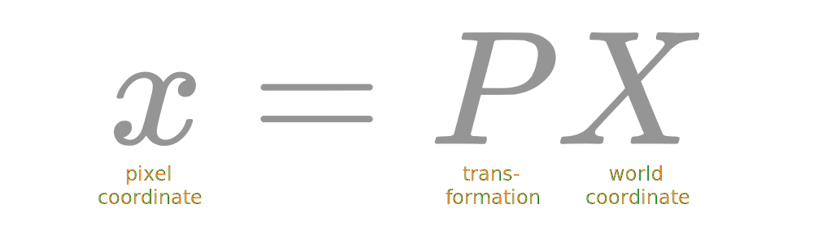
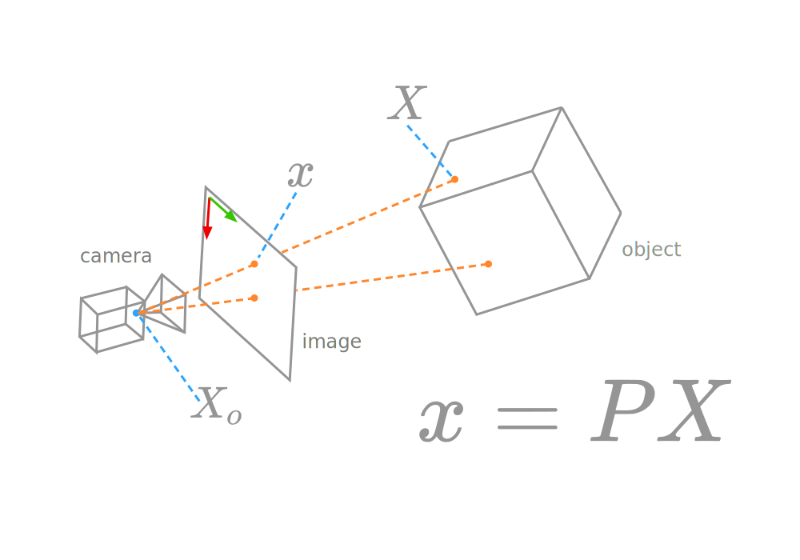
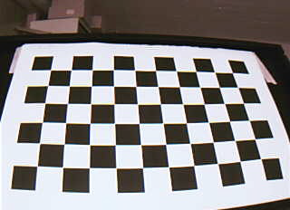
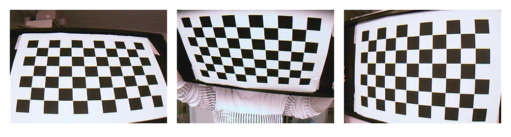
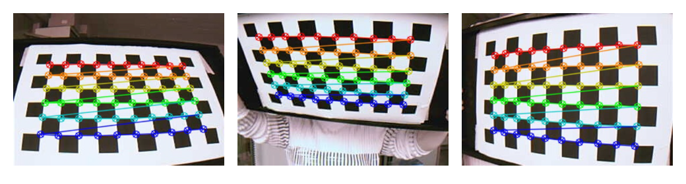

# Contents {data-transition="convex"}

- Zhang's Method
- Non-linear Distortion
- Three Point Algorithm

# Zhang's Method

A method of finding the **intrinsic** parameters of a camera.

- Zhang, Z., 2000. A flexible new technique for camera calibration. IEEE Transactions on pattern analysis and machine intelligence, 22(11), pp.1330-1334.

::: notes
the intrinsics are the parameters that belong to the camera - they remain the same
as we move the camera around.
:::

## Point mapping {data-auto-animate="true"}

::: notes
in the previous lecture we worked on the projection of points onto the image plane,
and calculated the **projection matrix**.
:::

## Point mapping {data-auto-animate="true"}

::: notes
we can illustrate this graphically - and please note - I have positioned the
image plane in the imaginary position in front of the camera.
This is very common in the literature, and is valid due to the similar triangles
of the pinhole camera model.
:::

## Direct Linear Transformation {data-auto-animate="true"}

Compute the 11 _intrinsic_ **and** _extrinsic_ parameters of a camera.

::: {style="font-size:1.5em"}

$$
\textbf{x} = K R [ I_3 | - \textbf{X}_o ] \textbf{X}
$$

:::

::: notes
and here we have the five intrinsic parameters on K
and 3 rotation values in R, and the 3 translation -Xo
:::

## Zhang's Method {data-auto-animate="true"}

Compute the 5 _intrinsic_ parameters in $K$.

::: {style="font-size:1.5em"}

$$
\textbf{x} = K R [ I_3 | - \textbf{X}_o ] \textbf{X}
$$

:::

::: notes
Why do this? surely we are better computing all the parameters?
answer - DLT requires knowledge of the scene we may ot have.
:::

## Zhang's Method {data-auto-animate="true"}

Camera calibration using images of a **checkerboard**.

{width="60%"}

::: notes
this time we don't need to know 3D points in the scene - we use a checkerboard of known dimensions.
:::

## Checkerboard {data-auto-animate="true"}

- Board is of **known** size and structure.
- The board must be **flat**.

::: notes
we know how big the squares are, and we know how many squares there are.
it must be flat - this is an important property that we will exploit.
:::

## Checkerboard Method {data-auto-animate="true"}

Set the **world** coordinate system to the **corner** of the checkerboard.

::: incremental

- do this for _each_ image captured.
- all points lie on x/y plane with z=0

:::

::: notes
using a corner detector, we find points on the checkerboard.
we use a 'trick' setting the xy plane to be parallel to the checkerboard,
with z pointing outward.
This means all the z coordinates are zero. We know how big the squares are in our printed pattern.
Knowing that z=0 changes the maths - let's see how!
:::

## Simplification {data-auto-animate="true"}

The $Z$ coordinate of each point is **zero**.

$$
\begin{bmatrix} x \\ y \\ 1 \end{bmatrix} =
\begin{bmatrix} c & s & x_H \\ 0 & c(1 + m) & y_H \\ 0 & 0 & 1 \end{bmatrix}
\begin{bmatrix}
    r_{11} & r_{12} & r_{13} & t_1 \\
    r_{21} & r_{22} & r_{23} & t_2 \\
    r_{31} & r_{32} & r_{33} & t_3
\end{bmatrix}
\begin{bmatrix} X \\ Y \\ \color{red}{Z} \\ 1 \end{bmatrix}
$$

::: notes
This is our DLT equation.
The left matrix is the intrinsic matrix, and the right matrix is the extrinsic matrix.
so the Z (in red) is zero all the time.
:::

## Simplification {data-auto-animate="true"}

The last column of the rotation matrix has no effect on the system.

- we can delete these components from the system

$$
\begin{bmatrix} x \\ y \\ 1 \end{bmatrix} =
\begin{bmatrix} c & s & x_H \\ 0 & c(1 + m) & y_H \\ 0 & 0 & 1 \end{bmatrix}
\begin{bmatrix}
    r_{11} & r_{12} & \color{red}{r_{13}} & t_1 \\
    r_{21} & r_{22} & \color{red}{r_{23}} & t_2 \\
    r_{31} & r_{32} & \color{red}{r_{33}} & t_3
\end{bmatrix}
\begin{bmatrix} X \\ Y \\ \color{red}{Z} \\ 1 \end{bmatrix}
$$

::: notes
because Z is always zero, the last column of the rotation matrix is not used.
it's something we don't need to estimate.
:::

## Simplification {data-auto-animate="true"}

- The $Z$ coordinate of each point is **zero**.
- Deleting the third column of $R$ gives us:

$$
\begin{bmatrix} x \\ y \\ 1 \end{bmatrix} =
\begin{bmatrix} c & s & x_H \\ 0 & c(1 + m) & y_H \\ 0 & 0 & 1 \end{bmatrix}
\begin{bmatrix}
    r_{11} & r_{12} & t_1 \\
    r_{21} & r_{22} & t_2 \\
    r_{31} & r_{32} & t_3
\end{bmatrix}
\begin{bmatrix} X \\ Y  \\ 1 \end{bmatrix}
$$

::: notes
every observed point leads to one of these equations.
:::

## Simplification {data-auto-animate="true"}

- Each observed point gives this equation.
- The _intrinsics_ persist for **all** images.
- The _extrinsics_ persist for **each** image.

$$
\begin{bmatrix} x \\ y \\ 1 \end{bmatrix} =
\begin{bmatrix} c & s & x_H \\ 0 & c(1 + m) & y_H \\ 0 & 0 & 1 \end{bmatrix}
\begin{bmatrix}
    r_{11} & r_{12} & t_1 \\
    r_{21} & r_{22} & t_2 \\
    r_{31} & r_{32} & t_3
\end{bmatrix}
\begin{bmatrix} X \\ Y  \\ 1 \end{bmatrix}
$$

::: notes
it is important to note that the intrinsics are the same for all images,
and the extrinsics are the same for one image, but all points.
:::
