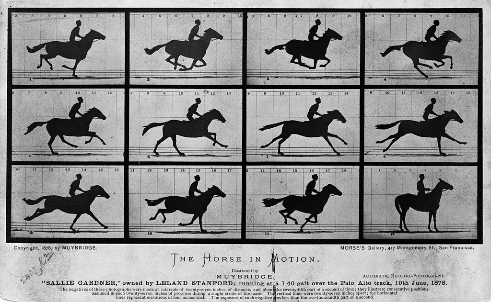
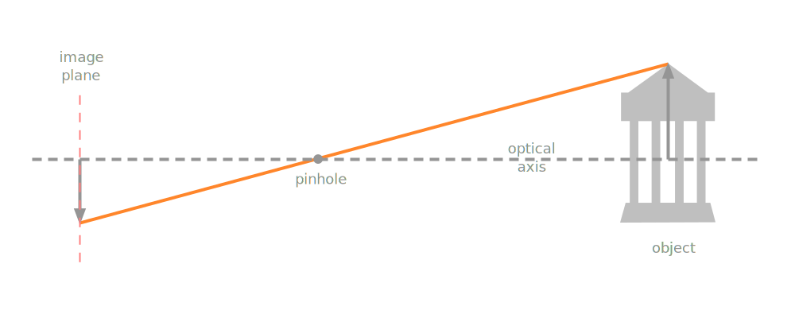
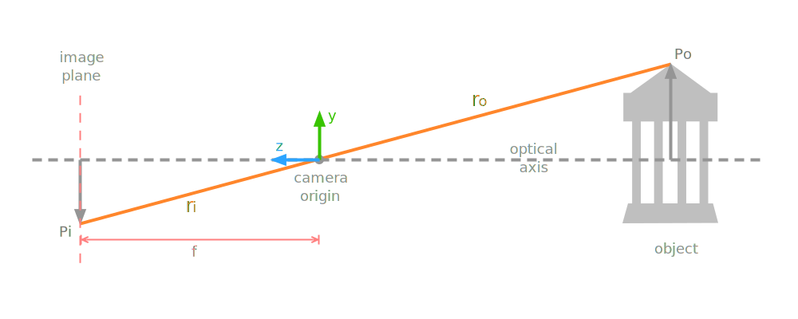
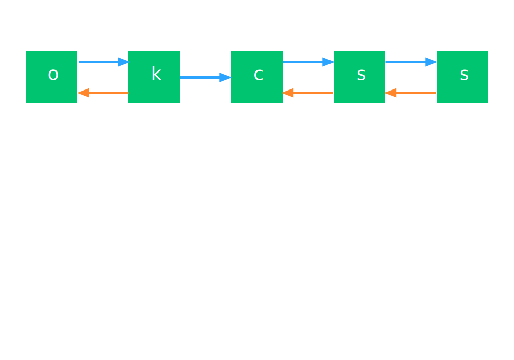
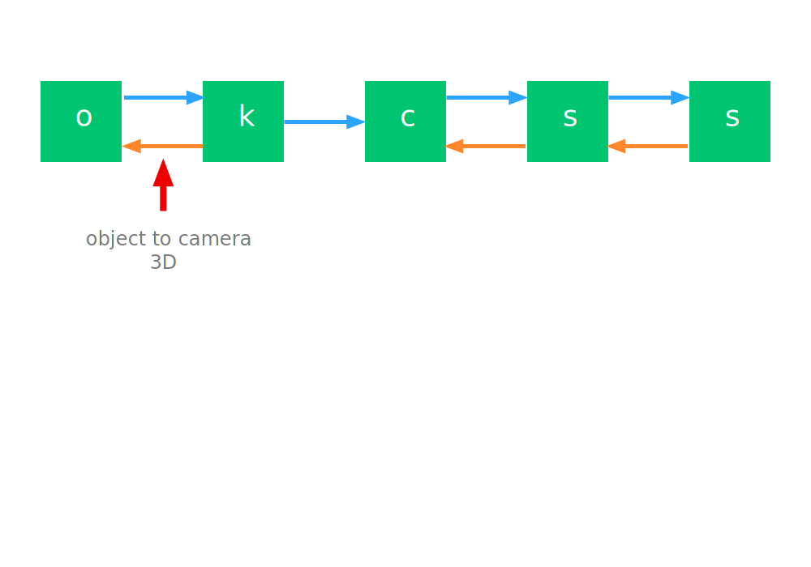
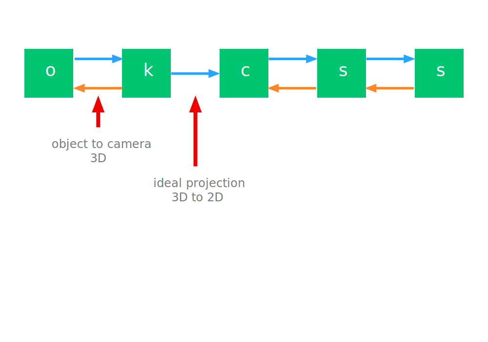
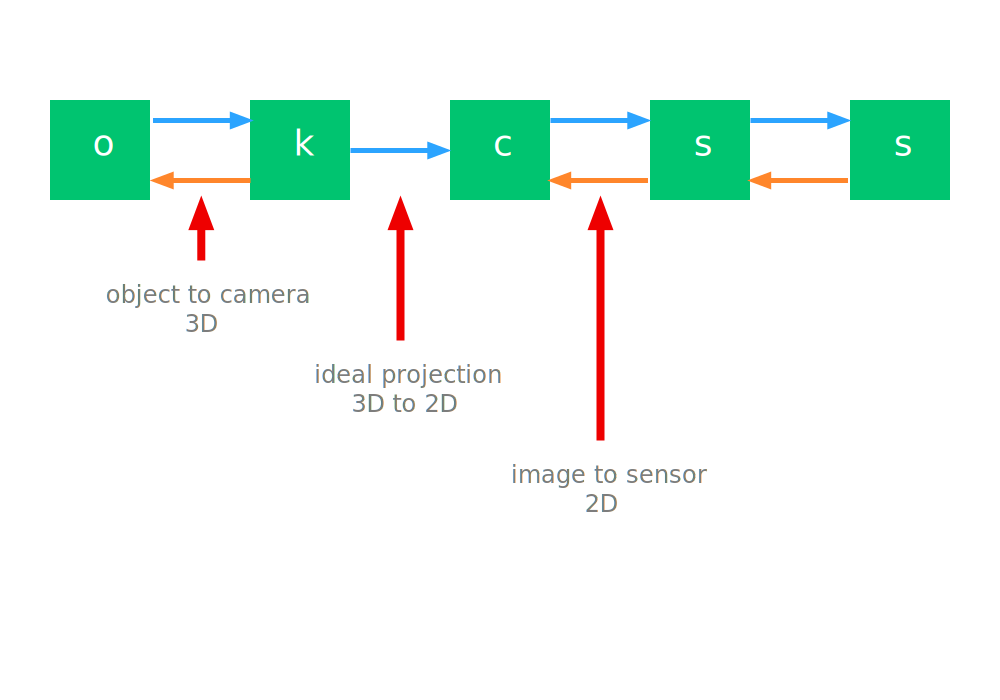
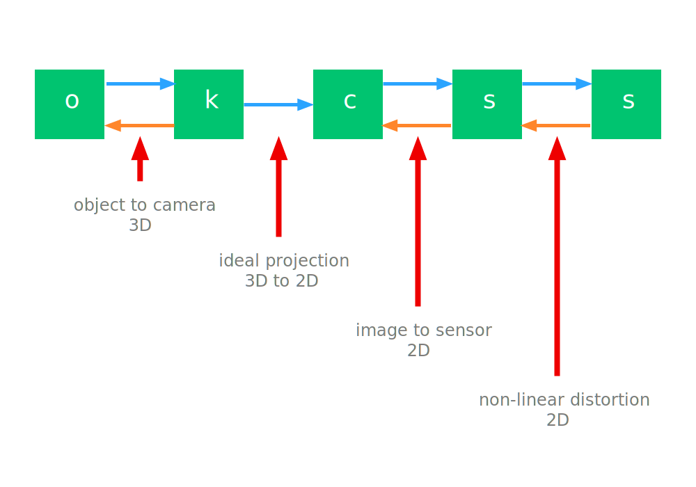
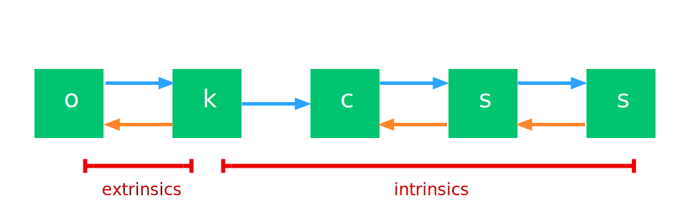
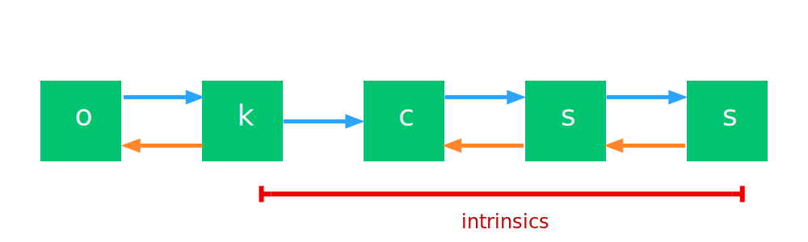

# Contents {data-transition="convex"}

- Camera Model
- Intrinsic and Extrinsic Parameters
- Direct Linear Transformation

::: notes
We have talked a lot about images, but not much on how we obtain images using a camera.
We will discuss the parameters of a pinhole camera model,
that serves well for computer vision tasks.
In the first part - we will then show the relationship between points in the world and points in the image.
:::

# The Camera

{width="80%"}

::: notes
who would disagree if I said the camera was one of the most
important inventions in the history of science?
Here Edweard Muybridge shows definitively that a
horses feet al leave the ground when galloping.
:::

## The Camera {data-auto-animate="true"}

Cameras measure light **intensities**.

- the sensor counts photons arriving at the pixel
- each pixel corresponds to a direction in world space

::: notes
What do cameras measure?
:::

## The Camera {data-auto-animate="true"}

Cameras can also be seen as _direction_ measurement devices.

- we are often interested in geometric properties of a scene
- an object reflects light to a specific location on the sensor
- Which 3D point is mapped to which pixel?

::: notes
light falls on an object, is reflected back to the camera, and then to a pixel.
which point in space maps to which position on the sensor?
this is information used to perform geometric measurements.
:::

## The Camera {data-auto-animate="true"}

How do we get the point observations?

- _keypoints_ and _features_
- SIFT, ORB, etc.
- **locally** distinct features

::: notes
We get these observations by detecting features in an image, finding corners, blobs, etc.
Thes are locally distinct features...
:::

## The Camera {data-auto-animate="true"}

Features identify points mapped from the 3D world to the 2D image.

::: notes
We assume this point has been mapped to the 2D image plane, and we want to reconstruct this point in the environment.

We often use a small number of such keypoints - maybe a few hundred per image - much less than the number of pixels in the image.

So the camera records intensities - but also directions - which we can use for geometric reconstruction.
:::

# Pinhole Camera Model {data-auto-animate="true"}

::: notes
I want to introduce the concept of the pinhole camera.
Real pinhole cameras can be made - and work... but here we are describing a model,
that helps us to understand the relationship between points in the world
and points in the image.
:::

## {data-auto-animate="true"}

- $f$ : effective focal length
- $\textbf{r}_{o} = (x_o, y_o, z_o)$
- $\textbf{r}_{i} = (x_i, y_i, f)$

::: notes
The distance from the camera origin to the image plane is called the focal length.
We can look at a ray from an object to the origin r_o,
that then passes through the pinhole to the image plane r_i.

NB. The pinhole diagram is often shown with the image plane in front of the camera.
NB2. Different texts apply different labels.
:::

## Pinhole Camera Model {data-auto-animate="true"}

Using similar triangles, we get the equations of perspective projection.

$$
\frac{\textbf{r}_{i}}{f} = \frac{\textbf{r}_{o}}{z_o} \quad \Rightarrow \quad
\frac{x_i}{f} = \frac{x_o}{z_o}, ~\frac{y_i}{f} = \frac{y_o}{z_o}
$$

::: notes
The 2d x, y on the image plane are derived by dividing the 3D by z, scaled by the focal length.
very simple equations - but can produce some very unintuitive effects.
:::

# Camera Parameters {data-auto-animate="true"}

Describe how a world point is mapped to a pixel coordinate.

::: notes
Our goal is to describe how a point in the world maps to a pixel in the image.
:::

## Camera Parameters {data-auto-animate="true"}

Describe how a world point is mapped to a pixel coordinate.

## Camera Parameters {data-auto-animate="true"}

We will describe this mapping in **homogeneous** coordinates.

::: {style="font-size:1.5em"}

$$
\begin{bmatrix} x \\ y \\ 1 \end{bmatrix} =
P \begin{bmatrix} X \\ Y \\ Z \\ 1 \end{bmatrix}
$$

:::

## Aside: Homogeneous Coordinates {data-auto-animate="true"}

$$
\begin{bmatrix} u \\ v \\ w \end{bmatrix} =
\begin{bmatrix} u/w \\ v/w \\ 1 \end{bmatrix} \Rightarrow
\begin{bmatrix} u/w \\ v/w \end{bmatrix} =
\begin{bmatrix} x \\ y \end{bmatrix}
$$

## Coordinate Systems {data-auto-animate="true"}

We have to transform via a number of coordinate systems:

::: incremental

- The world coordinate system
- The camera coordinate system
- The image coordinate system
- The pixel coordinate system

:::

## World to Pixels

::: notes
we start with a point in the world on the left of the image.
and move to the right in the diagram giving us the final pixel coordinate.
:::

## World to Pixels

::: notes
Object to camera is in 3D and is invertible.
We convert from one coordinate frame to another.
:::

## World to Pixels

::: notes
Then we project from 3D to 2D.
This is not invertible - we lose some information here.
:::

## World to Pixels

::: notes
The sensor coordinates need to be transformed from the projected coordinates.
Usually we have 0,0 in the top left of an image, whereas we have projected to the centre.
:::

## World to Pixels

::: notes
In the real world, lenses have distortions and aberrations that distort the image.
We can correct for these here.
:::

## Camera Parameters {data-auto-animate="true"}

How do we work with these parameters?

::: incremental

- _extrinsic_ parameters: the pose of the camera in the world
- _intrinsic_ parameters: the properties of the camera

:::

::: notes
we form two groups of parameters:
intrinsic - the ideal projection to 2D and then translation to pixel coordinates
extrinsic - the pose of the camera in the world
you can imagine if you pick up your camera and move it - it does not effect the position of the sensor, the pixel shape, the focal length, etc.
:::

# Extrinsic Parameters {data-auto-animate="true"}

The pose of the camera.

## Extrinsic Parameters {data-auto-animate="true"}

- Describe the **pose** of the camera in the world.
- That is, the _position_ and _heading_ of the camera.
- Invertible transformation.

How many parameters do we need?

::: incremental

- 3 parameters for the position
- 3 parameters for the heading
- There are **6** _extrinsic_ parameters.

:::

::: notes
the only thing we can do is translate, and rotate the camera.
:::

## Extrinsic Parameters {data-auto-animate="true"}

Point in world coordinates:

$$
\textbf{X}_p = [ X_p, Y_p, Z_p ]^T
$$

Origin of camera in world coordinates:

$$
\textbf{X}_o = [ X_o, Y_o, Z_o ]^T
$$

## Transformation {data-auto-animate="true"}

**Translation** between origin of world and camera coordinates is:

$$
\textbf{X}_o = [ X_o, Y_o, Z_o ]^T
$$

**Rotation** $R$ from world to camera coordinates system is:

$$
{}^{k}\textbf{X}_p = R(\textbf{X}_p - \textbf{X}_o)
$$

## Homogeneous Coordinates {data-auto-animate="true"}

$$
\begin{aligned}
\begin{bmatrix} {}^{k}\textbf{X}_p \\ 1 \end{bmatrix} &=
\begin{bmatrix} R &\quad \textbf{0} \\  \textbf{0}^T &\quad 1 \end{bmatrix}
\begin{bmatrix} I_3 &\quad -\textbf{X}_o \\  \textbf{0}^T &\quad 1 \end{bmatrix}
\begin{bmatrix} \textbf{X}_p \\ 1 \end{bmatrix} \\ &=
\begin{bmatrix} R &\quad -R \textbf{X}_o \\ \textbf{0}^T &\quad 1 \end{bmatrix}
\begin{bmatrix} \textbf{X}_p \\ 1 \end{bmatrix}
\end{aligned}
$$

or:

$$
{}^{k}\textbf{X}_p  = {}^{k}H \textbf{X}_p,
\quad \text{where} \quad
{}^{k}H = \begin{bmatrix} R \quad& -R \textbf{X}_o \\ \textbf{0}^T \quad& 1 \end{bmatrix}
$$

::: notes
here, the bold zero is the zero vector.
R is a 3x3 rotation matrix.
I_3 is the 3x3 identity matrix.
and we can premultiply the rotation and translation because we are in homogeneous coordinates.
So finally, we have H is the extrinsic parameters.
NB Homogeneous coordinates are shown in non-italic font.
:::

# Intrinsic Parameters {data-auto-animate="true"}

Projecting points from the camera to the sensor.

::: notes
if we have applied our extrinsic parameters, points in the world are now in camera coordinates.
How do we project these points to the sensor?
:::

## Intrinsic Parameters {data-auto-animate="true"}

- projection from camera coordinates to sensor coordinates
- central projection is **not** invertible
- image plane to sensor is invertible
- linear deviations are invertible

## {data-auto-animate="true"}

Recall for our pinhole model:

$$
\begin{aligned}
{}^{c}x_p &= c \frac{{}^{k}X_p}{{}^{k}Z_p} \\
{}^{c}y_p &= c \frac{{}^{k}Y_p}{{}^{k}Z_p}
\end{aligned}
$$

where $c$ is the focal length, or _camera constant_.

::: notes
in a nutshell - we are dividing by the (Z) distance from the camera.
:::

## Homogeneous Coordinates {data-auto-animate="true"}

$$
\begin{bmatrix} U \\ V \\ W \\ T \end{bmatrix} =
\begin{bmatrix} c \quad 0 \quad 0 \quad 0 \\
                0 \quad c \quad 0 \quad 0 \\
                0 \quad 0 \quad c \quad 0 \\
                0 \quad 0 \quad 1 \quad 0
\end{bmatrix}
\begin{bmatrix} {}^{k}X_p \\ {}^{k}Y_p \\ {}^{k}Z_p \\ 1 \end{bmatrix}
$$

Drop the 3rd row:

$$
\begin{bmatrix} {}^{c}x_p \\ {}^{c}y_p \\ 1 \end{bmatrix} =
\begin{bmatrix} {}^{c}u_p \\ {}^{c}v_p \\ {}^{c}w_p \end{bmatrix} =
\begin{bmatrix} c \quad 0 \quad 0 \quad 0 \\
                0 \quad c \quad 0 \quad 0 \\
                0 \quad 0 \quad 1 \quad 0
\end{bmatrix}
\begin{bmatrix} {}^{k}X_p \\ {}^{k}Y_p \\ {}^{k}Z_p \\ 1 \end{bmatrix}
$$

::: notes
we drop the third row to go from 3d homogeneous camera coords to
2d homogeneous image plane coords.

I recommend you do the matrix multiplication to confirm it is the same as our earlier projection equations. Don't forget to divide by the homogeneous coordinate.
:::

## Ideal Camera {data-auto-animate="true"}

The mapping for an ideal camera is:

$$
{}^{c}x = {}^{c}P X
$$

with:

$$
{}^{c}P =
\begin{bmatrix} c \quad 0 \quad 0 \quad 0 \\ 0 \quad c \quad 0 \quad 0 \\ 0 \quad 0 \quad 1 \quad 0 \end{bmatrix}
\begin{bmatrix} R \quad& -R \textbf{X}_o \\ \textbf{0}^T \quad& 1 \end{bmatrix}
$$

::: notes
This is our equation from earlier. Mapping a point in the world to the image plane.
The projection matrix P is formed by multiplying the extrinsic parameters by the intrinsic parameters.
We now want to carry on with the intrinsic parameters and we will want to premultiply with another 3x 3 matrix.
:::

## Calibration Matrix {data-auto-animate="true"}

We can now define the _calibration matrix_ for an **ideal** camera.

$$
{}^{c}K =
\begin{bmatrix} c \quad 0 \quad 0 \\ 0 \quad c \quad 0 \\ 0 \quad 0 \quad 1 \end{bmatrix}
$$

The mapping of a point in the world to the image plane is:

$$
{}^{c}P = {}^{c}K R [I_3 | - \textbf{X}_o]
$$

::: notes
We dropped the last column of zeros, so we have a 3x3 matrix.
in a lot of the literature this is labelled as K.
Our last matrix here is a 3x4 matrix - identity concatenated with the camera offset.
:::

## Linear Errors {data-auto-animate="true"}

The next step is mapping from the image plane to the sensor.

::: incremental

- Location of principal point in sensor coordinates.
- Scale difference in x and y, according to chip design.
- Shear compensation.

:::

::: notes
not all cameras have the same number of pixels in x and y.
Shear is not common in digital cameras - more a legacy of film cameras.
:::

## Location of Principal Point {data-auto-animate="true"}

::: columns
::::: column

:::::
::::: column
Origin of sensor space is not at the principal point:

$$
{}^{s}H_{c} =
\begin{bmatrix}
1 \quad& 0 \quad& x_H \\
0 \quad& 1 \quad& y_H \\
0 \quad& 0 \quad& 1
\end{bmatrix}
$$

Compensation is a _translation_.

:::::
:::

::: notes
The optical axis passes through the image plane at the principal point.
We need to translate to the pixel or sensor coordinate origin.
:::

## Scale and Shear {data-auto-animate="true"}

- Scale difference $m$ in x and y.
- Sheer compensation $s$.

We need to add 4 additional parameters to our calibration matrix:

$$
{}^{s}H_{c} =
\begin{bmatrix}
1 \quad& s \quad &x_H \\
0 \quad& 1 + m   &y_H \\
0 \quad& 0 \quad &1
\end{bmatrix}
$$

::: notes
why do we need scale difference? not all camera sensors have 'square' pixels.
sheer is unusual in digital cameras - expect it to be zero in most cases.
m, s, xh and yh.
:::

## Calibration Matrix {data-auto-animate="true"}

Normally, we combine these compensations with the ideal calibration matrix:

$$
\begin{aligned}
K &=
\begin{bmatrix}
1 \quad& s \quad &x_H \\
0 \quad& 1 + m   &y_H \\
0 \quad& 0 \quad &1
\end{bmatrix}
\begin{bmatrix}
c \quad 0 \quad 0 \\
0 \quad c \quad 0 \\
0 \quad 0 \quad 1
\end{bmatrix} \\
&=
\begin{bmatrix}
c \quad& s \quad    &x_H \\
0 \quad& c(1 + m)   &y_H \\
0 \quad& 0 \quad    &1
\end{bmatrix}
\end{aligned}
$$

::: notes
we pre multiply the ideal calibration matrix by the scale and shear matrix.
:::

## Calibration Matrix {data-auto-animate="true"}

$$
K =
\begin{bmatrix}
c \quad& s \quad    &x_H \\
0 \quad& c(1 + m)   &y_H \\
0 \quad& 0 \quad    &1
\end{bmatrix}
$$

There are **5** intrinsic parameters:

- camera constant $c$
- scale difference $m$
- principal point offset $x_H$ and $y_H$
- shear compensation $s$

::: notes
important - different literature may talk about 2 different camera constants, cx, cy or fx fy.
also important - we have not talked about non-linear distortions, from lenses etc.
:::

## Projection Matrix {data-auto-animate="true"}

Finally, we have the $3 \times 4$ homogeneous projection matrix:

$$
P = K R [I_3 | - \textbf{X}_o]
$$

It contains **11 parameters**:

- 6 extrinsic parameters
- 5 intrinsic parameters
