# Content

- ImageNet
- Neural Networks
- MNIST Examples
- Convolutional Neural Networks

# ImageNet

::: {style="font-size: 2.0em"}

$> ~$ 1,000,000 images

$> ~$ 1,000 classes

:::

---

Actually...

$> ~$ 15,000,000 images

$> ~$ 20,000 classes

Ground truth annotated manually with Amazon _Mechanical Turk_.

Freely available for research here: [https://www.image-net.org/](https://www.image-net.org/)

---

::: columns
::::: column

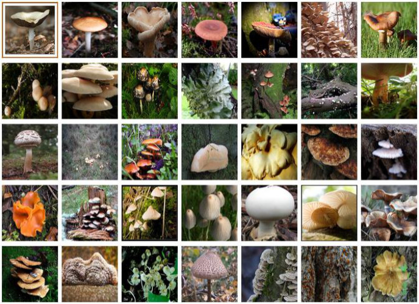

:::::
::::: column

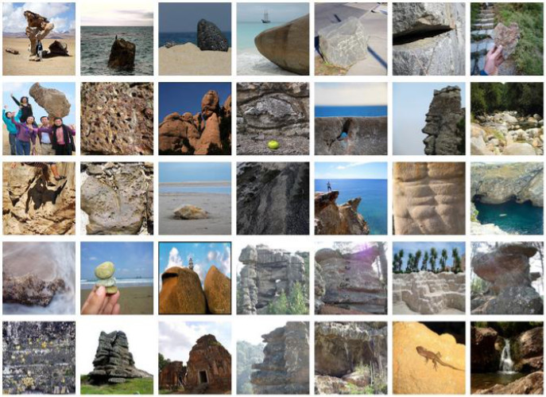

:::::
:::

---

ImageNet Top-5 challenge:

You score if ground truth class is one your top 5 predictions!

::: notes
In the case of the top-5 score, you check if the target label is one of your top 5 predictions (the 5 ones with the highest probabilities).
:::

## ImageNet in 2012

::: incremental

- Best approaches used hand-crafted features.
- SIFT, HOGs, Fisher vectors, etc. plus a classifier.
- Top-5 error rate: ~25%

:::

## {data-transition="zoom"}

::: {style="font-size: 2.5em"}

Then the game changed!

:::

## AlexNet

In 2012, Krizhevsky et al. used a deep neural network to achieve a **15%** error rate.

- AlexNet: Five convolutional layers, followed by three fully connected layers.
- ImageNet Classification with Deep Convolutional Neural Networks. Krizhevsky et al. 2012.

::: notes
Difficult to overstate the impact of this on the computer vision community.
AlexNet
Further architectural improvements have reduced the error rate further since then...
:::

## {data-transition="slide"}

Prior approaches used hand _designed_ features.

Neural networks **learn** features that help them classify and quantify images.

# Neural Networks

What _is_ a neural network?

::: notes
Actually, they have been around a long time.
In 1959, Bernard Widrow and Marcian Hoff, developed MADALINE,
the first neural network applied to a real world problem,
using an adaptive filter that eliminates echoes on phone lines.
:::

## Neural Networks

Multiple _layers_.

Data _propagates_ through layers.

_Transformed_ by each layer.

::: notes
we will hold onto the idea of layers for a while.
Each transformation becomes more useful as we progress through the model.
:::

## Neural Network Classifier

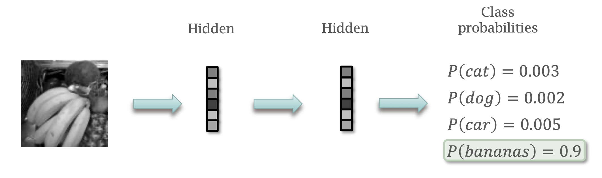

::: notes
It is common to represent such models graphically.
So here - an input image is passed to layers, deeper layers, until we get a probability vector.
:::

## Neural Network Regressor

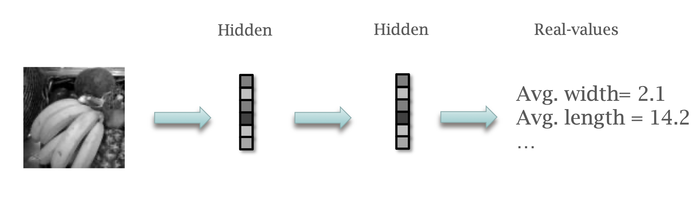

::: notes
Things don't change much for regression - where we want real values rather than categories.
:::

---

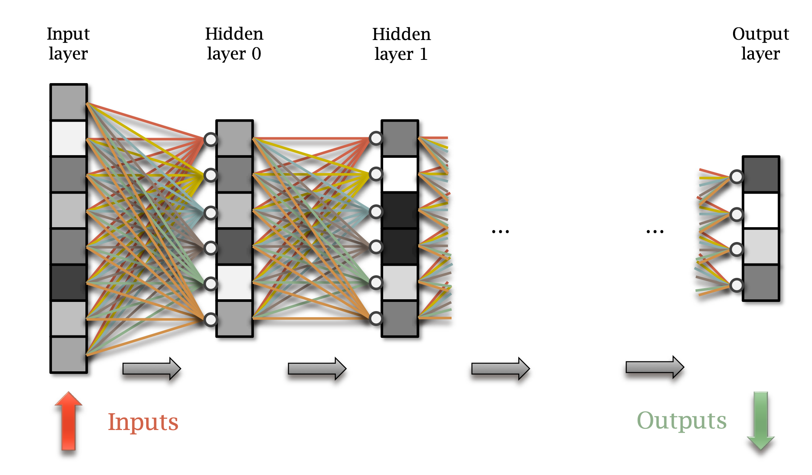

::: notes
we learn these weighted connections...
:::

---


::: notes
and we learn the biases.

so each line is a weight and we take the product sum of the inputs.
Using matrix multiplication...
:::

---

- $x$ input vector of size $M$
- $y$ output vector of size $N$
- $W$ weight matrix of size $M \times N$
- $b$ bias vector of size $N$
- $f$ activation function, e.g. ReLU: $\max(x, 0)$

$$y = f(Wx + b)$$

::: notes
Activation functions can be sigmoid, tanh, ReLU, etc.
:::

---

::: {style="font-size: 1.5em"}

$$y = f(Wx + b)$$

:::

::: notes
So, in a nutshell, this is a neural network - just need to repeat this function for each layer.
:::

---

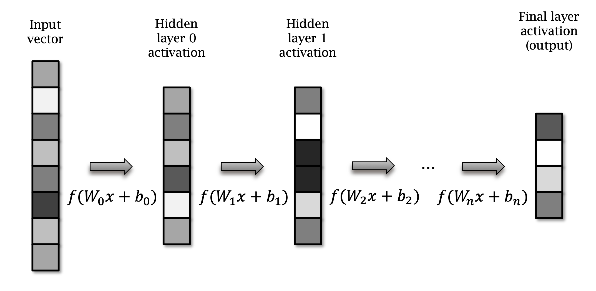

::: notes
graphically, we can see the data flowing through the layers, left to right.
:::

---

$$
\begin{aligned}
y_0 &= f(W_0x + b_0) \\
y_1 &= f(W_1y_0 + b_1) \\
 & \dotsc \\
y_L &= f(W_L y_{L-1} + b_L)
\end{aligned}
$$

---

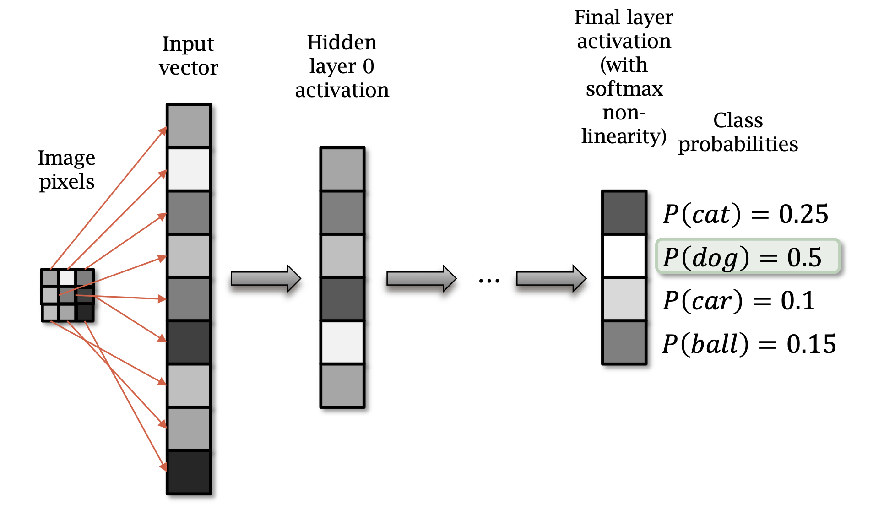

::: notes

in practical terms - we can flatten an image to a vector of size $M$

:::

---

A **Neural Network** is built from _layers_, each of which is:

- a matrix multiplication
- a bias
- a non-linear activation function

::: notes
To answer the question - what is a neural network?
:::

# Practical Examples

... using **PyTorch**.

## Practical Examples

::: columns
::::: column

:::::
::::: column
I've provided a small repository of code examples for you to try out, at:

[https://github.com/uea-teaching/Deep-Learning-for-Computer-Vision](https://github.com/uea-teaching/Deep-Learning-for-Computer-Vision)
:::::
:::

::: notes
There are some instructions on setting up your environment, if you are not familiar with Python.
:::

## Practical Examples

The first thing to note, is we usually work with **batches** of input data.

- or, more strictly, _mini-batches_.
- If a sample is a vector of M numbers Then a mini-batch of S samples is an S x M matrix.

## {data-auto-animate="true"}

```{.python data-line-numbers="1-12|1|4|7|10|12"}
import torch, torch.nn.functional as F

# Assume input_data is S * M matrix
x = torch.tensor(input_data)

# W: gaussian random M * N matrix, std-dev=1/sqrt(N)
W = torch.randn(M, N) / math.sqrt(N)

# Bias: zeros, N elements
b = torch.zeros(1, N)

y = F.relu(x @ W + b)
```

::: notes
let's step through the code above.
first the imports...
then, input_data is a NumPy array, convert to Torch tensor
then, W is a Torch tensor, with normally distributed random values, scaled.
then, b is a Torch tensor, with zeros
Finally, we perform the matrix multiplication and add the bias, and then apply the ReLU activation function (What we called f earlier).
The arobase @ is the matrix multiplication symbol.
libraries like PyTorch, NumPy, Matlab ‘broadcast’/replicate the 1xN to SxN for the addition
:::

---

This is all a bit clunky.

PyTorch provides nice convenient layers for you to use.

---

```{.python data-line-numbers="1-8|2|5|8"}
# Assume input_data is S * M matrix
x = torch.tensor(input_data)

# Linear layer, M columns in, N columns out
layer = torch.nn.Linear(M, N)

# Call the layer like a function to apply it
y = F.relu(layer(x))
```

::: notes
The nn.Linear module contains the weights and biases and initialises itself, saving us effort.

The matrix-multiply and applying the bias is done for us by nn.Linear.
:::

## Training {data-auto-animate="true"}

On order to _learn_ the correct weights, we need to **train** the model.

## Training {data-auto-animate="true"}

Define a **cost**; a measure of error between predictions and ground truth.

Use _back-propagation_ to modify parameters so that cost drops toward zero.

## Initialisation

Initialise weights randomly.

- We can follow the scheme proposed by He, et al. in 2015.
- We did this earlier, the scaled random normal initialisation.
- Pytorch does this by default, so no need to worry about it.

## Training {data-auto-animate="true"}

For each example $x_{train}$ from the training set.

::: incremental

- Evaluate network the prediction $y_{pred}$ given the training input.
- Measure _cost_ $c$: the difference between $y_{pred}$ output and ground truth $y_{train}$.
- Iteratively reduce the cost using **gradient descent**.

:::

---

Compute the derivative of _cost_ $c$ w.r.t. all parameters $W$ and $b$.

::: notes
so, we are looking for the gradient of the cost function.
:::

---

Update parameters $W$ and $b$ using gradient descent:

$$
\begin{aligned}
W'_0 &= W_0 - \lambda \frac{\partial c}{\partial W_0} \\
b'_0 &= b_0 - \lambda \frac{\partial c}{\partial b_0} \\
\end{aligned}
$$

$\lambda$ is the learning rate: a _hyperparameter_.

::: notes
learning rate must be set empirically, or from experience.
:::

---

Theoretically...use the chain rule to calculate gradients.

- This is time consuming.
- Easy to make mistakes.

## In Practice

Many Neural Network tool-kits do all this for you automatically.

Write the code that performs the **forward** operations, PyTorch keeps track of what you did and will compute _all_ the gradients in one step!

## Computing gradients in PyTorch

```{.python data-line-numbers="1-6|2|4|6"}
# Get predictions, no non-linearity
y_pred = layer(x_train)
# Cost is mean squared error
cost = ((y_pred - y_train) ** 2).mean()
# Compute gradients using 'backward' method
cost.backward()
```

::: notes
Get predictions, no non-linearity, for brevity.
Compute cost using mean squared error...
Back-propagation: compute gradients of cost w.r.t. parameters

layer.W.grad and layer.b.grad will contain the gradients of the cost w.r.t. layer.W and layer.b respectively
:::

## Gradient descent in PyTorch

```{.python data-line-numbers="1-12|2|5-6|8|10|12}"}
# Create an optimizer to update the parameters of layer
opt = torch.optim.Adam(layer.parameters(), lr=1e-3)

# Get predictions and cost as before
y_pred = layer(x_train)
cost = ((y_pred - y_train) ** 2).mean()
# Back-prop, zero the gradients attached to params first
opt.zero_grads()
# compute gradients
cost.backward()
# update the parameters
opt.step()
```

::: notes
PyTorch optimizer objects update the parameters for us. In this case we use the Adam rule; it’s a variant of stochastic gradient descent (SGD) that often works better

We give it the parameters we want it to update, and a learning rate.

:::

## Classification

Final layer has a **softmax** non-linear function.

The cost is the cross-entropy loss, which is the negative log-likelihood.

## Softmax

Softmax produces a probability vector:

$$
q(x) = \frac{e^{x_i}}{\sum_{i=0}^{N} e^{x_i}}
$$

::: notes
Softmax scales the logits (the raw output of the last layer) to probabilities.
:::

## Classification Cost

Negative log probability (categorical cross-entropy):

- $q$ is the predicted probability.
- $p$ is the true probability (usually 0 or 1).

$$
c = - \sum p_i \log q_i
$$

::: notes
have a think about what this cost would be for a single example.
:::

## Classification in PyTorch

```{.python data-line-numbers="1-7|2|4|6"}
# Create a nn.CrossEntropyLoss object to compute loss
criterion = torch.nn.CrossEntropyLoss()
# Get predicted logits
y_pred_logits = layer(x_train)
# Use criterion to compute loss
cost = criterion(y_pred_logits, y_train)
...
```

::: notes
Again, pytorch does a lot of the work for us.
Calling a CrossEntropyLoss object will: apply softmax and compute cross entropy loss in one go
:::

## Regression

To quantify something, with real-valued output.

Cost: Mean squared error.

## Mean Squared Error

- $q$ is the predicted value.
- $p$ is the true value.

$$
c = \frac{1}{N} \sum_{i=0}^{N} (q_i - p_i)^2
$$

## Regression in PyTorch

```{.python data-line-numbers="1-7|2|4|6"}
# Create a nn.CrossEntropyLoss object to compute loss
criterion = torch.nn.MSELoss()
# Get predicted logits
y_pred_logits = layer(x_train)
# Use criterion to compute loss
cost = criterion(y_pred_logits, y_train)
...
```

::: notes
nn.MSELoss (mean squared error loss) computes MSE loss
:::

## Training

Randomly split the training set into mini-batches of approximately 100 samples.

- Train on a mini-batch in a single step.
- The mini-batch cost is the mean of the costs of all samples in the mini-batch.

---

Training on mini-batches means that ~100 samples are processed in parallel.

- Good news for GPUs that do lots of operations in parallel.

---

Training on enough mini-batches to cover all examples in the training set is called an epoch.

- Run multiple epochs (often 200-300), until the cost converges.

## Training - Recap

::: incremental

1. Take mini-batch of training examples.
2. Compute the cost of the mini-batch.
3. Use gradient descent to update the parameters and reduce the cost.
4. Repeat, until done.

:::

::: notes
Training is an iterative process...
:::

# Multi-Layer Perceptron

The simplest network architecture...

::: notes
Nothing we haven't seen yet - uses only fully connected layers.
:::

## Multi-Layer Perceptron (MLP)

::: columns

::::: column
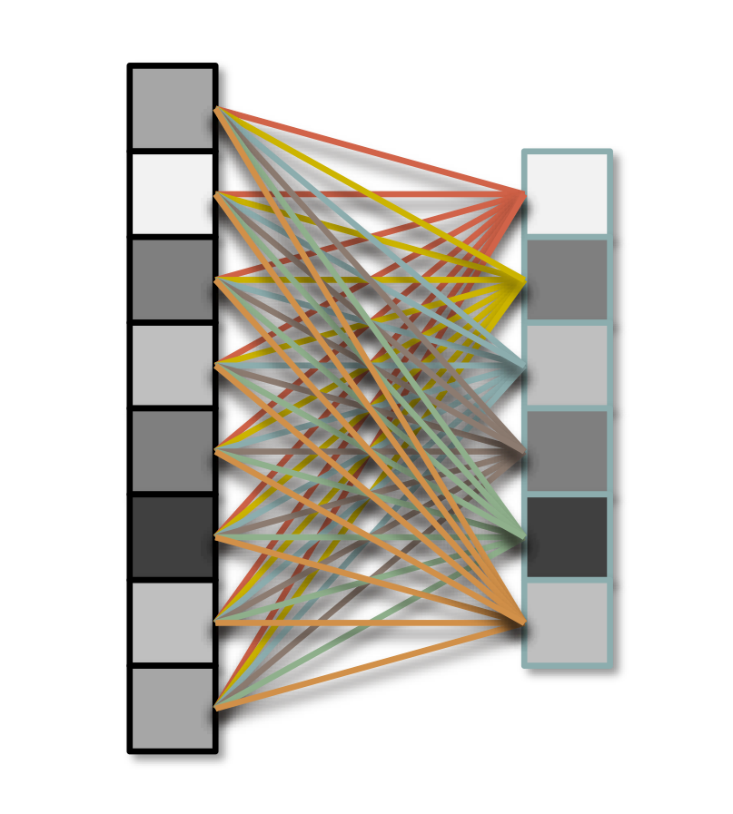
:::::

::::: column

### Dense layer

Each unit is connected to all units in previous layer.
:::::

:::

## MNIST Example

The "Hello World" of neural networks.

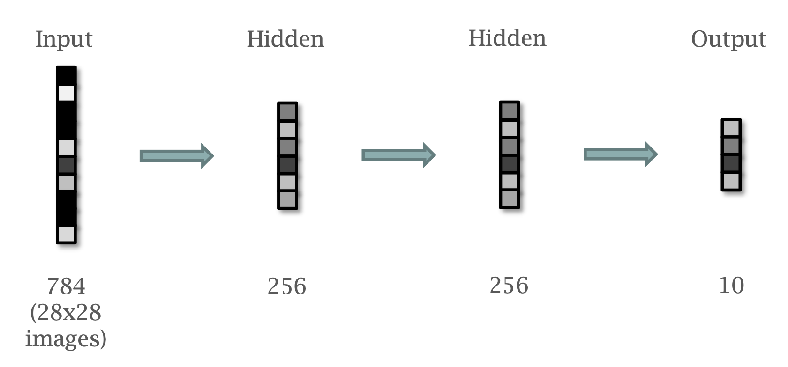

::: notes
2 hidden layers, both 256 units
after 300 iterations over training set:
1.83% validation error
:::

---

```{.python data-line-numbers="1-12"}
class Model(nn.Module):
    def __init__(self):
        super().__init__()
        self.input = nn.Linear(784, 256)
        self.hidden = nn.Linear(256, 256)
        self.output = nn.Linear(256, 10)

    def forward(self, x):
        x = x.view(x.shape[0], -1)
        x = F.relu(self.input(x))
        x = F.relu(self.hidden(x))
        return self.output(x)
```

::: notes
here is the network architecture in its entirety.
just 12 lines of code!
:::

---

```{.python data-line-numbers="4|5|6"}
class Model(nn.Module):
    def __init__(self):
        super().__init__()
        self.input = nn.Linear(784, 256)
        self.hidden = nn.Linear(256, 256)
        self.output = nn.Linear(256, 10)

    def forward(self, x):
        x = x.view(x.shape[0], -1)
        x = F.relu(self.input(x))
        x = F.relu(self.hidden(x))
        return self.output(x)
```

::: notes
here we instantiate the layers.
First fully connected layer takes 28x28 image flattened to 784-element vector.
Second hidden layer - so called because it is not connected to the outside world.
Third layer - output layer, with 10 predicted classes.
ONE hot encoding is used for the output layer.
:::

---

```{.python data-line-numbers="8|9|10|11|12"}
class Model(nn.Module):
    def __init__(self):
        super().__init__()
        self.input = nn.Linear(784, 256)
        self.hidden = nn.Linear(256, 256)
        self.output = nn.Linear(256, 10)

    def forward(self, x):
        x = x.view(x.shape[0], -1)
        x = F.relu(self.input(x))
        x = F.relu(self.hidden(x))
        return self.output(x)
```

::: notes
We declare a forward method that defines how the layers are applied.
first , we flatten out the image.
Then apply layers in sequence...
and return the output.
:::

## MNIST

MNIST is quite a special case.

- Digits nicely centred within the image.
- Scaled to approximately the same size.

## Visualisation {data-auto-animate="true"}

::: columns

::::: column
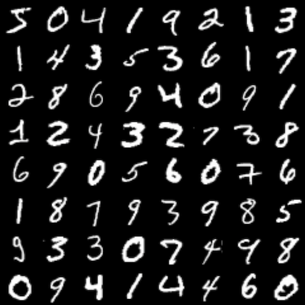
:::::

::::: column
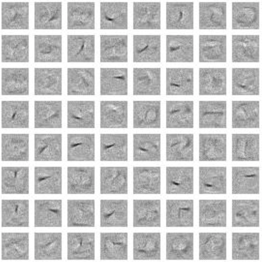
:::::
:::

::: notes
Visualising the learned weights can help to understand what the network is learning.
looking at the weights of layer 1...
The matrix is shape (784, 256) , so we can visualise a column as 28x28 image.
:::

## Visualisation {data-auto-animate="true"}

Note the stroke features detected by the various units.

::: columns

::::: column

:::::

::::: column

:::::
:::

::: notes
Each image visualises the weights connecting pixels to a specific unit in the first hidden layer.
Note the stroke features detected by the various units
:::

## Visualisation {data-auto-animate="true"}

Learned features lack translation invariance.

::: columns

::::: column

:::::

::::: column

:::::
:::

::: notes
The fully connected networks so far have a weakness:
No translation invariance; learned features are
position dependent
:::

---

For more general imagery:

- Require a training set large enough to see all features in all possible positions.
- Require network with enough units to represent this.

::: notes
Highly unlikely to achieve this...
:::

# Convolutional Neural Networks

The computer vision revolution...

::: notes
Really, the big power tool of modern computer vision.
:::

## Convolution {data-auto-animate="true"}

We have already discussed convolution.

- Slide a filter, or kernel, over the image.
- Multiply image pixels by filter weights and sum.
- Do this for all possible positions of the filter.

## Convolution {data-auto-animate="true"}

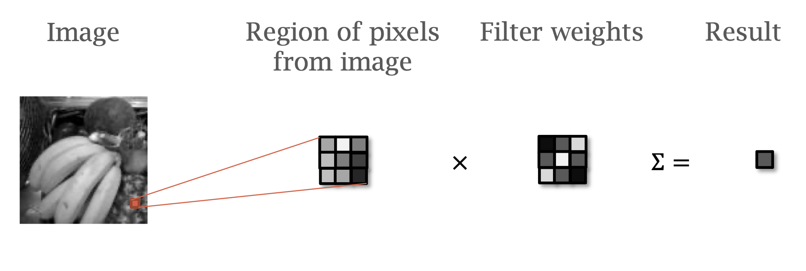

::: notes
We have seen this operation for image smoothing, getting gradients, etc.
We can perform convolution using matrix multiplication.
:::

## Convolution {data-auto-animate="true"}

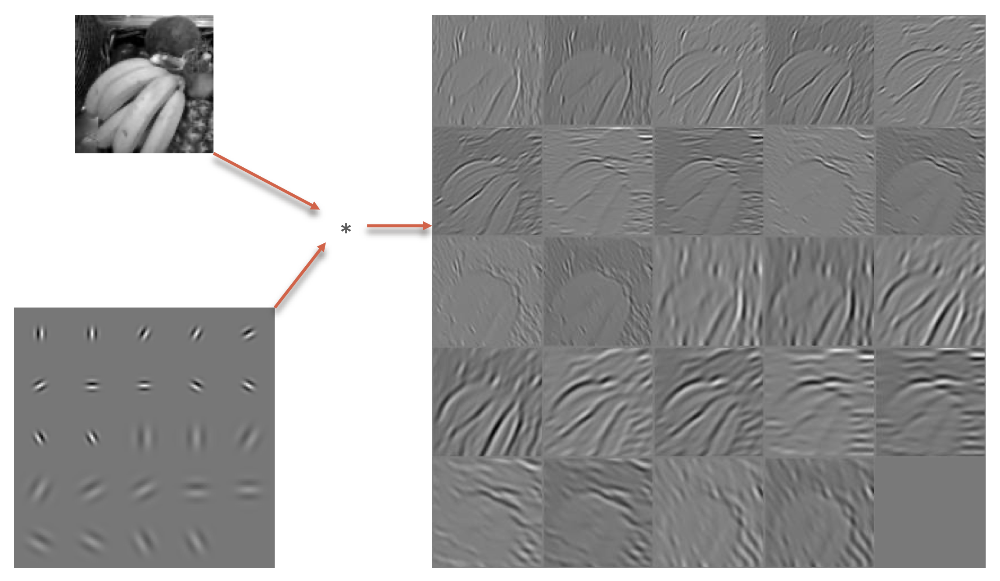

::: notes
Gabor filters, named after Dennis Gabor, is a linear filter used for texture analysis.
Rotated sinusoids, modulated by a Gaussian, are used to create a Gabor filter.
Arguably model some responses in the visual cortex.

Outputs show the filter response at each position.
:::

## Convolution {data-auto-animate="true"}

Convolution detects features in a _position independent_ manner.

Convolutional neural networks **learn** _position independent_ filters.

## Recap: Fully Connected Layer {data-auto-animate="true"}

Each hidden unit is fully connected to all inputs.


::: notes
Look at all the red connections.
:::

## Convolution {data-auto-animate="true"}

Each hidden unit is only connected to inputs in its local neighbourhood.

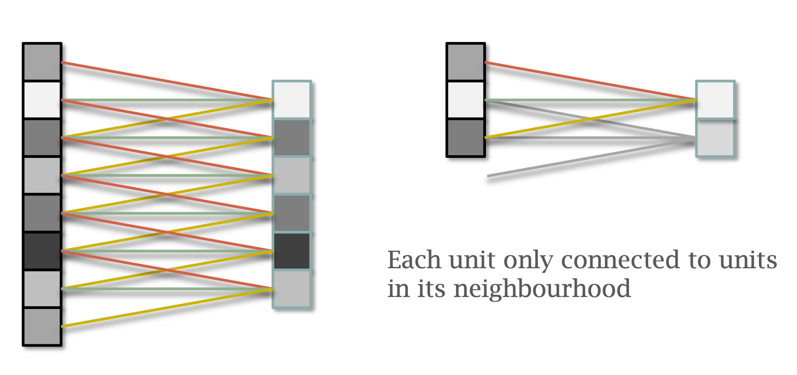

::: notes
Look at the connections coming back from the hidden unit.
:::

## Convolution {data-auto-animate="true"}

Each group of weights is shared between all units in the layer.

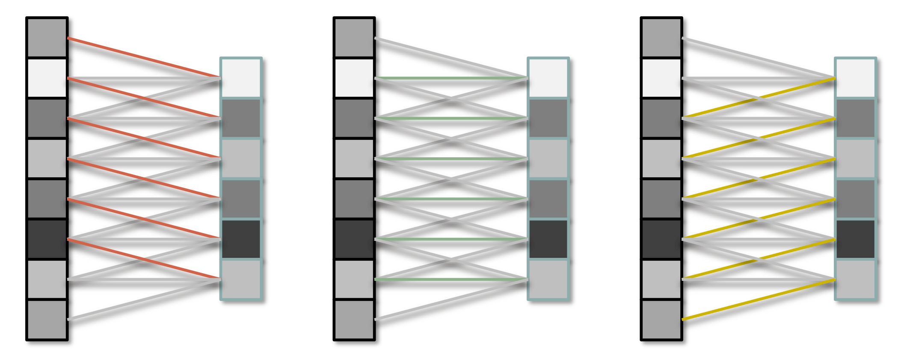

::: notes
red weights have the same value, as do green, as do yellow.
:::

## Convolution {data-auto-animate="true"}

The values of the weights form a **filter**.

For practical computer vision, more than one filter must be used to extract a variety of features.

## Convolution {data-auto-animate="true"}

::: columns
::::: column

:::::
::::: column
Multiple filter weights.

Output is image with multiple channels.
:::::
:::

::: notes
RGB has 3 channels - feature images can have 100s of channels
:::

## Convolution {data-auto-animate="true"}

Convolution can be expressed as multiplication by weight matrix.

$$
y = f(Wx + b)
$$

::: notes
It's a matrix multiplication, but the weights are repeated to achieve this operation.
:::

## Convolution {data-auto-animate="true"}

In subsequent layers, each filter connects to pixels in **all** channels in previous layer.

::: notes
eg. one filter operates on the R, G and B channels of input. And so on for feature images with multiple channels.
:::

## Max Pooling {data-auto-animate="true"}

::: columns
::::: column
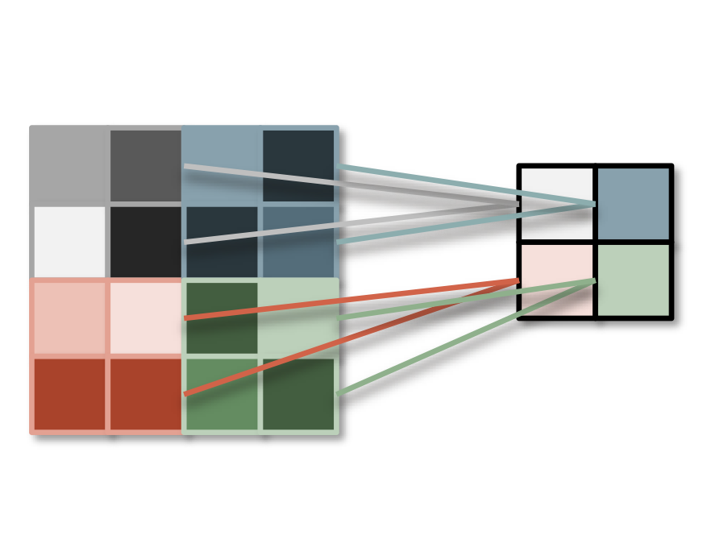
:::::
::::: column
Take the maximum from each $(p \times p)$ pooling region.

Down sample the image by a factor of p.
:::::
:::

::: notes
We often need to downsample the image spatial resolution.
Pooling is a common way to achieve this goal.
:::

## Striding {data-auto-animate="true"}

We can also down-sample using **strided** convolution.

- Generate output for 1 in every $n$ pixels.
- Faster, can work as well as max-pooling.

::: notes
arguably, becoming more popular with deep learning.
:::

# ConvNetJS

Nice Visualisations are avalable at ConvNetJS by Andrej Karpathy.

[https://cs.stanford.edu/people/karpathy/convnetjs/index.html](https://cs.stanford.edu/people/karpathy/convnetjs/index.html)

Source code for the site is available at

::: notes

We have a small lab sheet today ...
We will explore Neural Networks in the lab, using this website.
:::

# Summary

- ImageNet
- Neural Networks
- MNIST Examples
- Convolutional Neural Networks

::: notes
we have motivated Deep Learning - following the success with ImageNet.
we have looked at how a neural network can be built with matrix operations.
and how we train a neural network.
Worked through an example with the MNIST data set
Realised we needed to move to CNNs to get location invarian features.
:::
