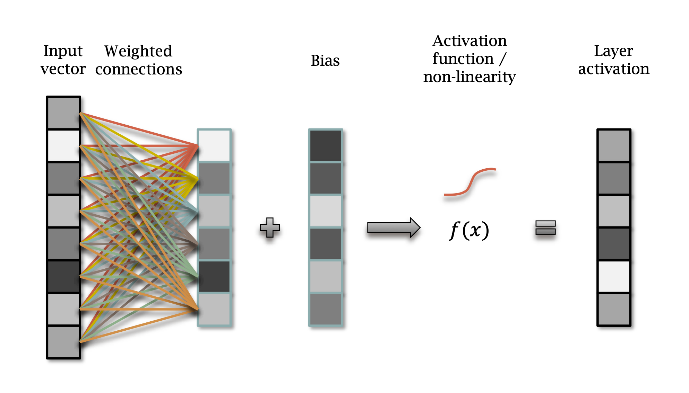

# Content

- ImageNet
- Neural Networks

# ImageNet

::: {style="font-size: 2.0em"}

$> ~$ 1,000,000 images

$> ~$ 1,000 classes

:::

---

Actually...

$> ~$ 10,000,000 images

$> ~$ 1,000 classes

Ground truth annotated manually with Amazon _Mechanical Turk_.

Freely available for research here: [https://www.image-net.org/](https://www.image-net.org/)

---

::: columns
::::: column

:::::
::::: column

:::::
:::

---

ImageNet Top-5 challenge:

You score if ground truth class is one your top 5 predictions!

::: notes
In the case of the top-5 score, you check if the target label is one of your top 5 predictions (the 5 ones with the highest probabilities).
:::

## ImageNet in 2012

::: incremental

- Best approaches used hand-crafted features.
- SIFT, HOGs, Fisher vectors, etc. plus a classifier.
- Top-5 error rate: ~25%

:::

## {data-transition="zoom"}

::: {style="font-size: 2.5em"}

Then the game changed!

:::

## AlexNet

In 2012, Krizhevsky et al. used a deep neural network to achieve a 15% error rate.

::: notes
Difficult to overstate the impact of this on the computer vision community.
AlexNet
Further architectural improvements have reduced the error rate further since then...
:::

## {data-transition="slide"}

Prior approaches used hand _designed_ features.

Neural networks **learn** features that help them classify and quantify images.

# Neural Networks

What _is_ a neural network?

::: notes
Actually, they have been around a long time.
In 1959, Bernard Widrow and Marcian Hoff, developed MADALINE,
the first neural network applied to a real world problem,
using an adaptive filter that eliminates echoes on phone lines.
:::

## Neural Networks

Multiple _layers_.

Data _propagates_ through layers.

_Transformed_ by each layer.

::: notes
we will hold onto the idea of layers for a while.
Each transformation becomes more useful as we progress through the model.
:::

## Neural Network Classifier

::: notes
It is common to represent such models graphically.
So here - an input image is passed to layers, deeper layers, until we get a probability vector.
:::

## Neural Network Regressor

::: notes
Things don't change much for regression - where we want real values rather than categories.
:::

---

::: notes
we learn these weighted connections...
:::

---

::: notes
and we learn the biases.

so each line is a weight and we take the product sum of the inputs.
Using matrix multiplication...
:::

---

- $x$ input vector of size $M$
- $y$ output vector of size $N$
- $W$ weight matrix of size $M \times N$
- $b$ bias vector of size $N$
- $f$ activation function, e.g. ReLU: $\max(x, 0)$

$$y = f(Wx + b)$$

::: notes
Activation functions can be sigmoid, tanh, ReLU, etc.
:::

---

::: {style="font-size: 1.5em"}

$$y = f(Wx + b)$$

:::

::: notes
So, in a nutshell, this is a neural network - just need to repeat this function for each layer.
:::

---

::: notes
graphically, we can see the data flowing through the layers, left to right.
:::

---

$$
\begin{aligned}
y_0 &= f(W_0x + b_0) \\
y_1 &= f(W_1y_0 + b_1) \\
 & \dotsc \\
y_L &= f(W_L y_{L-1} + b_L)
\end{aligned}
$$

---

::: notes

in practical terms - we can flatten an image to a vector of size $M$

:::

---

A Neural Network is, built from _layers_, each of which is:

- a matrix multiplication
- a bias
- a non-linear activation function

<!-- $$\frac{e^{x*i}}{\sum^N*{i=0}} e^{x_i}$$ -->
