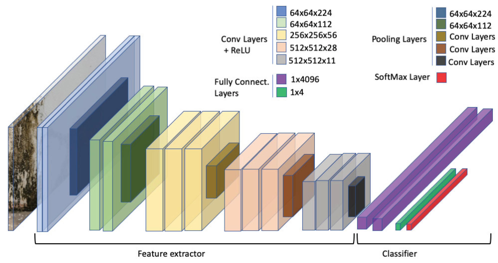

# Content

- Convolutional Neural Network (CNN)
- Transfer Learning
- Tricks of the Trade
- Work in the Field

# Convolutional Neural Network (CNN)

A simplified LeNet for MNIST digits.

- Gradient Based Learning Applied to Document Recognition. LeCun, et al. 1998

## Images as Tensors {data-auto-animate="true}

Images are sampled on a 2D grid.

::: incremental

- Greyscale 2D $h~ \times ~w$
- RGB Images have a 3rd _channel_ dimension.
- Feature images, inside the network, can have many channels.

:::

::: notes
before we step into the design of the network, we need to introduce the notion of a tensor.
:::

## Images as Tensors {data-auto-animate="true}

In Pytorch, the channel dimension is **before** the spatial dimensions.

$$C~ \times ~H~ \times ~W$$

::: notes
This is not true for all frameworks - and can cause confusion!
:::

## Images as Tensors {data-auto-animate="true}

When training Neural Networks, we use mini-batches.

$$S~ \times ~C~ \times ~H~ \times ~W$$

Hence, we pass **4D** Tensors to the network.

::: notes
And this is why we have these particular shaped arrays...
:::

## LeNet for MNIST


::: notes
definitely simplified - original paper had more layers.
talking through the network
image n*n, filter f*f, >> n - f + 1
:::

## MNIST CNN in PyTorch {data-auto-animate="true"}

```{.python data-line-numbers="1-8|1-3|4-5|6|7-8"}
class Model(torch.nn.Module):
    def __init__(self):
        super().__init__()
        self.conv1 = nn.Conv2d(1, 20, kernel_size=5)
        self.conv2 = nn.Conv2d(20, 50, kernel_size=5)
        self.pool = nn.MaxPool2d(2, 2)
        self.fc1 = nn.Linear(800, 256)
        self.output = nn.Linear(256, 10)
```

::: notes
conv2d: in_channels, out_channels, kernel_size
why 800? 4x4x50 = 800
why 10? 10 classes
:::

## MNIST CNN in PyTorch {data-auto-animate="true"}

```{.python data-line-numbers="1-8|3-4|5|6-8"}
...
    def forward(self, x):
        x = self.pool(F.relu(self.conv1(x)))
        x = self.pool(F.relu(self.conv2(x)))
        x = x.view(-1, 800)
        x = F.relu(self.fc1(x))
        x = self.output(x)
        return x
```

::: notes
and the forward method...
we call the pool method twice - once for each convolutional layer
then we flatten the output - why 800? 4x4x50 = 800
and carry on out with linear layers
:::

---

After 300 iterations over training set: **99.21%** validation accuracy.

| Model       | Error |
| ----------- | ----- |
| FC64        | 2.85% |
| FC256-FC256 | 1.83% |
| SimpLeNet   | 0.79% |

:::notes
I have attached the simplenet name to the example we have just looked at.
:::

## Learned Kernels {data-auto-animate="true"}


::: notes
It is really interesting to see how the network learns the kernels.
From the ImageNet paper.
You can see the upper part looks like Gabor filters...
The lower half understands colour...
Network was trained on 2 GPUs to explain the split look.
:::

---


::: notes
Zeiler 14: Visualizing and Understanding Convolutional Networks
These are images of the activations of the convolutional layers.
We can see that middle layers respond to texture patterns.

:::

---


::: notes
Zeiler 14: Visualizing and Understanding Convolutional Networks
Going deeper...
We can see now that later layers respond to high level structure patterns.
:::

# Transfer Learning

Original AlexNet trained for 90 epochs, using 2 GPUs and took 6 days!

::: notes
I can't wait...
GTX 580
What about the energy consumption?
:::

## Pre-Trained Networks {data-auto-animate="true"}

The term "Transfer Learning" simply means using a _pre-trained_ network to save on training.

::: incremental

- Motivation enough to use a pre-trained network.
- but, there are bigger considerations.
- What about data?

:::

::: notes
could save hours or days of training time.
:::

## Pre-Trained Networks {data-auto-animate="true"}

The greatest barrier to supervised machine learning is the lack of **labelled** data.

::: incremental

- use a network trained on one task to solve another problem
- greatly reduces the requirement for labelled data

:::

::: notes
How much human effort to label 10+ million images?
How much effort to label the segmentation boundaries of  
:::

---

Researchers have developed neural network architectures for Computer Vision tasks.

::: incremental

- The parameters of these networks have been made available for further research.

:::

---

What can we use transfer learning for?

::: incremental

- classifying images not part of the original ImageNet dataset.
- object detection
- boundary detection

:::

::: notes
in other words - transfer learning is applicable for every task we have seen so far.
:::

## VGG16 {data-auto-animate="true"}

The **VGG** group at Oxford university trained _VGG-16_ and _VGG-19_ for ImageNet classification.

::: notes
Visual Geometry Group
One such model is VGG 16
We will use VGG-16; the 16-layer model
:::

## VGG16 {data-auto-animate="true"}

VGG [Karen Simonyan & Andrew Zisserman, 2014] is a good choice for a first step in transfer learning.

It has a relatively simple architecture:

- Convolutional layers, increasing in depth, decreasing spatially.
- fully-connected layers for classification.
- Max-pooling layers.
- ReLU activation functions.

::: notes
So, just what we have discussed so far...
:::

## VGG16 {data-auto-animate="true"}

{width="90%"}

## VGG16 {data-auto-animate="true"}

This kind of architecture works well for many Computer Vision tasks.

- Small convolutional filters (3x3)
- Max-pooling layers
- ReLU activation functions

::: notes
We have looked at lots of 3x3 kernel examples so far - but these have been designed for a specific task. Now we are looking at kernels learnt from data.
:::

## Transfer Learning

Two strategies for transfer learning are:

::: incremental

- Fine _tuning_ the **whole** network on new data, with a small _learning rate_.
- Leave all the early layers as is and use as a _feature extractor_.
- In both cases, we usually have to replace the last fully-connected layers.

:::

::: notes
We usually have to replace the last layers to fit our own data - do we have the same number of tasks? Are we doing classification?
:::

## Transfer Learning

::: columns
::::: column

:::::
::::: column
There are examples of both fine tuning and feature extraction at the example repository:

[https://github.com/uea-teaching/Deep-Learning-for-Computer-Vision](https://github.com/uea-teaching/Deep-Learning-for-Computer-Vision)

:::::
:::

::: notes
I won't step through all the code here, but you can explore in your own time.
I also include an example using ResNet, probably the most popular network in the literature.
:::

# Tricks of the Trade

::: notes
How to get successful results in a short time?
:::
