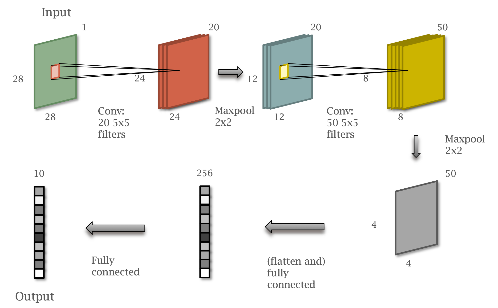
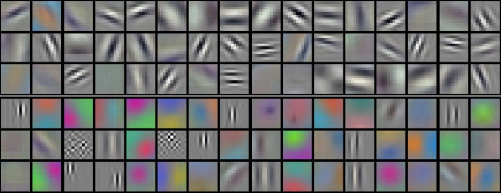
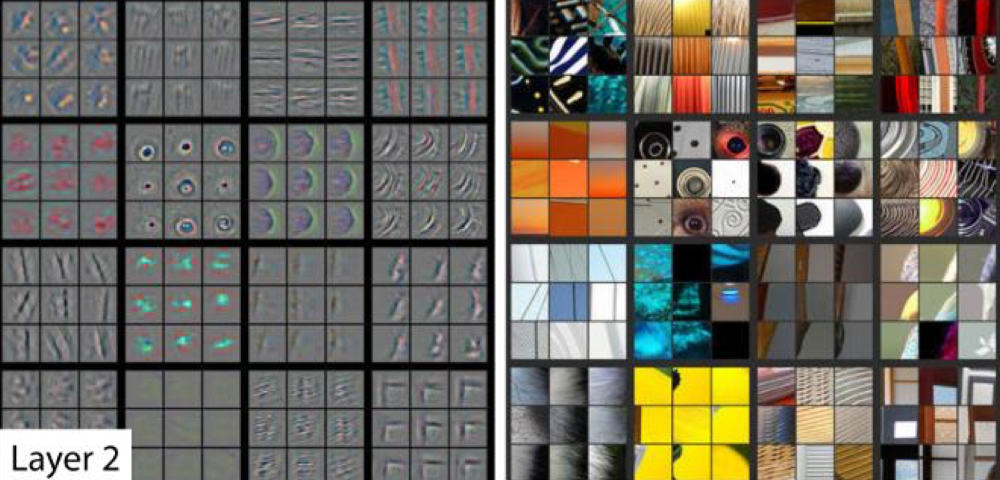
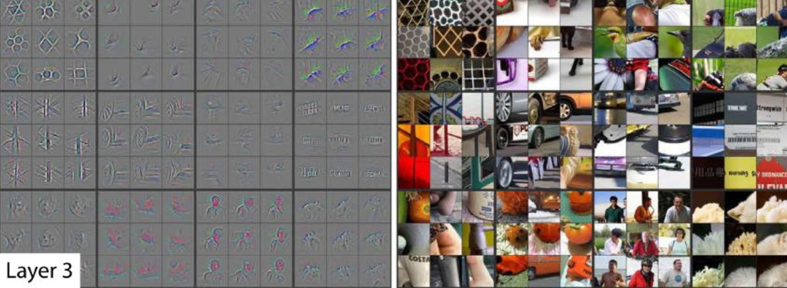
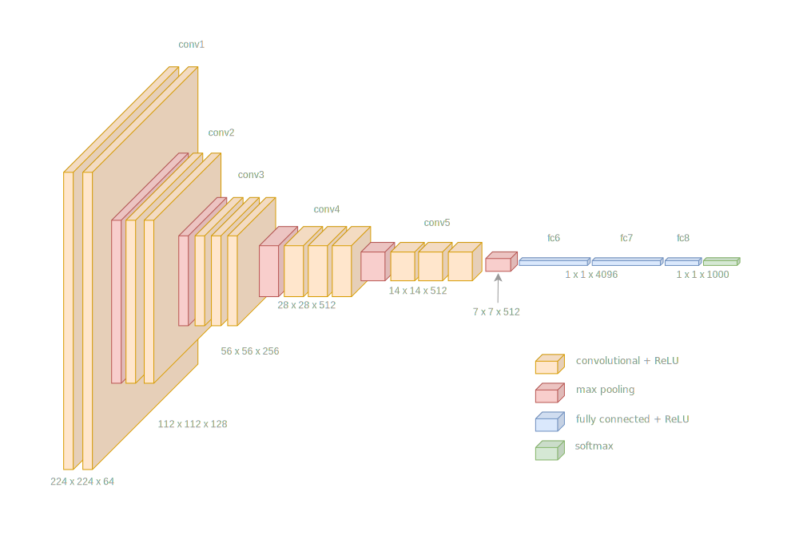
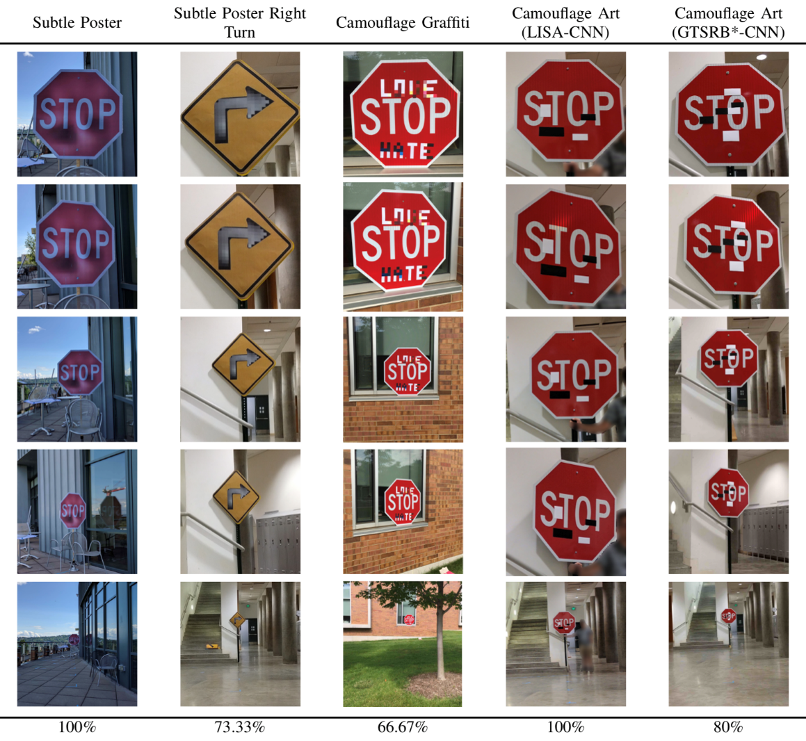
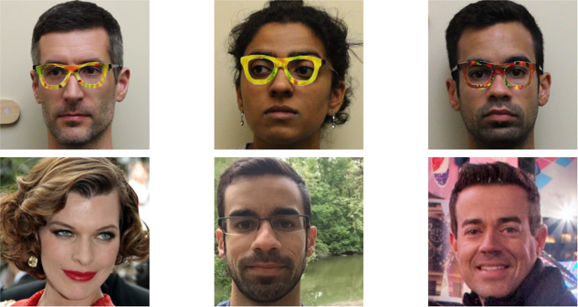
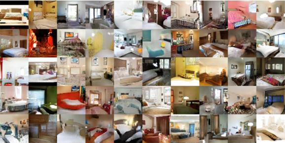
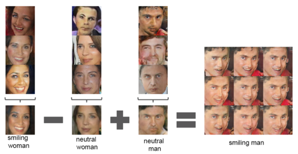
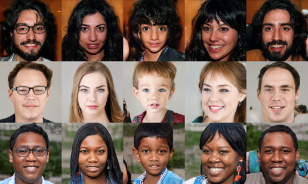

# Content

- Convolutional Neural Network (CNN)
- Transfer Learning
- Tricks of the Trade
- Work in the Field

# Convolutional Neural Network (CNN)

A simplified LeNet for MNIST digits.

- Gradient Based Learning Applied to Document Recognition. LeCun, et al. 1998

## Images as Tensors {data-auto-animate="true}

Images are sampled on a 2D grid.

::: incremental

- Greyscale 2D $h~ \times ~w$
- RGB Images have a 3rd _channel_ dimension.
- Feature images, inside the network, can have many channels.

:::

::: notes
before we step into the design of the network, we need to introduce the notion of a tensor.
:::

## Images as Tensors {data-auto-animate="true}

In Pytorch, the channel dimension is **before** the spatial dimensions.

$$C~ \times ~H~ \times ~W$$

::: notes
This is not true for all frameworks - and can cause confusion!
:::

## Images as Tensors {data-auto-animate="true}

When training Neural Networks, we use mini-batches.

$$S~ \times ~C~ \times ~H~ \times ~W$$

Hence, we pass **4D** Tensors to the network.

::: notes
And this is why we have these particular shaped arrays...
:::

---

{width=80%}

::: notes
definitely simplified - original paper had more layers.
talking through the network
image n*n, filter f*f, >> n - f + 1
:::

## MNIST CNN in PyTorch {data-auto-animate="true"}

```{.python data-line-numbers="1-8|1-3|4-5|6|7-8"}
class Model(torch.nn.Module):
    def __init__(self):
        super().__init__()
        self.conv1 = nn.Conv2d(1, 20, kernel_size=5)
        self.conv2 = nn.Conv2d(20, 50, kernel_size=5)
        self.pool = nn.MaxPool2d(2, 2)
        self.fc1 = nn.Linear(800, 256)
        self.output = nn.Linear(256, 10)
```

::: notes
conv2d: in_channels, out_channels, kernel_size
why 800? 4x4x50 = 800
why 10? 10 classes
:::

## MNIST CNN in PyTorch {data-auto-animate="true"}

```{.python data-line-numbers="1-8|3-4|5|6-8"}
...
    def forward(self, x):
        x = self.pool(F.relu(self.conv1(x)))
        x = self.pool(F.relu(self.conv2(x)))
        x = x.view(-1, 800)
        x = F.relu(self.fc1(x))
        x = self.output(x)
        return x
```

::: notes
and the forward method...
we call the pool method twice - once for each convolutional layer
then we flatten the output - why 800? 4x4x50 = 800
and carry on out with linear layers
:::

---

After 300 iterations over training set: **99.21%** validation accuracy.

| Model       | Error |
| ----------- | ----- |
| FC64        | 2.85% |
| FC256-FC256 | 1.83% |
| SimpLeNet   | 0.79% |

:::notes
I have attached the simplenet name to the example we have just looked at.
:::

## Learned Kernels {data-auto-animate="true"}



::: notes
It is really interesting to see how the network learns the kernels.
From the ImageNet paper.
You can see the upper part looks like Gabor filters...
The lower half understands colour...
Network was trained on 2 GPUs to explain the split look.
:::

---



::: notes
Zeiler 14: Visualizing and Understanding Convolutional Networks
These are images of the activations of the convolutional layers.
We can see that middle layers respond to texture patterns.

:::

---



::: notes
Zeiler 14: Visualizing and Understanding Convolutional Networks
Going deeper...
We can see now that later layers respond to high level structure patterns.
:::

# Transfer Learning

Original AlexNet trained for 90 epochs, using 2 GPUs and took 6 days!

::: notes
I can't wait...
GTX 580
What about the energy consumption?
:::

## Pre-Trained Networks {data-auto-animate="true"}

The term "Transfer Learning" simply means using a _pre-trained_ network to save on training.

::: incremental

- Motivation enough to use a pre-trained network.
- but, there are bigger considerations.
- What about data?

:::

::: notes
could save hours or days of training time.
:::

## Pre-Trained Networks {data-auto-animate="true"}

The greatest barrier to supervised machine learning is the lack of **labelled** data.

::: incremental

- use a network trained on one task to solve another problem
- greatly reduces the requirement for labelled data

:::

::: notes
How much human effort to label 10+ million images?
How much effort to label the segmentation boundaries of  
:::

---

Researchers have developed neural network architectures for Computer Vision tasks.

::: incremental

- The parameters of these networks have been made available for further research.

:::

---

What can we use transfer learning for?

::: incremental

- classifying images not part of the original ImageNet dataset.
- object detection
- boundary detection

:::

::: notes
in other words - transfer learning is applicable for every task we have seen so far.
:::

## VGG16 {data-auto-animate="true"}

The **VGG** group at Oxford university trained _VGG-16_ and _VGG-19_ for ImageNet classification.

- Karen Simonyan & Andrew Zisserman, (2014)

::: notes
Visual Geometry Group
One such model is VGG 16
We will use VGG-16; the 16-layer model
:::

## VGG16 {data-auto-animate="true"}

VGG-16 is a good choice for a first step in transfer learning.

It has a relatively simple architecture:

- Convolutional layers, increasing in depth, decreasing spatially.
- fully-connected layers for classification.
- Max-pooling layers.
- ReLU activation functions.

::: notes
So, just what we have discussed so far...
:::

## VGG16 {data-auto-animate="true"}



## VGG16 {data-auto-animate="true"}

This kind of architecture works well for many Computer Vision tasks.

- Small convolutional filters (3x3)
- Max-pooling layers
- ReLU activation functions

::: notes
We have looked at lots of 3x3 kernel examples so far - but these have been designed for a specific task. Now we are looking at kernels learnt from data.
:::

## Transfer Learning

Two strategies for transfer learning are:

::: incremental

- Fine _tuning_ the **whole** network on new data, with a small _learning rate_.
- Leave all the early layers as is and use as a _feature extractor_.
- In both cases, we usually have to replace the last fully-connected layers.

:::

::: notes
We usually have to replace the last layers to fit our own data - do we have the same number of tasks? Are we doing classification?
:::

## Transfer Learning

::: columns
::::: column

:::::
::::: column
There are examples of both fine tuning and feature extraction at the example repository:

[https://github.com/uea-teaching/Deep-Learning-for-Computer-Vision](https://github.com/uea-teaching/Deep-Learning-for-Computer-Vision)

:::::
:::

::: notes
I won't step through all the code here, but you can explore in your own time.
I also include an example using ResNet, probably the most popular network in the literature.
:::

# Tricks of the Trade

Best practice...

::: notes
How to get successful results in a short time?
:::

## Data Standardisation {data-auto-animate="true"}

Ensure zero-mean and unit standard deviation.

- In numerically diverse data, learning will be dominated by larger values.
- Arguably less important with image data.
- Many pre-trained networks expect standardised data.

::: notes
as many images are well exposed 8 bit origination...
:::

## Data Standardisation {data-auto-animate="true"}

For regression tasks, we need to standardise the output data too.

::: incremental

- Don't forget to invert the predictions back to the original scale.

:::

::: notes
again this is common - and recommended for regression tasks.
:::

## Data Standardisation {data-auto-animate="true"}

Extract sample data: pixel values in the case of images.

Compute the mean and standard deviation of the samples.

$$
x' = \frac{x - \mu(x)}{\sigma(x)}
$$

::: notes
how to do it?
:::

## Batch Size {data-auto-animate="true"}

Small batch sizes, approximately 1-10.

::: incremental

- Small batch size results in regularisation, with lower ultimate error.
- Low memory requirements.
- Need to compensate with lower learning rate.
- More epochs required.

:::

::: notes
small batch - Goodfellow 16
Batch size is ultimately constrained by available memory, but below that, we can make choices.
The loss landscape is spikier with small batch sizes.
:::

## Batch Size {data-auto-animate="true"}

Large batch sizes, greater than 500-1000.

::: incremental

- Fast due to high parallelism
- High memory usage - can run out of RAM on large networks.
- Won’t reach the same error rate as smaller batches.
- may not learn at all...

:::

::: notes
only fast if cuda cores are available.
:::

## Batch Size {data-auto-animate="true"}

Typical choice around 64-256, lots of experiments use ~100.

::: incremental

- Effective training - reaches acceptable error rate or loss.
- Balanced between speed and memory usage.

:::

::: notes
Learns reasonably quickly – in terms of improvement per epoch
~100 seems to work well; gets good results
:::

## Batch Size {data-auto-animate="true"}

Increasing mini-batch size will improve performance up to the point where all GPU units are in use.

Increasing it further will not improve performance; it will reduce accuracy!

## Learning Rate {data-auto-animate="true"}

The amount of change applied to the parameters at each iteration.

::: incremental

- Small learning rates can be slow to train.
- Small learning rates can get stuck in local minima.
- Large learning rates can be unstable and cause divergence.
- Experiment with different learning rates.
- Increase or decrease by a factor of 10.

:::

::: notes
using a decreasing learning rate over the time period is a powerful technique.
:::

## DropOut {data-auto-animate="true"}

Over-fitting is a well-known problem in machine learning.

- Dropout _reduces_ over-fitting.

::: notes
... affects neural networks particularly.
A model over-fits when it is very good at correctly predicting samples in the training set
but fails to generalise to samples in the test set.
:::

## DropOut {data-auto-animate="true"}

During training, randomly choose units to _'drop out'_.

::: incremental

- Set output to 0, with probability $P$, usually around 0.5.
- Compensate by multiplying other values by $\frac{1}{1 - P}$.
- Turn off dropout during testing.

:::

## DropOut {data-auto-animate="true"}

Activates a different subset of units for each sample.

::: incremental

- Causes units to learn more robust features.
- Units can't rely on the presence of specific features.
- Emulates an ensemble of models.

:::

::: notes
Geoffrey Hinton
:::

## DropOut {data-auto-animate="true"}

"I went to my bank. The tellers kept changing and I asked one of them why?
He said he didn’t know but they got moved around a lot.
I figured it must be because it would require cooperation between employees
to successfully defraud the bank...
This made me realise that randomly removing a different subset of
neurons on each example would prevent conspiracies and thus reduce over fitting."

::: notes
Geoff Hinton on the inspiration for dropout...
:::

## Batch normalisation {data-auto-animate="true"}

Batch normalization (Ioffe, et al. 2015).

::: incremental

- Recommended in most cases.
- Lets you build deeper networks.
- Speeds up training; loss and error drop faster per epoch.

:::

## Batch normalisation {data-auto-animate="true"}

Apply between internal layers.

- Use `BatchNorm2d` with a convolutional layer.
- Use `BatchNorm1d` with a fully-connected layer.

::: notes
this is for pytorch, other frameworks may have different implementations.
Originally, apply after convolutional, before the non-linearity.
:::

## Batch normalisation {data-auto-animate="true"}

Standardise **activations** per-channel _between_ network layers.

Solves problems caused by _exponential_ growth or shrinkage of layer activations in deep networks.

::: notes
the same operation we recommended for data outside of the network.
This time - between the layers.
if an activation doubles - for say n=50 layers it ends up at x\*2^50.
resulting in numerical errors.
:::

## Dataset augmentation {data-auto-animate="true"}

Reduce over-fitting by enlarging training set.

::: incremental

- _Artificially_ modify **existing** training samples to make new ones.
- Apply transformations such as move, scale, rotate, reflect, etc.

:::

::: notes
This is actually a big area of research, and there are some really clever augmentations of datasets.
Another related area is creating entirely new synthetic datasets, to give perfect ground truth.
:::

# Work in the Field

Some interesting work in the field...

::: notes
So to wrap up, I want to show you a few selections from the research community.
:::

---

::: columns
::::: column

:::::
::::: column
Robust Physical-World Attacks on Deep Learning Models. Eykholt, et al. 2018.
:::::
:::

::: notes
Deep learning for computer vision is a powerful tool, but we don't always get models that are as smart as we want. This work showed how easily a network could be fooled by making small changes to images of road signs...
:::

---

Accessorize to a Crime: Real and Stealthy Attacks on State-of-the-Art Face Recognition. Sharif, et al. 2016.

{width="80%"}

::: notes
Here, researchers fooled facial recognition networks by constructing spectacles that convinced the network person A had identity B. Milla Jovovich.
:::

## Generative Adversarial Networks {data-auto-animate="true"}

Generative Adversarial Nets. Goodfellow et al. 2014.

Train **two** networks; one given random parameters to _generate_ an image, another to _discriminate_ between a generated image and one from the training set.

::: notes
The seminal work for this technique - just a small paper, 6 pages or so... but very influential.
A beautiful idea - has proved very popular since...
forger and detective...
:::

---

Unsupervised representation Learning with Deep Convolutional Generative Adversarial Nets. Radford, et al. 2015.

{width="80%"}

::: notes
here, images of bedrooms are generated from random input vectors.
:::

---

{width="80%"}

::: notes
vectors that produced a smiling woman minus the mean woman vector + mean man vector = smiling man.
:::

---

A Style-Based Generator Architecture for Generative Adversarial Networks. Karras, et al. 2018

{width="80%"}

::: notes
by understanding the distribution of the latent generator code Karras showed some stunning images of faces.
trained on flickr images - real people.
:::

# Summary

- Convolutional Neural Networks
- Transfer Learning
- Useful techniques
- Deep learning examples.

Reading:

- Deep Learning, Goodfellow et al: https://www.deeplearningbook.org
- the papers mentioned in the lecture
- visualisations of network training: https://losslandscape.com

::: notes

:::
