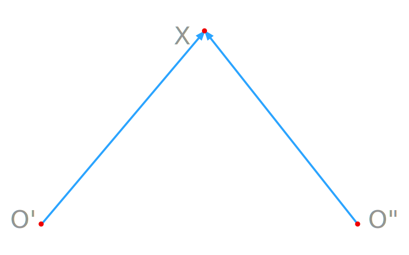
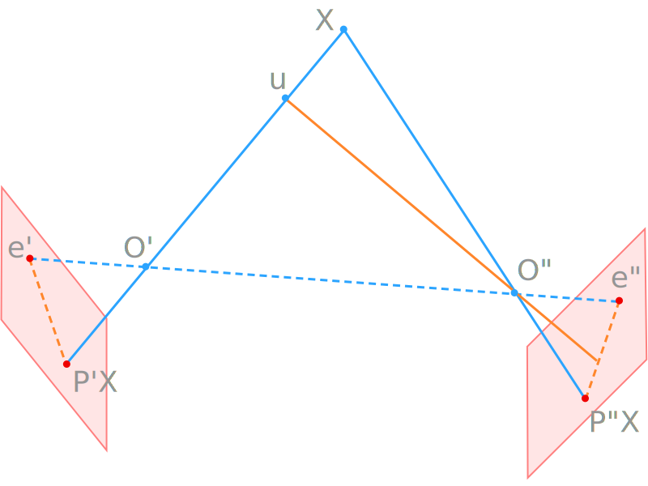

# Contents {data-transition="convex"}

- Motivation
- Epipolar Geometry
- Epipolar Elements
- Point Correspondences

# Motivation {data-auto-animate="true}

Given $x'$ in the first image, **find** the corresponding point $x''$ in the second image.

::: notes
We can make a motivating statement.
For a while now we have been talking about finding features in images.
And lately, we have been talking about finding correspondences between
image features...
now, if we find a promising feature in the first image -
how do we go about finding the correspondence in the second image?
:::

## {data-auto-animate="true}

- Coplanarity constraint
- Intersection of two corresponding rays
- The rays lie in a 3D plane

{width=60%}

::: notes
A typical arrangement - one camera with projection centre on the
left and the other on the right.
When they observe the same point, the two rays will intersect in a plane.
This is the coplanarity constraint we used to derive the
fundamental matrix and the essential matrix.
This will also play a role in the epipolar geometry we will talk about now.

So when we can see the point in image 1, then we need to search for it in image 2?
Where do I search? The whole image? Or, can I reduce the search space?
:::

# Epipolar Geometry {data-auto-animate="true}

- describe _geometric_ relations in image pairs
- _efficient_ search and prediction of corresponding points
- search space reduced from 2D to 1D

::: notes
epipolar geometry can help us with the search.
This takes into account the baseline vectors, where points are mapped to,
how the epipolar plane intersects the image planes.
It turns out that this geometry can reduce the search from the whole image
to just one line in image 2.
This has a couple of advantages: most obviously, it is faster, but also it reduces
the possibility of making incorrect associations...
many images have multiple similar features.
:::

## Epipolar Geometry {data-auto-animate="true}

{width=80%}

::: notes
Lets look at some elements of this figure.
epipolar axis between projection centres
epipolar plane formed by the projection centres and the observed point
epipoles - the projection of the other camera's projection centre
epipolar lines - intersection of the epipolar plane with the image planes

Look at the projection of X in camera 1. We don't know how far away it is, it could be at U. But that point can only exist on the epipolar line in image 2.
:::

## Epipolar Geometry {data-auto-animate="true}

Epipolar elements:

::: incremental

- **epipolar axis** $\mathcal{B} = (O' O'')$
- **epipolar plane** $\mathcal{E} = (O' O'' X)$
- **epipoles** $e' = (O'')', e'' = (O')''$
- **epipolar lines** $\mathcal{L}'(X) = (O'' X)', \mathcal{L}''(X) = (O' X)''$

:::

::: notes
Again, with labels...
epipolar axis between projection centres
epipolar plane formed by the projection centres and the observed point, different for each observation.
epipoles - the projection of the other camera's projection centre
epipolar lines - projection of the ray from the other camera's projection centre to the observed point.
:::

## {data-auto-animate="true}

We can also write the **epipoles** as:

$$
e' = (O' O'') \cap \mathcal{E}',
\quad e'' = (O' O'') \cap \mathcal{E}''
$$

And the **epipolar lines** as:

$$
\mathcal{L}'(X) = \mathcal{E} \cap \mathcal{E}',
\quad \mathcal{L}''(X) = \mathcal{E} \cap \mathcal{E}''
$$

::: notes
this notation describes the intersections
:::

## {data-auto-animate="true}

{width=80%}

::: notes
to review the figure, I'll just point out all these elements again...
:::

## In the Epipolar Plane {data-auto-animate="true}

Assuming a distortion free lens:

::: incremental

- The projection centres $O'$ and $O''$.
- The observed point $X$.
- The epipolar lines, $\mathcal{L}'(X)$ and $\mathcal{L}''(X)$.
- The epipoles, $e'$ and $e''$.
- The image points $x'$ and $x''$.

:::

::: notes
all of these elements are in the epipolar plane.
:::

## In the Epipolar Plane {data-auto-animate="true}

- The projection centres $O'$ and $O''$.
- The observed point $X$.
- The epipolar lines, $\mathcal{L}'(X)$ and $\mathcal{L}''(X)$.
- The epipoles, $e'$ and $e''$.
- The image points $x'$ and $x''$.

**All lie in the epipolar plane** $\mathcal{E}$.

::: notes
This is especially important for the task of predicting correspondences.
And this is what allows us to restrict the search space to a line in image 2.
So, the epipolar plane is a constraining element for the search.
:::

## Predicting Point Correspondence {data-auto-animate="true}

Task: Predict the location of $x''$ given $x'$.

- For the epipolar plane $\mathcal{E} = (O'O''X)$
- The intersection of $\mathcal{E}$ and the second image plane $\mathcal{E}''$ yields the epipolar line $\mathcal{L}''(X)$
- The corresponding point $x''$ lies on that epipolar line $\mathcal{L}''(X)$.
- Search space is reduced from 2D to 1D.

::: notes
with all these elements all we need to do is search along the epipolar line.
In practice, it would be a good idea to lok either side by a pixel or two...
:::

# Computing the Elements of Epipolar Geometry {data-auto-animate="true}

::: notes
We have discussed the properties and the advantages of epipolar geometry.
How do we compute these elements?
:::

## Computing the Elements of Epipolar Geometry {data-auto-animate="true}

- We described the important elements geometrically.
- We will _compute_ them using the **projection** matrices and the **fundamental** matrix.

::: notes
we are going to need the projection matrices from last week and the fundamental matrix from earlier.
:::

## Epipolar Axis {data-auto-animate="true}

The direction of the epipolar axis can be derived directly from the projection centres.

$$
b = X_{O'} - X_{O''}
$$

The vector $b$ is _homogeneous_ and the equation expresses that we know only the _direction_, **not** the _length_.

::: notes
This is relatively straightforward. We can ge the equation for the epipolar axis from the projection centres.
:::

## Epipolar Lines {data-auto-animate="true}

Image points lie on the epipolar lines.

$$
x' \in \mathcal{L}' , \quad x'' \in \mathcal{L}''
$$

::: notes
next, we want to compute the epipolar lines.
and now we are in the image plane.
:::

## Epipolar Lines {data-auto-animate="true}

For $x'$:

$$
x^{'T} \mathcal{L}' = 0
$$

::: notes
you may remember that to find if a point lies on a line we just need the dot product equal to zero.

So this is the constraint that must be observed if the point is on the epipolar line.

From the definition of the line equation:
ax + by + c = 0 , l . x = 0 where l = [a b c] is the line and x = [x y 1] is a point on the line.
:::

## Epipolar Lines {data-auto-animate="true}

For $x'$:

$$
x^{'T} \mathcal{L}' = 0
$$

We can exploit the coplanarity constraint for $x'$ and $x''$:

$$
x^{'T}  \underbrace{Fx''}_{\mathcal{L}'} = 0
$$

::: notes
So the epipolar line is a projection into the image plane of the ray from the other camera,
so we can use the coplanarity constraint,
because we know these rays are converging to the observed point.

So we can see that the line in the first image plane is
the fundamental matrix multiplied by point in the second plane.

NOW, just by comparing terms, we can see that the line is equivalent to Fx''.
:::

## Epipolar Lines {data-auto-animate="true}

We can exploit the coplanarity constraint for $x'$ and $x''$:

$$
x^{'T}  \underbrace{Fx''}_{\mathcal{L}'} = 0
$$

$$
\mathcal{L}' = Fx''
$$

::: notes
This means the epipolar line can be very easily obtained by using the
fundamental matrix and the point in the other image.
So, knowing the point in
image 2, gives me the epipolar line in image 1.
And, of course and can do this for the other line.
:::

## Epipolar Lines {data-auto-animate="true}

The same for $x''$:

$$
\mathcal{L}^{''T} x'' = 0
$$

We can exploit the same constraint $x^{'T}Fx''= 0$ and obtain:

$$
\mathcal{L}^{''T} = x^{'T}F
$$

::: notes
this time we have to take care to use the transpose operator
:::

## Epipolar Lines {data-auto-animate="true}

We can exploit the same constraint $x^{'T}Fx''= 0$ and obtain:

$$
\mathcal{L}^{''T} = x^{'T}F
$$

$$
\mathcal{L}^{''} = F^{T}x^{'}
$$

::: notes
so when we transpose F we get the line - which is our 1d search space.
So this is the key thing that speeds up our search - we just look along the epipolar line.
:::

## Epipolar Lines {data-auto-animate="true}

Image points lie on the epipolar lines, $x' \in \mathcal{L}'$ and $x'' \in \mathcal{L}''$.

- we can exploit the coplanarity constraint $x^{'T}Fx''= 0$.
- which is valid if:

$$
\mathcal{L}' = Fx'' \quad \mathcal{L}'' = F^{T}x'
$$

::: notes
all one one slide - I think the epipolar line is the most useful of the epipolar geometry - certainly for point matching.
:::

## Epipoles {data-auto-animate="true}

The epipoles are the projection of the camera origin onto the other image.

- Both can be computed using the projection matrices.

::: notes
let's look at the epipoles...
:::

## Epipoles {data-auto-animate="true}

The epipoles are the projection of the camera origin onto the other image.

- Both can be computed using the projection matrices.

$$
e' = P'X_{O''} \quad e'' = P''X_{O'}
$$

::: notes
we can get the epipoles directly from the projection matrices.
Just consider the camera origin of the other camera like any other point in the world.
:::

## Epipoles {data-auto-animate="true}

The epipole is the _intersection_ of **all** the epipolar lines in an image.

$$
\forall \mathcal{L}' : e^{'T} \mathcal{L}' = 0 \quad
\forall \mathcal{L}'' : e^{''T} \mathcal{L}'' = 0
$$

::: notes
We can observe another property of the epipoles.
because the epipole is the projection along the epipolar axis - all epipolar lines
pass through the epipole.
Picture the plane pivoting around the epipolar axis, all lines will pass through the epipole.
:::

# Summary {data-auto-animate="true}

- We assumed an uncalibrated camera.
- We discussed Epipolar geometry and epipolar elements.
- Epipolar geometry reduces the correspondence search from 2D to 1D.

Reading:

- Forsyth, Ponce; Computer Vision: A modern approach.
- Hartley, Zisserman; Multiple View Geometry in Computer Vision.

Data:

- [Middlebury Stereo Datasets](https://vision.middlebury.edu/stereo/data/)
- [ETH Zurich 3D](https://www.eth3d.net/overview)

::: notes
For our introduction to epipolar geometry we assumed uncalibrated cameras.
We built on the coplanarity constraint from earlier - and found a stereo geometry
that allowed us to reduce the correspondence search from 2D to 1D.

There is good information in the course text.
And HZ has very detailed text on epipolar geometry.

I have also included a couple of links at the end leading to some stereo datasets.
You might find them interesting and useful if you carry on with computer vision after this year.
:::
