# Contents {data-transition="convex"}

- Motivation
- SIFT - Scale-Invariant Feature Transform
- BRIEF - Binary Robust Independent Elementary Features
- ORB - Oriented FAST Rotated BRIEF

::: notes
Now we are in the second part of talking about visual features...
In the first part we talked about how to compute keypoints - locally distinct point in an image.
Now we are talking about how to describe such a keypoint - or more precisely, how to describe the local area around a keypoint, that allows us to distinguish it from other keypoints.
We will look at 3 approaches. SIFT - the modern standard traditional approach.
We will also look at BRIEF and ORB, which are 'binary' features, which are popular for certain applications when we need to compute features very quickly, for example SLAM.
:::

# Visual Features {data-transition="convex"}

::: columns
::::: column
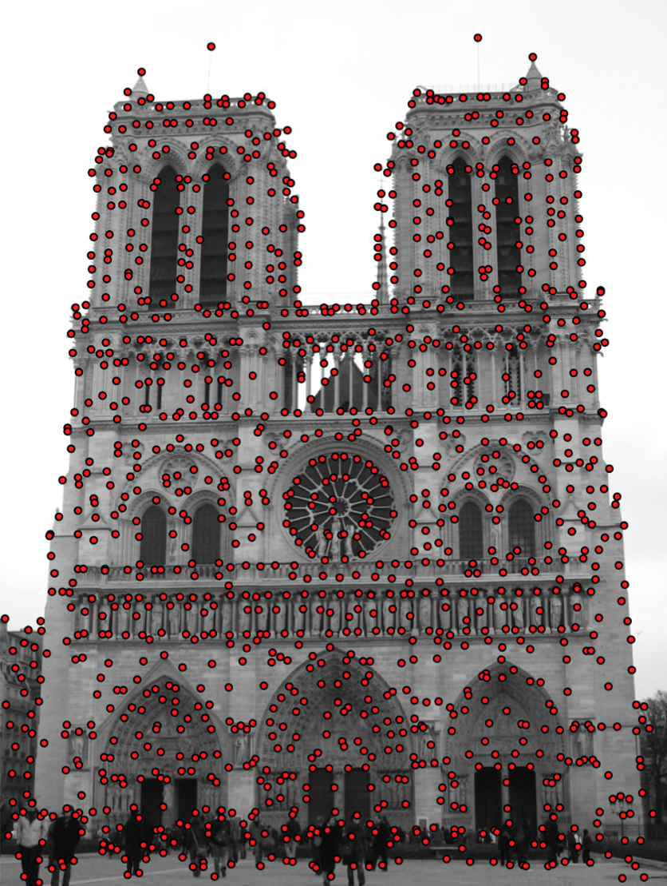{width="80%"}
:::::
::::: column

Why do we want to find image features?

::: incremental

- Image summary.
- Classification.
- Image retrieval.
- 3D reconstruction.

:::

:::::
:::

::: notes
Look at the image...
these red dots are distinct features...
These are points from which I want to do certain tasks.
Maybe a 3D reconstruction - I may not be able to do it for all pixels in an image (too many, no correspondence) - but for a subset.
:::

## {data-transition="convex"}

How do we **describe** keypoints in a way that similar points can be matched?

::: columns
::::: column
{width="80%"}
:::::
::::: column
{width="80%"}
:::::
:::

::: notes
I might want to find where an image was taken with respect to another image.
Here we have two different images - I want to compute, where was the camera?

Now I need to find a certain number or correspondences between the two images,
points I can recognise in both images.

Now I want to discuss how to **describe** these points in a way
that similar points will be able to be matched.
:::

## Keypoint and Descriptor {data-auto-animate="true"}

An important distinction:

::: incremental

- Keypoint is a distinct **location** in an image
- Descriptor is a summary **description** of that neighbourhood.

:::

::: notes
Features have two parts - where is it, and how can we describe the feature - what distinguishes it from a possibly large number of other features?
The keypoint is locally distinct, and we can find it under slightly changing conditions...
The descriptor is a summary of the neighbourhood, a vector of values.
:::

## Keypoint and Descriptor {data-auto-animate="true"}

::: columns
::::: column
{width="90%"}
:::::
::::: column

keypoint: $(x, ~y)$

descriptor _at_ the keypoint:

$$
\begin{bmatrix} 0.02 \\ 0.01 \\ 0.10 \\ 0.05 \\ 0.01 \\ ... \end{bmatrix}
$$

:::::
:::

::: notes
We have so far discussed how to compute the locations of keypoints, how to spot a good point.
We are now going to compute this feature descriptor.
:::

## Descriptors {data-auto-animate="true"}

- HOG: Histogram of Oriented Gradients
- SIFT: Scale Invariant Feature Transform
- SURF: Speeded-Up Robust Features
- GLOH: Gradient Location and Orientation Histogram
- BRIEF: Binary Robust Independent Elementary Features
- ORB: Oriented FAST and rotated BRIEF
- BRISK: Binary Robust Invariant Scalable Keypoints
- FREAK: Fast REtinA Keypoint

... and many more

::: notes
There are many popular descriptors, we have already seen HoG, but there is a huge range of research on visual descriptors and this is just a selection.
:::

## Descriptors {data-transition="slide"}

Describing a keypoint.

::: incremental

- SIFT : Scale-Invariant Feature Transform
- BRIEF : Binary Robust Independent Elementary Features
- ORB : Oriented FAST and Rotated BRIEF

:::

# SIFT {data-transition="slide"}

Scale-Invariant Feature Transform

::: notes
SIFT is the gold standard of feature descriptor - it's been around for about 20 years...
there was some issue with patents - but they have now expired recently - you can find SIFT in many popular libraries.
so let's look at the SIFT descriptor, we can start with some of the properties of SIFT.
:::

## SIFT Features {data-auto-animate="true"}

Image content is transformed into features that are **invariant** to:

- image translation
- image rotation
- image scale

::: notes
these are highly desirable properties of image features - it is unlikely that images are always taken from the same angle or position...
:::

## SIFT Features {data-auto-animate="true"}

SIFT Features are _partially_ invariant to:

- illumination changes
- affine transformations and 3D projections

::: notes
these are gradient based features, so absolute illumination level changes do not change gradient values.
affine and projective transformations occur when we move camera position in our 3D world space.
:::

## SIFT Features {data-auto-animate="true"}

SIFT Features are _suitable_ for detecting visual landmarks:

- from different angles and distances.
- with a different illumination.

::: notes
Think about recognising a microwave oven in a kitchen...
different angles of view, near and far...
SIFT are a very good choice for this type of image data.
:::

## DoG over Scale-Space Pyramid {data-auto-animate="true"}

Over different image pyramid levels:

1. Gaussian smoothing.
2. Difference-of-Gaussians (DoG) and find **extrema**.
3. _Maxima_ suppression for edges.

::: notes
SIFT keypoints start with the difference of Gaussians we discussed earlier.
So quick recap...
This is how we get the keypoints...
:::

## SIFT Features {data-auto-animate="true"}

A SIFT feature is given by a vector computed at a local extreme point in the scale space.

::: {style="font-size: 2em"}
$$ \langle p, s, r, f \rangle$$
:::

::: notes
p : position, s : scale, r : rotation, f : feature
:::

## SIFT Features {data-auto-animate="true"}

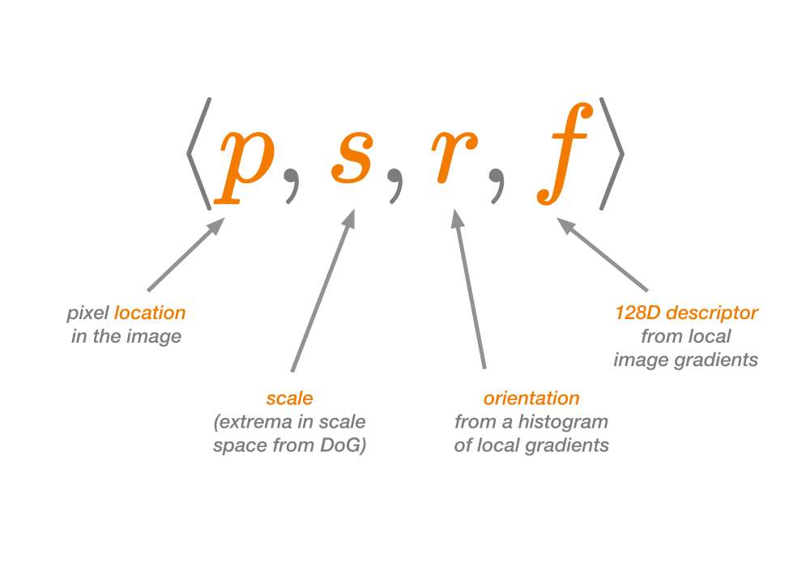

::: notes

:::

## SIFT Features {data-auto-animate="true"}

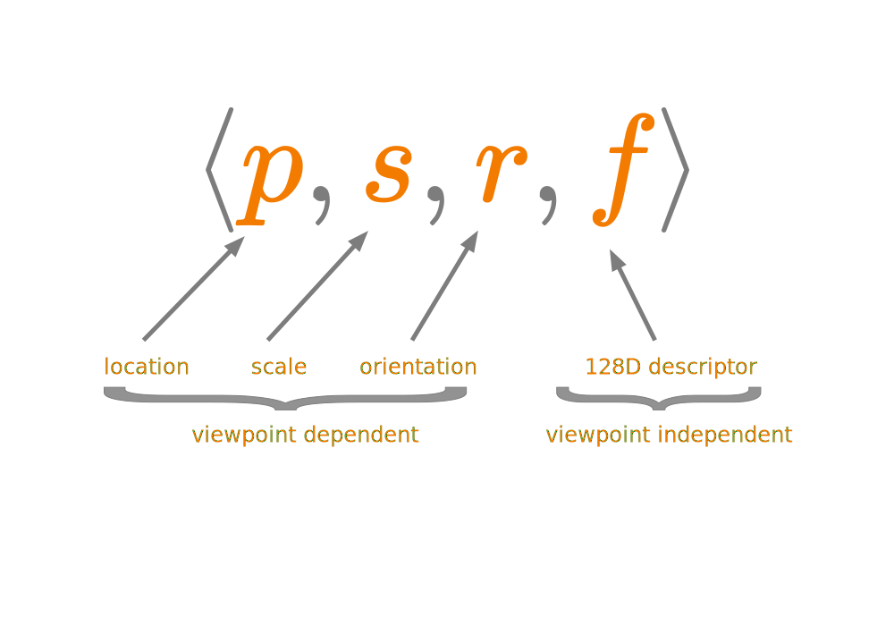

::: notes

:::

## SIFT Features {data-auto-animate="true"}

::: columns
::::: column

:::::
::::: column
From an input image we convert to grey scale then compute the Difference of Gaussians (DoG) and find the extrema.
:::::
:::

::: notes
image from VLFeat library.
:::

## SIFT Features {data-auto-animate="true"}

::: columns
::::: column
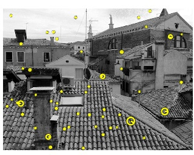
:::::
::::: column
We preserve the scale, and compute a peak of the histogram of orientations.
:::::
:::

::: notes
image from VLFeat library.
:::

## SIFT Features {data-auto-animate="true"}

::: columns
::::: column
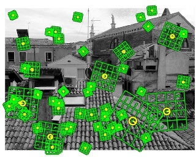
:::::
::::: column
We compute a local patch, based on the scale and orientation.

It is from this patch we compute the 128D feature _descriptor_ vector.

:::::
:::

::: notes
image from VLFeat library.
:::

## SIFT Descriptor {data-auto-animate="true"}

Compute image gradients in local 16x16 area at the selected scale.

- Create an array of orientation histograms
- 8 orientations x 4x4 histogram array = 128 dimensions

## SIFT Descriptor {data-auto-animate="true"}

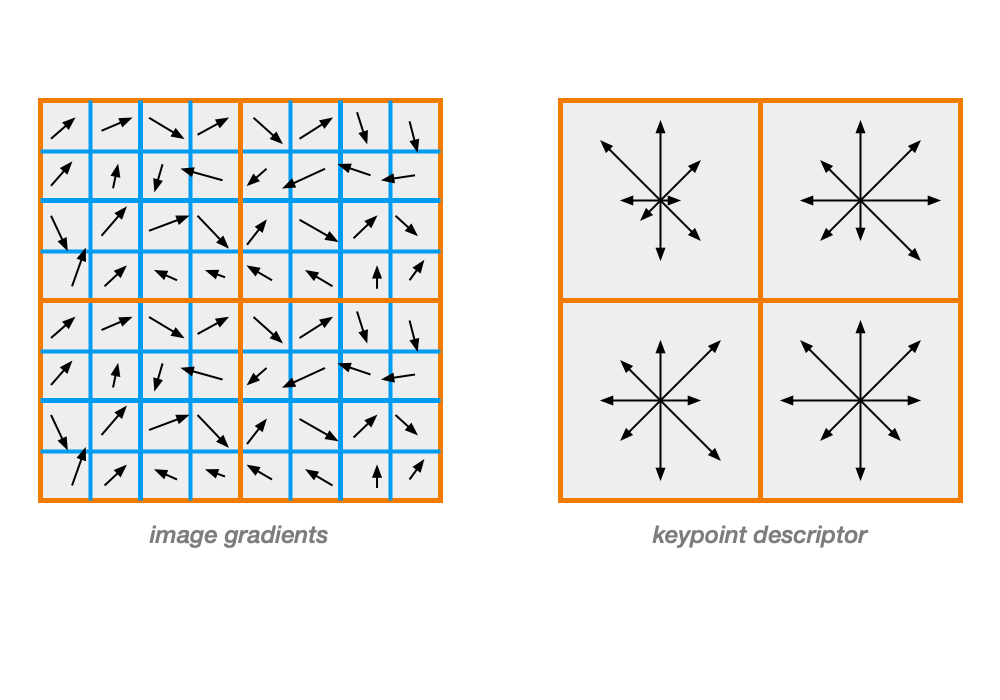{width="70%"}

::: notes
this example uses 8x8 area...
:::

## SIFT Descriptor {data-auto-animate="true"}

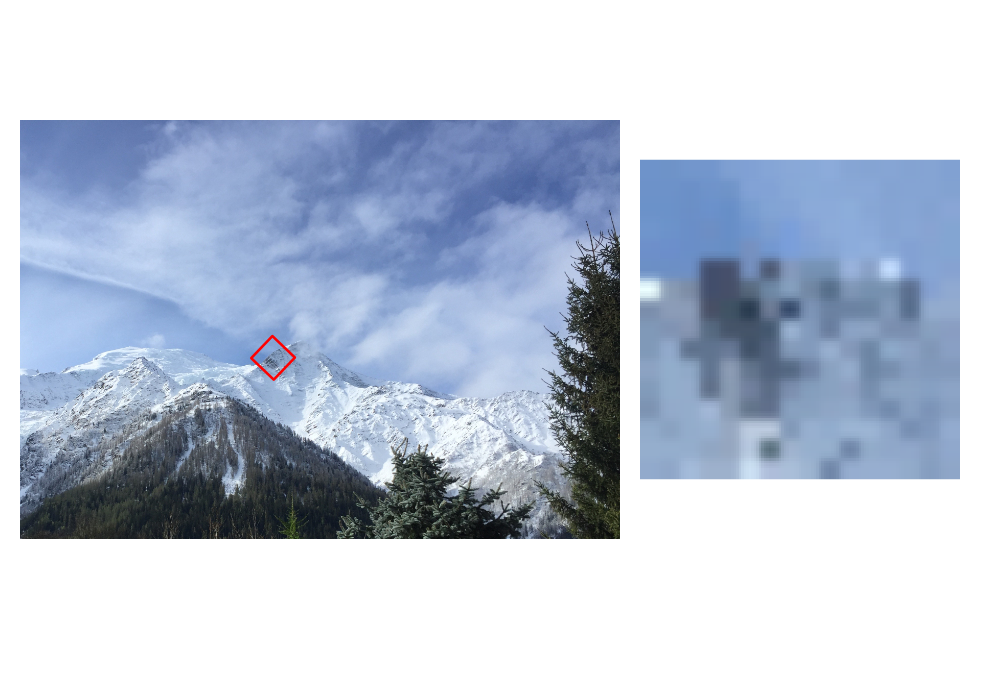

## SIFT Descriptor {data-auto-animate="true"}

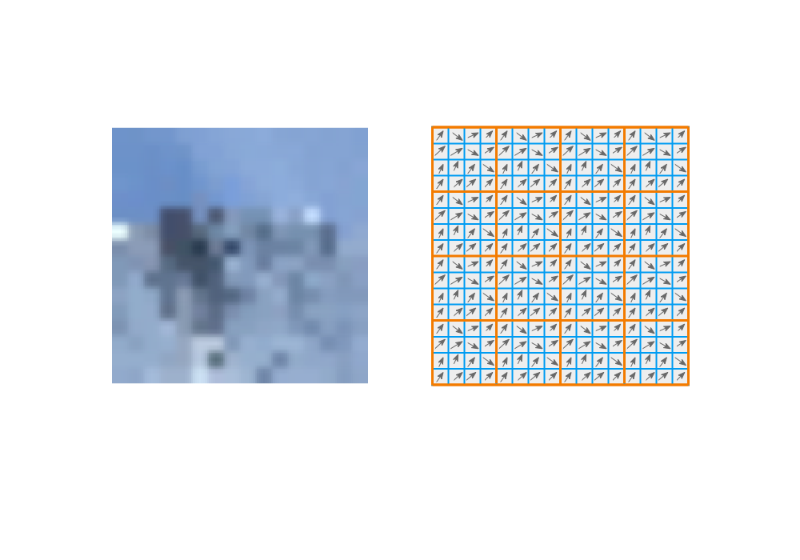

## SIFT Descriptor {data-auto-animate="true"}

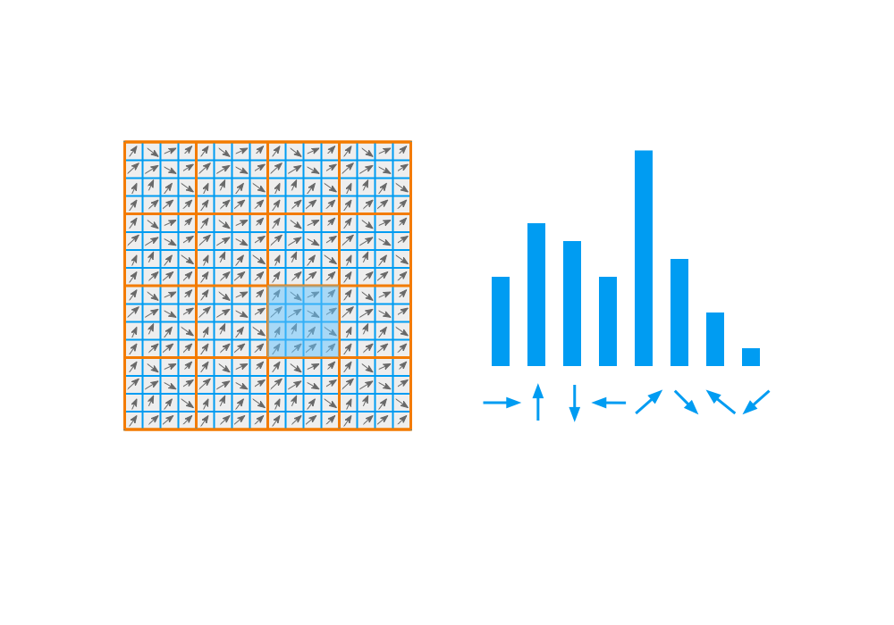

## SIFT Descriptor {data-auto-animate="true"}

Concatenate all histograms to form a 128D vector.

::: notes
I have not illustrated all 16 histograms...
:::

## SIFT Descriptor {data-auto-animate="true"}

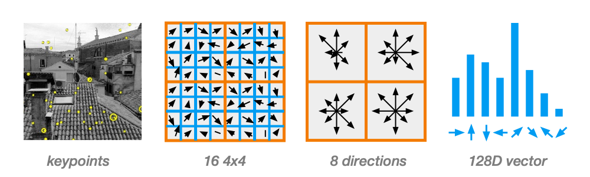

## SIFT Features {data-auto-animate="true"}

**Keypoints** : Using DoG

**Descriptor** : Using Gradient Histogram

::: notes
we have arrived at the final SIFT descriptor.
:::

# Matching

How do we match features from two images?

##

::: columns
::::: column
{width="80%"}
:::::
::::: column
{width="80%"}
:::::
:::

## Distance Matching {data-auto-animate="true"}

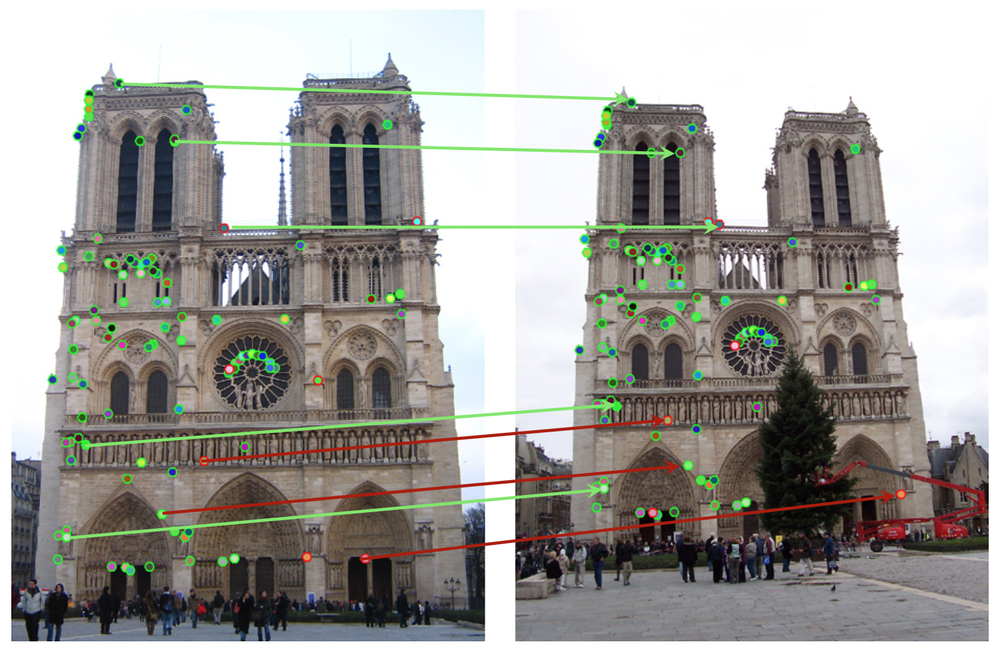{width="90%"}

## Ratio Test {data-auto-animate="true"}

Eliminate ambiguous matches for a query feature $q$.

1. Find closest descriptors, $p_1$ and $p_2$ using **Euclidian** distance.

2. Test if distance to best match is smaller than a threshold:

$$d(q, p_1) < t$$

3. Accept only if the best match is substantially better than second:

$$\frac{d(q, p_1)}{d(q, p_2)} < \frac{1}{2}$$

## Ratio Test {data-auto-animate="true"}

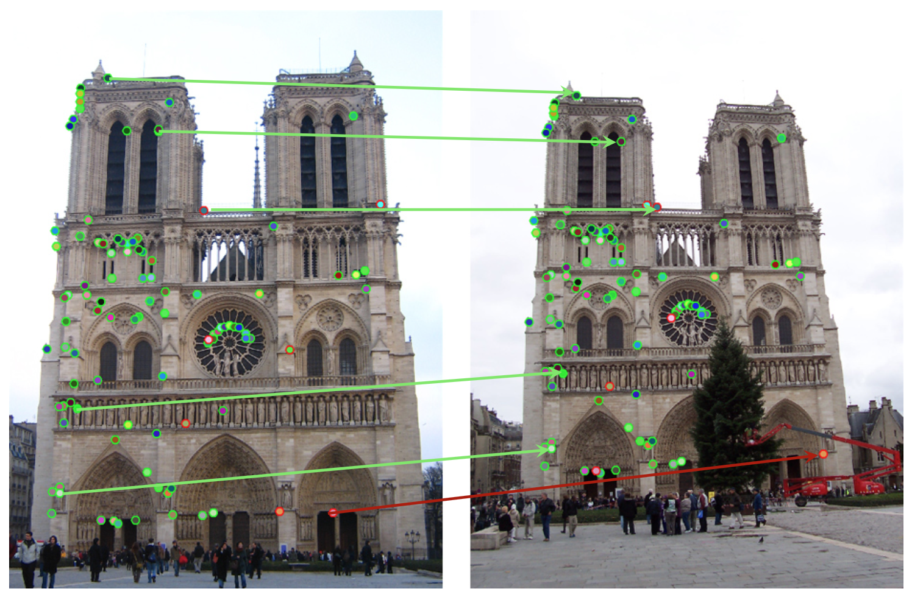{width="90%"}

## Ratio Test {data-auto-animate="true"}

Lowe's Ratio test works well.

- There will still remain few outliers.
- Outliers require extra treatment.
