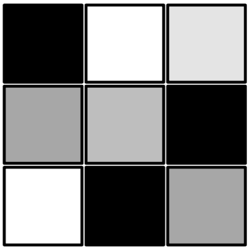
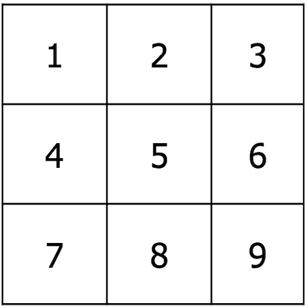
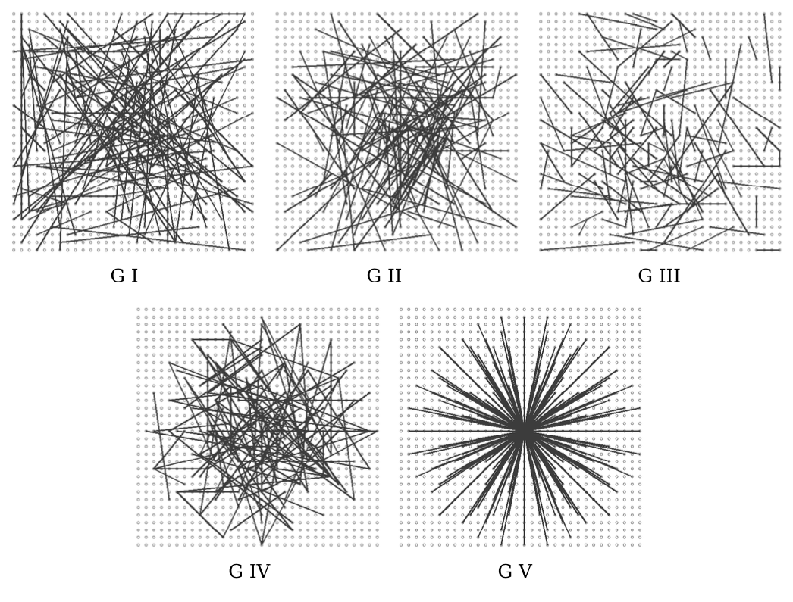
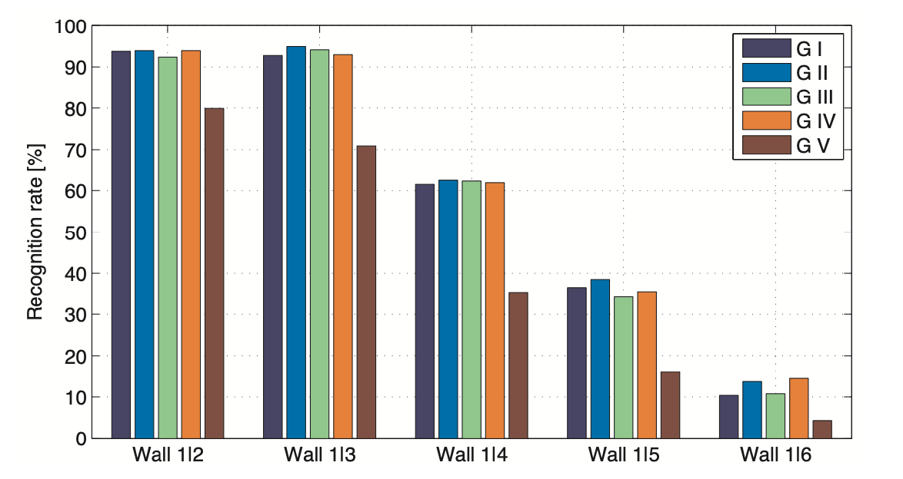

# Contents {data-transition="convex"}

- Motivation
- SIFT - Scale-Invariant Feature Transform
- BRIEF - Binary Robust Independent Elementary Features
- ORB - Oriented FAST Rotated BRIEF

::: notes
Now we are in the second part of talking about visual features...
In the first part we talked about how to compute keypoints - locally distinct point in an image.
Now we are talking about how to describe such a keypoint - or more precisely, how to describe the local area around a keypoint, that allows us to distinguish it from other keypoints.
We will look at 3 approaches. SIFT - the modern standard traditional approach.
We will also look at BRIEF and ORB, which are 'binary' features, which are popular for certain applications when we need to compute features very quickly, for example SLAM.
:::

# Visual Features {data-transition="convex"}

::: columns
::::: column
{width="80%"}
:::::
::::: column

Why do we want to find image features?

::: incremental

- Image summary.
- Classification.
- Image retrieval.
- 3D reconstruction.

:::

:::::
:::

::: notes
Look at the image...
these red dots are distinct features...
These are points from which I want to do certain tasks.
Maybe a 3D reconstruction - I may not be able to do it for all pixels in an image (too many, no correspondence) - but for a subset.
:::

## {data-transition="convex"}

How do we **describe** keypoints in a way that similar points can be matched?

::: columns
::::: column
{width="80%"}
:::::
::::: column
{width="80%"}
:::::
:::

::: notes
I might want to find where an image was taken with respect to another image.
Here we have two different images - I want to compute, where was the camera?

Now I need to find a certain number or correspondences between the two images,
points I can recognise in both images.

Now I want to discuss how to **describe** these points in a way
that similar points will be able to be matched.
:::

## Keypoint and Descriptor {data-auto-animate="true"}

An important distinction:

::: incremental

- Keypoint is a distinct **location** in an image
- Descriptor is a summary **description** of that neighbourhood.

:::

::: notes
Features have two parts - where is it, and how can we describe the feature - what distinguishes it from a possibly large number of other features?
The keypoint is locally distinct, and we can find it under slightly changing conditions...
The descriptor is a summary of the neighbourhood, a vector of values.
:::

## Keypoint and Descriptor {data-auto-animate="true"}

::: columns
::::: column
{width="90%"}
:::::
::::: column

keypoint: $(x, ~y)$

descriptor _at_ the keypoint:

$$
\begin{bmatrix} 0.02 \\ 0.01 \\ 0.10 \\ 0.05 \\ 0.01 \\ ... \end{bmatrix}
$$

:::::
:::

::: notes
We have so far discussed how to compute the locations of keypoints, how to spot a good point.
We are now going to compute this feature descriptor.
:::

## Descriptors {data-auto-animate="true"}

- HOG: Histogram of Oriented Gradients
- SIFT: Scale Invariant Feature Transform
- SURF: Speeded-Up Robust Features
- GLOH: Gradient Location and Orientation Histogram
- BRIEF: Binary Robust Independent Elementary Features
- ORB: Oriented FAST and rotated BRIEF
- BRISK: Binary Robust Invariant Scalable Keypoints
- FREAK: Fast REtinA Keypoint

... and many more

::: notes
There are many popular descriptors, we have already seen HoG, but there is a huge range of research on visual descriptors and this is just a selection.
:::

## Descriptors {data-transition="slide"}

Describing a keypoint.

::: incremental

- SIFT : Scale-Invariant Feature Transform
- BRIEF : Binary Robust Independent Elementary Features
- ORB : Oriented FAST and Rotated BRIEF

:::

# SIFT {data-transition="slide"}

Scale-Invariant Feature Transform

::: notes
SIFT is the gold standard of feature descriptor - it's been around for about 20 years...
there was some issue with patents - but they have now expired recently - you can find SIFT in many popular libraries.
so let's look at the SIFT descriptor, we can start with some of the properties of SIFT.
:::

## SIFT Features {data-auto-animate="true"}

Image content is transformed into features that are **invariant** to:

- image translation
- image rotation
- image scale

::: notes
these are highly desirable properties of image features - it is unlikely that images are always taken from the same angle or position...
:::

## SIFT Features {data-auto-animate="true"}

SIFT Features are _partially_ invariant to:

- illumination changes
- affine transformations and 3D projections

::: notes
these are gradient based features, so absolute illumination level changes do not change gradient values.
affine and projective transformations occur when we move camera position in our 3D world space.
:::

## SIFT Features {data-auto-animate="true"}

SIFT Features are _suitable_ for detecting visual landmarks:

- from different angles and distances.
- with a different illumination.

::: notes
Think about recognising a microwave oven in a kitchen...
different angles of view, near and far...
SIFT are a very good choice for this type of image data.
:::

## DoG over Scale-Space Pyramid {data-auto-animate="true"}

Over different image pyramid levels:

1. Gaussian smoothing.
2. Difference-of-Gaussians (DoG) and find **extrema**.
3. _Maxima_ suppression for edges.

::: notes
SIFT keypoints start with the difference of Gaussians we discussed earlier.
So quick recap...
This is how we get the keypoints...
:::

## SIFT Features {data-auto-animate="true"}

A SIFT feature is given by a vector computed at a local extreme point in the scale space.

::: {style="font-size: 2em"}
$$ \langle p, s, r, f \rangle$$
:::

::: notes
p : position, s : scale, r : rotation, f : feature
:::

## SIFT Features {data-auto-animate="true"}

::: notes

:::

## SIFT Features {data-auto-animate="true"}

::: notes

:::

## SIFT Features {data-auto-animate="true"}

::: columns
::::: column

:::::
::::: column
From an input image we convert to grey scale then compute the Difference of Gaussians (DoG) and find the extrema.
:::::
:::

::: notes
image from VLFeat library.
:::

## SIFT Features {data-auto-animate="true"}

::: columns
::::: column

:::::
::::: column
We preserve the scale, and compute a peak of the histogram of orientations.
:::::
:::

::: notes
image from VLFeat library.
:::

## SIFT Features {data-auto-animate="true"}

::: columns
::::: column

:::::
::::: column
We compute a local patch, based on the scale and orientation.

It is from this patch we compute the 128D feature _descriptor_ vector.

:::::
:::

::: notes
image from VLFeat library.
:::

## SIFT Descriptor {data-auto-animate="true"}

Compute image gradients in local 16x16 area at the selected scale.

- Create an array of orientation histograms
- 8 orientations x 4x4 histogram array = 128 dimensions

::: notes
so, how do we compute these histograms?
:::

## SIFT Descriptor {data-auto-animate="true"}

{width="70%"}

::: notes
this example uses 8x8 area...
:::

## SIFT Descriptor {data-auto-animate="true"}

::: notes
at each patch, we rotate according to the angle we have, and scale to 16x16
:::

## SIFT Descriptor {data-auto-animate="true"}

::: notes
then, we segregate the patch into 16x4x4 regions and compute gradients.
:::

## SIFT Descriptor {data-auto-animate="true"}

::: notes
then, we compute the 8 direction bins N, S, E, W, NE, NW, SE, SW.
:::

## SIFT Descriptor {data-auto-animate="true"}

Concatenate all histograms to form a 128D vector.

::: notes
I have not illustrated all 16 histograms...
This is the descriptor vector, we scale and normalise this vector, to form
the final 128D floating point vector, which we use as a point in
high dimensional space for classification, matching etc.
:::

## SIFT Descriptor {data-auto-animate="true"}

::: notes
a visual round up of the SIFT descriptor.
:::

## SIFT Features {data-auto-animate="true"}

**Keypoints** : Using DoG

**Descriptor** : Using Gradient Histogram

::: notes
we have arrived at the final SIFT descriptor.
If you want to implement SIFT, there are a few other details for normalising the descriptor vector.
:::

## Dense SIFT

Variation of the SIFT feature,
where the keypoints are sampled over a uniform grid in the image domain,
rather than using the sparse points from the DoG.

::: notes
particularly suited to your coursework and bag of words applications.
:::

## Dense SIFT

At each uniform grid point:

- Compute the SIFT descriptor.
- Cluster the descriptors into a vocabulary.
- K-means clustering.

::: notes
Beyond bags of features: Spatial pyramid matching for recognizing natural scene categories.
S Lazebnik, C Schmid, J Ponce - 2006 , A very influential paper.
:::

# Matching

How do we match features from two images?

##

::: columns
::::: column
{width="80%"}
:::::
::::: column
{width="80%"}
:::::
:::

::: notes
if we have two images - taken from different viewpoints, or at different times.
we look at one descriptor, then search all the descriptors in the other image.
:::

## Distance Matching {data-auto-animate="true"}

{width="90%"}

::: notes
based on a distance, we will find matches, but it is likely some will be ambiguous.
look at the central balustrade in the image. Do you understand why this might be ambiguous?
:::

## Ratio Test {data-auto-animate="true"}

Eliminate ambiguous matches for a query feature $q$.

1. Find closest descriptors, $p_1$ and $p_2$ using **Euclidian** distance.

2. Test if distance to best match is smaller than a threshold:

$$d(q, p_1) < t$$

3. Accept only if the best match is substantially better than second:

$$\frac{d(q, p_1)}{d(q, p_2)} < \frac{1}{2}$$

::: notes
Lowe ratio test.
Each keypoint of the first image is matched with a number of keypoints from the second image.
keep the 2 best matches for each keypoint.
Check that the two distances are sufficiently different.
If not, the keypoint is eliminated and will not be used for further calculations.
:::

## Ratio Test {data-auto-animate="true"}

{width="90%"}

::: notes
we have eliminated some ambiguous matches, but still have the one by the right hand doorway...
:::

## Ratio Test {data-auto-animate="true"}

Lowe's Ratio test works well.

- There will still be a few outliers.
- Outliers require extra treatment.

::: notes
we will look at RanSac in a later lecture.
:::

# Binary Descriptors

Computing descriptors _fast_

## Why Binary Descriptors?

Complex features such as SIFT work well, but...

::: incremental

- SIFT is _expensive_ to compute.
- SIFT ~~has~~ **had** patenting issues.
- Binary descriptors are easy to compute _and_ compare.

:::

## Key Idea of Binary Descriptors

- Select a region around a keypoint.
- Select a _set_ of pixel **pairs** in that region
- For each pair, compare the intensities.
- concatenate all $b$ to a string.

$$
b=
\begin{cases}
    1, & \text{if}\ I(s_1) < I(s_2) \\
    0, & \text{otherwise}
\end{cases}
$$

## Example

::: columns
::::: column
{width="60%"}
:::::
::::: column
{width="60%"}
:::::
:::

- pairs: $~\{(5, 1), (5, 9), (4, 6), (8, 2), (3, 7)\}$
- test: $~b=0, ~b=0, ~b=0, ~b=1, ~b=1$
- result: $~B=00011$

## Advantages of Binary Descriptors {data-auto-animate="true"}

Compact descriptor

- The number of pairs gives the length in bits

## Advantages of Binary Descriptors {data-auto-animate="true"}

Fast to compute

- Simply intensity value comparisons

## Advantages of Binary Descriptors {data-auto-animate="true"}

Trivial and fast to compare _Hamming_ distance:

$$
d_{Hamming}(B_1, B_2) = sum(xor(B_1, B_2) )
$$

---

Different binary descriptors differ mainly by the
strategy of selecting the pairs.

## Important

In order to compare descriptors we must:

- Use the same pairs
- Maintain the same order in which the pairs are tested.

::: notes
this is vital - it is the only real difference between binary descriptors.
:::

# BRIEF

Binary Robust Independent Elementary Features.

- BRIEF: Binary Robust Independent Elementary Features.
- Calonder, et al. 2010.

## BRIEF {data-auto-animate="true"}

First binary image descriptor.

- Proposed in 2010
- 256 bit descriptor
- Provides five different sampling strategies
- Operations performed on a smoothed image to deal with noise

::: notes
made 256 comparisons
:::

---

{width="80%"}

## BRIEF sampling pairs

- G I: Uniform random sampling
- G II: Gaussian sampling
- G III: $~s_1~$ Gaussian; $~s_2~$ Gaussian centred around $~s_1~$.
- G IV: Discrete location from a coarse polar grid.
- G V: $s_1=(0,0)$, $~s_2~$ are all locations from a coarse polar grid.

---

{width="80%"}

# ORB

Oriented FAST Rotated BRIEF.

- ORB: an efficient alternative to SIFT or SURF
- Rublee, et al. 2011.

## ORB

An extension to BRIEF that:

- Adds rotation compensation.
- Learns the optimal sampling pairs.

## ORB: Rotation Compensation

Estimates the centre of mass and the main orientation of the local area.

Image moment:

$$
m_{pq} = \sum_{x,y} x^p y^q I(x,y)
$$

Centre of Mass, Orientation:

$$
C = \left( \frac{m_{10}}{m_{00}} , \frac{m_{01}}{m_{00}} \right)~,
~\theta = \arctan2(m_{01}, m_{10})
$$

::: notes
section 3.2 in paper - moments a weighted average of the image values.
C becomes the mean values of the x values and y values.
and theta is from the rise, y, over run, x, of mean image intensities.
and this is the trick to add rotation compensation.
:::

## ORB: Rotation Compensation

Rotate the coordinates of all pairs by $\theta$ around $C$:

$$
s' = T(C, \theta) s
$$

- Use the transformed pixel coordinates for performing the test.
- Rotation is invariant in the image plane.

::: notes
and so the we rotate the patch of pairs around the centre of mass, by theta
to get rotation invariance around the image plane
:::

## ORB: Learning Sampling Pairs

Pairs should be **uncorrelated**.

- each new pair adds new information to the descriptor

Pairs should have **high variance**.

- makes a feature more discriminative

ORB defines a strategy for selecting 256 pairs,
optimising for these properties using a training database.

::: notes
collect training data to select the pairs that are optimal for these properties.
:::

## ORB versus SIFT

- ORB is 100x faster than SIFT
- ORB: 256 bit vs. SIFT: 4096 bit
- ORB is not scale invariant (achievable via an image pyramid)
- ORB mainly in-plane rotation invariant
- ORB has a similar matching performance as SIFT (w/o scale)
- Several modern online systems (e.g. SLAM) use binary features

# Summary

- Keypoint and descriptor together define visual features
- Descriptor describes the appearance
- SIFT
- Binary descriptors

Reading:

- The papers mentioned in the lecture
- Forsyth, Ponce; Computer Vision: A modern approach, 2nd ed.
- [VLFeat.org](https://www.vlfeat.org) - nice tutorials.
