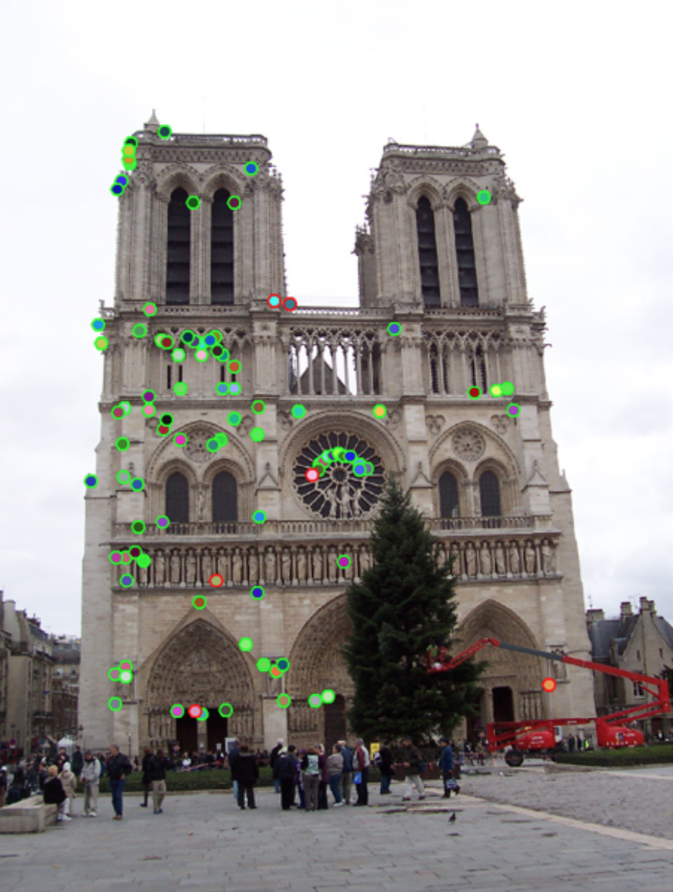

# Contents

- Motivation
- SIFT - Scale-Invariant Feature Transform
- BRIEF - Binary Robust Independent Elementary Features
- ORB - Oriented FAST Rotated BRIEF

::: notes
Now we are in the second part of talking about visual features...
In the first part we talked about how to compute keypoints - locally distinct point in an image.
Now we are talking about how to describe such a keypoint - or more precisely, how to describe the local area around a keypoint, that allows us to distinguish it from other keypoints.
We will look at 3 approaches. SIFT - the modern standard traditional approach.
We will also look at BRIEF and ORB, which are 'binary' features, which are popular for certain applications when we need to compute features very quickly, for example SLAM.
:::

# Visual Features {data-auto-animate="true"}

::: columns
::::: column
{width="80%"}
:::::
::::: column

Why do we want to find image features?

::: incremental

- Image summary.
- Classification.
- Image retrieval.
- 3D reconstruction.

:::

:::::
:::

::: notes
Look at the image...
these red dots are distinct features...
These are points from which I want to do certain tasks.
Maybe a 3D reconstruction - I may not be able to do it for all pixels in an image (too many, no correspondence) - but for a subset.
:::

---

How do we **describe** keypoints in a way that similar points can be matched?

::: columns
::::: column
{width="80%"}
:::::
::::: column
{width="80%"}
:::::
:::

::: notes
I might want to find where an image was taken with respect to another image.
Here we have two different images - I want to compute, where was the camera?
Now I need to find a certain number or correspondences between the two images - points I can recognise in both images.
Now I want to discuss how to **describe** these points in a way that similar points will be able to be matched.
:::

## Keypoint and Descriptor {data-auto-animate="true"}

An important distinction:

::: incremental

- Keypoint is a distinct **location** in an image
- Descriptor is a summary **description** of that neighbourhood.

:::

::: notes
Features have two parts - where is it, and how can we describe the feature - what distinguishes it from a possibly large number of other features?
The keypoint is locally distinct, and we can find it under slightly changing conditions...
The descriptor is a summary of the neighbourhood, a vector of values.
:::

## Keypoint and Descriptor {data-auto-animate="true"}

::: columns
::::: column
{width="90%"}
:::::
::::: column

keypoint: $(x, ~y)$

descriptor _at_ the keypoint:

$$
\begin{bmatrix} 0.02 \\ 0.01 \\ 0.10 \\ 0.05 \\ 0.01 \\ ... \end{bmatrix}
$$

:::::
:::

::: notes
We have so far discussed how to compute the locations of keypoints, how to spot a good point.
We are now going to compute this feature descriptor.
:::

## Descriptors {data-auto-animate="true"}

- HOG: Histogram of Oriented Gradients
- SIFT: Scale Invariant Feature Transform
- SURF: Speeded-Up Robust Features
- GLOH: Gradient Location and Orientation Histogram
- BRIEF: Binary Robust Independent Elementary Features
- ORB: Oriented FAST and rotated BRIEF
- BRISK: Binary Robust Invariant Scalable Keypoints
- FREAK: Fast REtinA Keypoint

... and many more

::: notes
There are many popular descriptors, we have already seen HoG, but there is a huge range of research on visual descriptors and this is just a selection.
:::

## Descriptors {data-auto-animate="true"}

Describing a keypoint.

::: incremental

- SIFT : Scale-Invariant Feature Transform
- BRIEF : Binary Robust Independent Elementary Features
- ORB : Oriented FAST and Rotated BRIEF

:::

# SIFT
