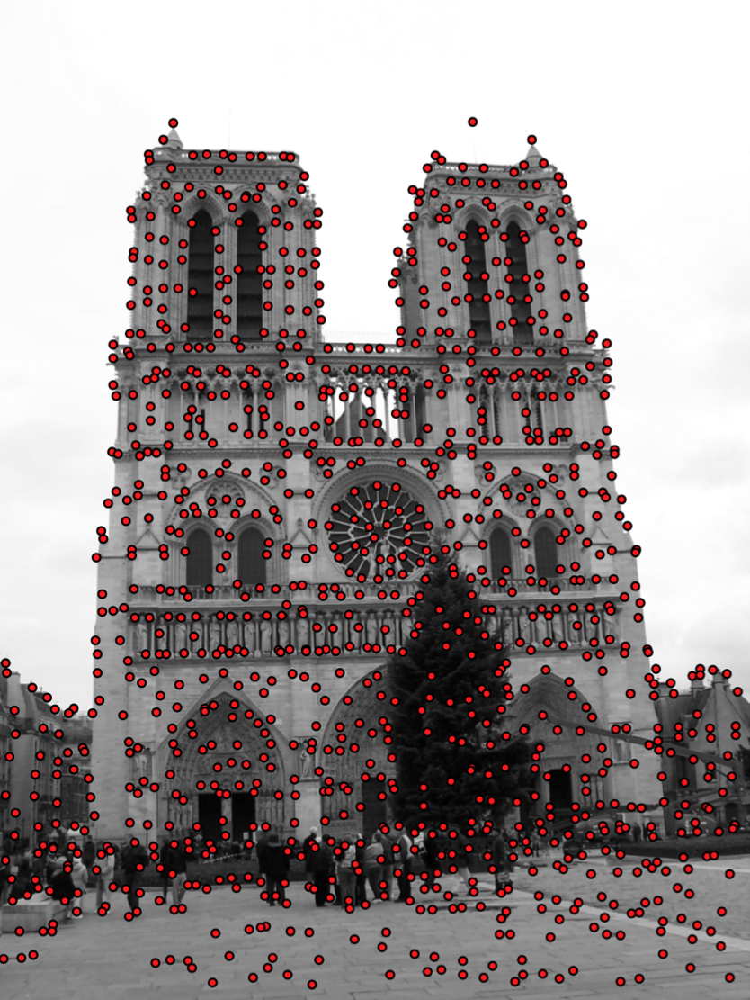

# Contents

- Motivation
- Harris Corner Detection
- Shi-Tomasi Corner Detection
- Difference of Gaussian

::: notes
visual features for classification, forming bag of words...
but other really important applications are:
SLAM, SFM, 3D reconstruction, etc.
two images side by side with the same features - correspondence...
geometric tasks and also image recognition.
Lecture in 2 parts: keypoints, then descriptors...

previously we talked about Hog in depth, today we will explore some more very important visual features.

:::

# Visual Features {data-auto-animate="true"}

::: columns
::::: column

:::::
::::: column
We want to find _locally distinct_ features in an image.

::: incremental

- How do we **find** these features?
- How do we **describe** them?

:::

:::::
:::

::: notes
Look at the image...
these red dots are distinct... They stand out from their surroundings...
we hope that if we took another image form a different view, the local distinction would still apply in that image, and we could find a correspondence.
:::

## Visual Features {data-auto-animate="true"}

::: columns
::::: column

:::::
::::: column
We can take advantage of these locally distinct features for:

::: incremental

- image classification
- image retrieval
- correspondence between two images
- 3D reconstruction

:::

:::::
:::

## Visual Features {data-auto-animate="true"}

::: columns
::::: column

:::::
::::: column

:::::
:::

::: notes
here are two images - taken from different views of the same object.
we can try to find correspondences between these two images.
we wont be able to find all correspondence...
this can allow us to find the camera motion for example...
we can look at a keypoint in one image and search amongst all the keypoints in the other image....
:::

## Keypoint and Descriptor {data-auto-animate="true"}

An important distinction:

::: incremental

- Keypoint is a distinct **location** in an image
- Descriptor is a **description** of that neighbourhood.

:::

::: notes
we want to localise the feature so we want to know where it is with a (sub) pixel location.
Then, how can we describe the feature - what distinguishes it from a possibly large number of other features?
We do this by examining the neighbourhood of the feature and forming a vector of values- more later...
:::

## Keypoint and Descriptor {data-auto-animate="true"}

::: columns
::::: column

:::::
::::: column

keypoint:

$$(x, ~y)$$

descriptor _at_ the keypoint:

$$
\begin{bmatrix} 0.02 \\ 0.01 \\ 0.10 \\ 0.05 \\ 0.01 \\ ... \end{bmatrix}
$$

:::::
:::

::: notes
for every keypoint we have a descriptor - often using gradient information - but there are other methods.
:::

## Keypoints {data-auto-animate="true"}

Finding locally distinct points.

::: incremental

- Harris Corner Detection
- Shi-Tomasi Corner Detection
- Förstner operator
- Difference of Gaussians (DoG)

:::

:::notes
We can summarise as finding these distinct points in an image.
Harris - early technique...
Shi-Tomasi - later improvements...now standard...
Förstner was the first, but Harris and Shi-Tomasi became more popular.
DoG stack of blurred images - used in SIFT ...later
:::

# Corners {data-auto-animate="true"}

Corners are often highly distinct points.

::: notes
corners are distinct because of gradients.
:::

## Corners {data-auto-animate="true"}

::: columns
::::: column

:::::
::::: column

:::::
:::

::: notes
particularly for corners...
gradients in two directions... which allows them to be localised **precisely**.
:::

## Corners {data-auto-animate="true"}

::: incremental

- Corners are often highly _distinct_ points.
- Edges are a rapid change in pixel value.
- Corners are formed from two _orthogonal_ edges.
- Corners are _invariant_ to translation, rotation and illumination.

:::

::: notes
For edges on their own they are only localised along the direction of brightness change (orthogonal to edge)... you could slide along the edge...

These properties are why we choose corners.
:::

## Finding Corners {data-auto-animate="true"}
