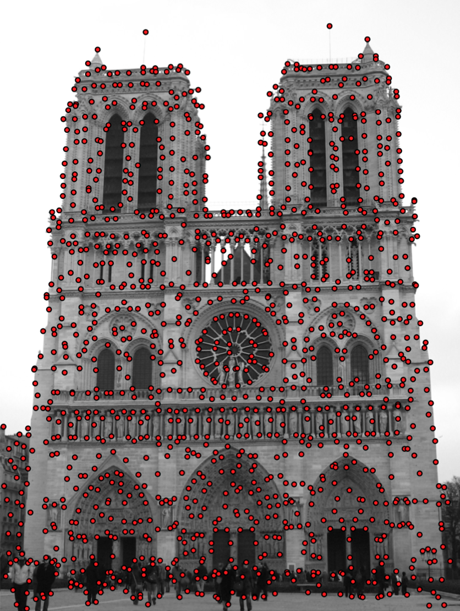

# Contents

- Motivation
- Harris Corner Detection
- Shi-Tomasi Corner Detection
- Difference of Gaussian

::: notes
visual features for classification, forming bag of words...
but other really important applications are:
SLAM, SFM, 3D reconstruction, etc.
two images side by side with the same features - correspondence...
geometric tasks and also image recognition.
Lecture in 2 parts: keypoints, then descriptors...

previously we talked about Hog in depth, today we will explore some more very important visual features.

:::

# Visual Features {data-auto-animate="true"}

::: columns
::::: column
{width="80%"}
:::::
::::: column
We want to find _locally distinct_ features in an image.

::: incremental

- How do we **find** these features?
- How do we **describe** them?

:::

:::::
:::

::: notes
Look at the image...
these red dots are distinct... They stand out from their surroundings...
we hope that if we took another image form a different view, the local distinction would still apply in that image, and we could find a correspondence.
:::

## Visual Features {data-auto-animate="true"}

::: columns
::::: column
{width="80%"}
:::::
::::: column
We can take advantage of these locally distinct features for:

::: incremental

- image classification
- image retrieval
- correspondence between two images
- 3D reconstruction

:::

:::::
:::

## Visual Features {data-auto-animate="true"}

::: columns
::::: column
{width="80%"}
:::::
::::: column
{width="80%"}
:::::
:::

::: notes
here are two images - taken from different views of the same object.
we can try to find correspondences between these two images.
we wont be able to find all correspondence...
this can allow us to find the camera motion for example...
we can look at a keypoint in one image and search amongst all the keypoints in the other image....
:::

## Keypoint and Descriptor {data-auto-animate="true"}

An important distinction:

::: incremental

- Keypoint is a distinct **location** in an image
- Descriptor is a summary **description** of that neighbourhood.

:::

::: notes
we want to localise the feature so we want to know where it is with a (sub) pixel location.
Then, how can we describe the feature - what distinguishes it from a possibly large number of other features?
We do this by examining the neighbourhood of the feature and forming a vector of values- more later...
:::

## Keypoint and Descriptor {data-auto-animate="true"}

::: columns
::::: column
{width="80%"}
:::::
::::: column

keypoint: $(x, ~y)$

descriptor _at_ the keypoint:

$$
\begin{bmatrix} 0.02 \\ 0.01 \\ 0.10 \\ 0.05 \\ 0.01 \\ ... \end{bmatrix}
$$

:::::
:::

::: notes
for every keypoint we have a descriptor - often using gradient information - but there are other methods.
:::

## Keypoints {data-auto-animate="true"}

Finding locally distinct points.

::: incremental

- Harris Corner Detection
- Shi-Tomasi Corner Detection
- Förstner operator
- Difference of Gaussians (DoG)

:::

:::notes
We can summarise as finding these distinct points in an image.
Harris - early technique...
Shi-Tomasi - later improvements...now standard...
Förstner was the first, but Harris and Shi-Tomasi became more popular.
DoG stack of blurred images - used in SIFT ...later
:::

# Corners {data-auto-animate="true"}

Corners are often highly distinct points.

::: notes
corners are distinct because of gradients.
:::

## Corners {data-auto-animate="true"}

::: columns
::::: column
{width="80%"}
:::::
::::: column
{width="80%"}
:::::
:::

::: notes
particularly for corners...
gradients in two directions... which allows them to be localised **precisely**.
:::

## Corners {data-auto-animate="true"}

::: incremental

- Corners are often highly _distinct_ points.
- Edges are a rapid change in pixel value.
- Corners are formed from two _orthogonal_ edges.
- Corners are _invariant_ to translation, rotation and illumination.

:::

::: notes
For edges on their own they are only localised along the direction of brightness change (orthogonal to edge)... you could slide along the edge...

These properties are why we choose corners.
:::

## Finding Corners {data-auto-animate="true"}

To find corners we need to **search** for _intensity changes_ in two directions.

## Finding Corners {data-auto-animate="true"}

Compute the SSD of pixels in the neighbourhood $W$ around $(x, ~y)$.

$$
f(x, y) = \sum_{(u, v) \in W_{x,y} } (I(u, v) - I(u + \delta u , v + \delta v))^2
$$

::: notes
sum of squared differences...
in some local area W, we look at the difference between a pixel and another at some small offset.
In areas where the function is high, we have an area where there is a lot of gradient ... things will probably stand out...
:::

## Finding Corners {data-auto-animate="true"}

$$
f(x, y) = \sum_{(u, v) \in W_{x,y} } (I(u, v) - I(u + \delta u , v + \delta v))^2
$$

Using **Taylor** expansion, with _Jacobian_ $\left[J_x, J_y \right]$:

$$
I(u + \delta u , v + \delta v) \approx I(u, v) + \left[J_x, J_y \right]
\begin{bmatrix} \delta u \\ \delta v \end{bmatrix}
$$

::: notes
the jacobian for an image is the x, y gradient, the partial derivatives.
Now, notice if we substitute, the intensity value will disappear.
:::

## Finding Corners {data-auto-animate="true"}

Taylor approximation leads to:

$$
f(x, y) = \sum_{(u, v) \in W_{x,y} } \left( [J_x, J_y]
\begin{bmatrix} \delta u \\ \delta v \end{bmatrix}\right)^2
$$

Written in matrix form:

$$
f(x, y) = \sum_{(u, v) \in W_{x,y} }
\begin{bmatrix} \delta u \\ \delta v \end{bmatrix}^T
\begin{bmatrix} J_x^2  &J_xJ_y \\ J_xJ_y  &J_y^2 \end{bmatrix}
\begin{bmatrix} \delta u \\ \delta v \end{bmatrix}
$$

## Finding Corners {data-auto-animate="true"}

Given:

$$
f(x, y) = \sum_{(u, v) \in W_{x,y} }
\begin{bmatrix} \delta u \\ \delta v \end{bmatrix}^T
\begin{bmatrix} J_x^2  &J_xJ_y \\ J_xJ_y  &J_y^2 \end{bmatrix}
\begin{bmatrix} \delta u \\ \delta v \end{bmatrix}
$$

Move the summation inside the matrix:

$$
f(x, y) =
\begin{bmatrix} \delta u \\ \delta v \end{bmatrix}^T
\begin{bmatrix}
\sum_{W}J_x^2   &\sum_{W}J_xJ_y \\
\sum_{W}J_xJ_y  &\sum_{W}J_y^2
\end{bmatrix}
\begin{bmatrix} \delta u \\ \delta v \end{bmatrix}
$$

::: notes
We are summing over the u and v of the local area W. We can move the summation to the matrix.
When we move the summation inside the matrix, his matrix now contains all we need to know about the local patch. It contains the gradient information, with the shift matrix (u, v) on the outside...
We get what is called the structure matrix.
:::

# Structure Matrix {data-auto-animate="true"}

$$
M =
\begin{bmatrix}
\sum_{W}J_x^2   &\sum_{W}J_xJ_y \\
\sum_{W}J_xJ_y  &\sum_{W}J_y^2
\end{bmatrix}
$$

::: notes
Summarises the first derivative of the image in a local area.
And accumulates the gradients in the x and y directions, and xy.
Given this information we can decide if a point is locally distinct or not.
:::

## Structure Matrix {data-auto-animate="true"}

- The structure matrix is key to finding edges and corners.
- Encodes the image intensity changes in a local area.
- built from image gradients.

$$
M =
\begin{bmatrix}
\sum_{W}J_x^2   &\sum_{W}J_xJ_y \\
\sum_{W}J_xJ_y  &\sum_{W}J_y^2
\end{bmatrix}
$$

::: notes
we will look at the eigen decomposition of the structure matrix.
if one eigen value is large and another is small, we have an edge.
If both are large, we have a corner.
if both are small, we have a flat area.
so the structure matrix encodes the info in a local area.
:::

## Structure Matrix {data-auto-animate="true"}

Matrix built from image gradients.

$$
M =
\begin{bmatrix}
\sum_{W}J_x^2   &\sum_{W}J_xJ_y \\
\sum_{W}J_xJ_y  &\sum_{W}J_y^2
\end{bmatrix}
$$

Jacobians computed by _convolution_ with gradient kernel, e.g. Sobel:

$$
\begin{aligned}
J_x^2  &= (D_x * I)^2 \\
J_xJ_y &= (D_x * I) (D_y * I) \\
J_y^2  &= (D_y * I)^2
\end{aligned}
$$

::: notes
We can compute these gradients using convolution using a small kernel (e.g. Sobel).
In a standard way...we compute the whole image derivative.
:::

## Structure Matrix {data-auto-animate="true"}

Matrix built from image gradients.

$$
M =
\begin{bmatrix}
\sum_{W}J_x^2   &\sum_{W}J_xJ_y \\
\sum_{W}J_xJ_y  &\sum_{W}J_y^2
\end{bmatrix}
$$

Jacobians using Sobel:

$$
D_x = \begin{bmatrix}
       1  &  2  &  1 \\
       0  &  0  &  0 \\
    \llap{-}1 & \llap{-}2 & \llap{-}1
    \end{bmatrix}~, ~
D_y = \begin{bmatrix}
        1  & 0 & \llap{-}1 \\
        2  & 0 & \llap{-}2 \\
        1  & 0 & \llap{-}1
    \end{bmatrix}
$$

::: notes
using these operators, moved over the image we can compute in a simple way all the gradients.
We are just left to sum all the pixels in the local area.
:::

## Structure Matrix {data-auto-animate="true"}

Summarises the dominant gradient directions around a point.

$$
M =
\begin{bmatrix}
\sum_{W}J_x^2   &\sum_{W}J_xJ_y \\
\sum_{W}J_xJ_y  &\sum_{W}J_y^2
\end{bmatrix}
$$

::: notes
The actual values we end up with inside the SM gives us the summary of the gradient directions.

:::

## Structure Matrix {data-auto-animate="true"}

::: columns

::::: {.column width="35%"}

:::::

::::: {.column style="font-size:1.5em;"}

$$ M = \begin{bmatrix} \gg 1 &\approx 0 \\ \approx 0 &\gg 1 \end{bmatrix} $$

:::::
:::

## Structure Matrix {data-auto-animate="true"}

::: columns

::::: {.column width="35%"}

:::::

::::: {.column style="font-size:1.5em;"}

$$ M = \begin{bmatrix} \gg 1 &\approx 0 \\ \approx 0 &\approx 0 \end{bmatrix} $$

:::::
:::

## Structure Matrix {data-auto-animate="true"}

::: columns

::::: {.column width="35%"}

:::::

::::: {.column style="font-size:1.5em;"}

$$ M = \begin{bmatrix} \approx 0 &\approx 0 \\ \approx 0 &\approx 0 \end{bmatrix} $$

:::::
:::

## Corners from Structure Matrix {data-auto-animate="true"}

Consider points as corners if their structure matrix has **two large** Eigenvalues.

::: columns

::::: {.column width="35%"}

:::::

::::: {.column style="font-size:1.5em;"}

$$ M = \begin{bmatrix} \gg 1 &\approx 0 \\ \approx 0 &\gg 1 \end{bmatrix} $$

:::::
:::

# Corner Detection

Three similar approaches...

::: notes
We will look at three methods for finding corners...
:::

## Harris - Shi-Tomasi - Förstner

Three similar approaches:

- 1987 Förstner
- 1988 Harris
- 1994 Shi-Tomasi

All rely on the _structure_ matrix.

- Use different criterion for deciding if a point is a corner
- Förstner offers subpixel estimation

::: notes
Forstner is earliest, but Harris became more popular.
Shi-Tomasi is the most widely used now, but Harris still in many applications.
They all follow the same idea and differ only in the way they decide what should be a corner...
:::

## Harris Corner Criterion {data-auto-animate="true"}

Criterion:

$$
\begin{aligned}
R &= det(M) - k(trace(M))^2 \\
  &= \lambda_1 \lambda_2 - k(\lambda_1 + \lambda_2)^2
\end{aligned}
$$

with $k \in [0.04, 0,06]$:

$$
\begin{aligned}
|R| &\approx 0 \Rightarrow \lambda_1 \approx \lambda_2 \approx 0 \\
R &< 0 \Rightarrow \lambda_1 \gg \lambda_2~ or ~\lambda_2 \gg \lambda_1 \\
R &\gg 0 \Rightarrow \lambda_1 \approx \lambda_2 \gg 0
\end{aligned}
$$

::: notes
in the first case, the two eigenvalues are equal and equal to zero, so a flat region.
2nd case, the two eigenvalues are unequal, so an edge.
3rd case, the two eigenvalues are equally large, so a corner.
:::

---

{width="90%"}

::: notes
we can show this graphically by plotting R according to different R values.
:::
