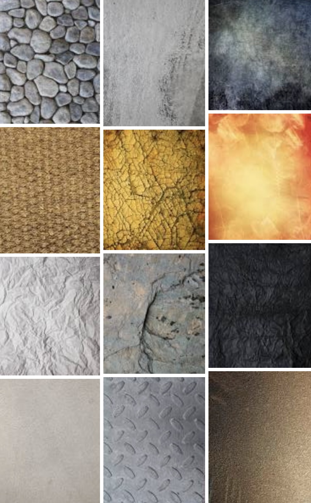
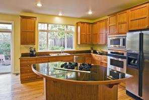
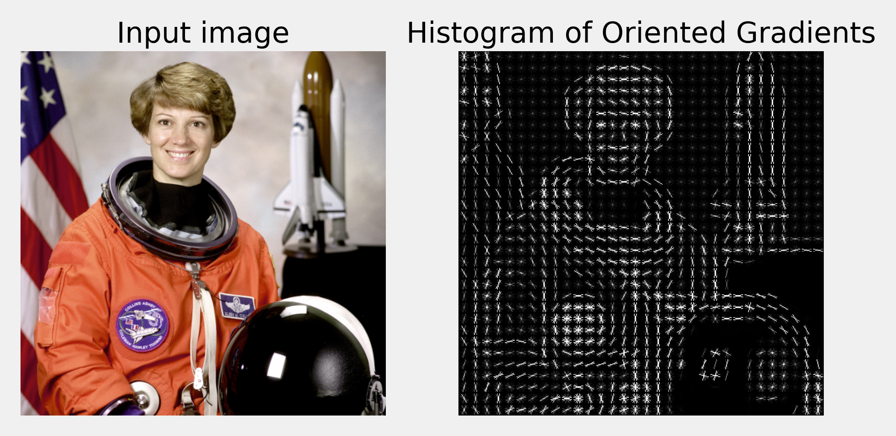
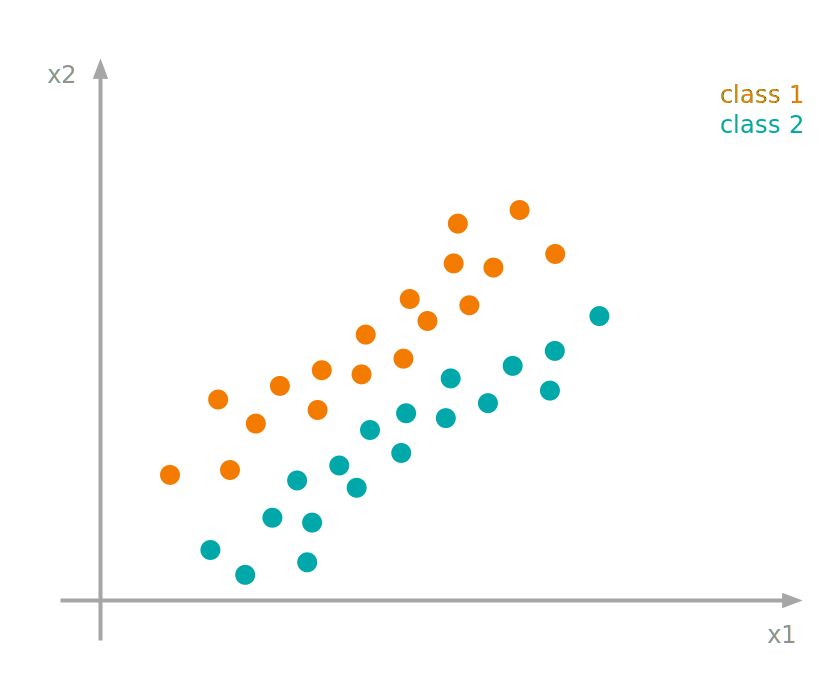
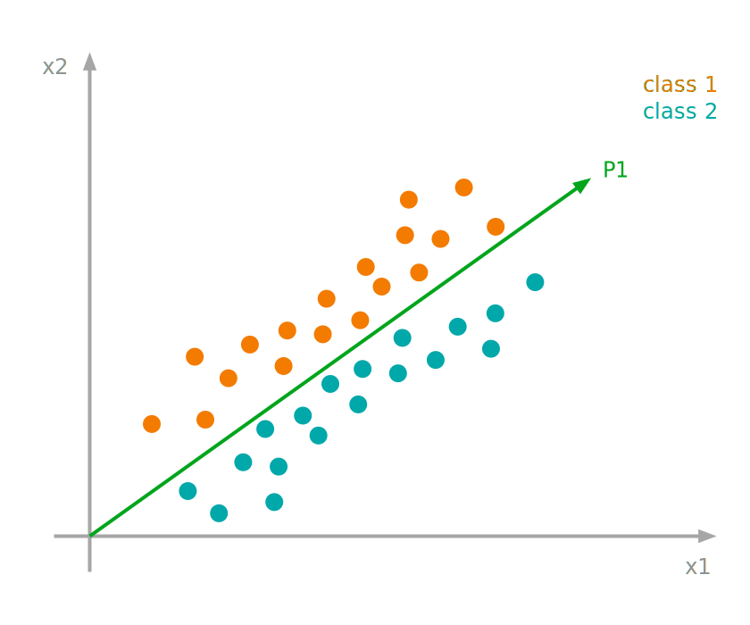
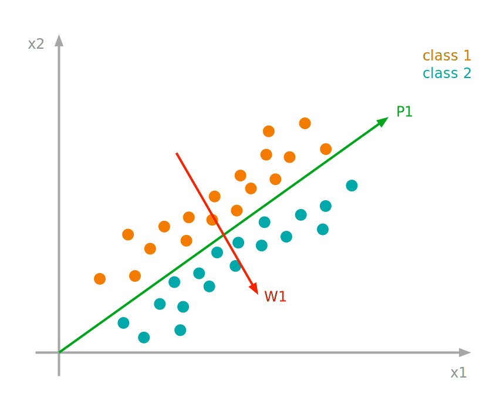
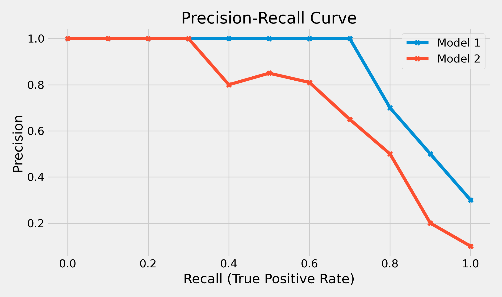

# Content

- HOG features
- Visual Words
- Spatial Pyramid
- PCA and LDA
- Evaluation

::: notes
briefly discuss HOGs...
some other classification methods...
PCA and LDA - PCA is everywhere!
Some more on evaluation...

This week we will look at two computer vision application scenarios which can employ the aforementioned classifiers.

:::

# Image Classification

Passing a **whole** image to a classifier.

::: notes
Image classification really means to classify the whole image as belonging to a class, rather than identify objects within the image.

Of course, if a particular object is present in an image, it could be the criteria for classification.

But object recognition is a more specific problem - and we will talk about that later.

We have previously studied various classifiers.
That discussion talked of clouds of points to be classified, but now, these points will be image features.
:::

# Feature Extraction

What are good features?

::: notes
there are many ways to extract features - but are they useful to our task?
:::

## Feature Extraction {data-auto-animate="true"}

The main difficulty in solving these image classification problems is finding good image features.

::: notes
the trick is to extract good features... but what are they?
:::

## What are good features? {data-auto-animate="true"}

::: incremental

- Good features should **exhibit** _between-class_ variation.
- Good features should **suppress** _within-class_ variation.

:::

::: notes
to classify cats and dogs, we want features extracted from cats to be very different from features extracted from dogs. - between-class variation

also, we want features extracted from different cats to be a s similar as possible.
:::

---

Other desirable properties of features are:

::: incremental

- _invariant_ to rotation, translation and scaling of an image
- _invariant_ to illumination

:::

::: notes
we don't want the feature to change if it is in a different part of the image.
we don't want the feature to change if it has different illumination...
black cat in coal cellar, white cat in white room, etc.
:::

## What are good features? {data-auto-animate="true"}

::: columns

::::: {.column width=40%}
{width="75%"}
:::::

::::: column

Texture is a good feature, and often provides good diagnostics.

- e.g. summary statistics on gradient orientations

:::::

:::

::: notes
you might guess - texture is a good feature...
we learned earlier how to calculate gradient and gradient direction...
gradient captures the smallest features of an image...
:::

---

::: columns
::::: {.column width=35%}

{width="85%"}

{width="85%"}

:::::

::::: column

Exact feature locations are not important.

- Small variations in the layout will not change the class label.

:::::

:::

::: notes
These images from the coursework...
15 classes - one of which is kitchen...
it does not matter where in the image is a window or microwave...
translation invariance is important...
:::

## Classification Applications

Classify an X-ray image as containing cancer or not.

::: incremental

- A _binary_ classification problem.
- Normally requires significant human expertise!

:::

::: notes
We could fill the entire lecture with examples of classification applications, such is the rapid expansion of the field.
:::

---

Material classification, eg. wood, metal, plastic, etc.

::: incremental

- Texture is likely useful, but...
- Illumination may significantly change the texture.
- Extract features invariant to illumination.

:::

---

Scene classification e.g. kitchen, bathroom, beach.

::: incremental

- Importance of context.
- Scenes contain many objects, but their exact location is less important.

:::

# Image Classification Strategies

Extracting _low level_ features from an image.

::: notes
usually we would extract some low level features...
:::

## Low Level Features

Two low level features, which are used often, include
_SIFT_ and _HOG_ features, combined with some colour descriptors.

---

SIFT - Scale Invariant Feature Transform

::: incremental

- Localised feature based on image gradients.
- One of the first of its kind.
- Some proprietary aspects to its use.
- covered in a later lecture.

:::

---

HOG - histograms of oriented gradients.

- Also a gradient based feature.
- next up!

## Histograms of Oriented Gradients {data-auto-animate="true"}

- Image is divided into regions - a window.
- Each window is further divided into cells.
- Each cell is typically 6 to 8 pixels wide.

::: notes
In the paper they describe the window as containing a grid of cells.
so in practice, we decide a cell size, then build windows of cell blocks.
:::

## Histograms of Oriented Gradients {data-auto-animate="true"}

A local 1D histogram of _gradient_ directions.

::: incremental

- 1D dimension is the **angle** of the gradient
- the angle is _quantised_ into a discrete set of bins
- for example, for a bin size 20 degrees, we have 18 bins
- sum of all elements is equal to number of pixels in the _cell_

:::

::: notes
so far you have been working with histograms of colour values.
:::

## Angle {data-transition="slide"}

- A gradient is calculated using a centred $[-1,0,1]$ filter.
- The filter is applied vertically and horizontally.
- We derive the gradient direction from these first derivatives.

$$\alpha = \tan^{-1} \frac{\delta g}{\delta y}~ / ~ \frac{\delta g}{\delta x}$$

## Magnitude {data-transition="slide"}

For colour images, we can calculate gradient for the three channels and select the one with the largest _magnitude_.

$$|G| = \sqrt{\left(\frac{\delta g}{\delta x}\right)^2 + \left(\frac{\delta g}{\delta y}\right)^2} $$

::: notes
and, of course, we can get the gradient magnitude for each pixel with Pythagoras.
:::

## Binning {data-transition="slide"}

For each pixel within a cell, its gradient _orientation_ is used to increment the relevant histogram bin.

::: incremental

- in _proportion_ to the gradient magnitude

:::

::: notes
different to colour histogram, where we just increment on value of colour.
this is to promote edges in the image
:::

## Interpolation {data-transition="slide"}

To enforce invariance to some small gradient orientation differences, we _interpolate_ histogram contributions between the neighbouring bin centres.

::: incremental

- Typical binning - 20 degrees.

:::

::: notes
to avoid bin mis-match where a small variation in a gradient can shift the assignment of a pixel to a bin.
:::

## Contrast Normalisation {data-transition="slide"}

We choose a certain configuration of cells and call it a _block_

::: incremental

- typically 2-3 cell wide
- perform _normalisation_ within each block
- various schemes proposed in original paper
- e.g. modified L2 norm $v \rightarrow v / \sqrt{||v||^2_2 + \epsilon^2}$

:::

::: notes
this step imparts some illumination invariance - the epsilon is a small constant to avoid division by zero.
:::

## {data-transition="slide"}

{width="85%"}

Dalal and Triggs. "Histograms of Oriented Gradients for Human Detection", CVPR, 2005

::: notes
Histogram features from all cells are combined forming
a feature vector which can be used for classification.
We will look at this paper again later today when discussing applications.
A very influential paper - 40k citatations.
:::

# Visual Words {data-transition="convex-in slide-out"}

Once the features are extracted, we would often use _dictionaries_ of **visual words**.

::: notes
we could use the features directly - but it is better to do something extra...
:::

## Visual Words {data-transition="slide" data-auto-animate="true"}

Features representing scenes should be able to **summarise** these scenes.

## Visual Words {data-auto-animate="true"}

Imagine we would like to classify images containing _sets_ of objects.

::: notes
rather like your coursework - a kitchen has a lot of objects common to other kitchens.
:::

## Visual Words {data-auto-animate="true"}

The precise location of objects may not be relevant.

::: incremental

- The objects may move or deform within the image.
- The viewpoint may change or the image may be deformed or scaled.

:::

::: notes
rather like your coursework - a kitchen has a lot of objects common to other kitchens.
Some objects may not be present in some scenes.
:::

## Visual Words {data-auto-animate="true"}

This suggests some kind of high level histogram representation of the scene.

::: incremental

- How many cups or plates visible in a kitchen scene?
- Will these objects be present in an outdoor scene?
- How many trees might you expect in a kitchen?

:::

::: notes
Think of high level features as being the bins of a histogram.
Of course HOG do not directly represent these objects...but edges , corners etc..
:::

## Visual Words {data-auto-animate="true"}

Detect _interest_ points in the image.

::: incremental

- e.g. corners, T-junctions etc.
- build _neighbourhoods_ around them.

:::

::: notes
How do we achieve this high level histogram?
:::

## Visual Words {data-auto-animate="true"}

Describe these neighbourhoods with low level features.

For example, **SIFT**

::: notes
How do we achieve this high level histogram?
:::

## Visual Words {data-auto-animate="true"}

Vector-quantise these features.

::: incremental

- e.g. by **k-means** clustering.
- These _clusters_ are very much like words.

:::

::: notes
How do we achieve this high level histogram?
eg SIFT is 128D point in in space.
Many features form a point cloud...
50 clusters...
:::

## Visual Words {data-auto-animate="true"}

For each image, build a histogram of these visual words.

::: incremental

- Two _similar_ images should have _similar_ histograms.

:::

::: notes
two images with similar objects should have similar histograms.
:::

## Visual Words {data-auto-animate="true"}

Compare histograms using _histogram intersection_.

$$HI = \sum_{i=1}^{n} \min(h_i, g_i)$$

- Sivic and Zisserman, "Efficient Visual Search...", Proc. IEEE 2008.

::: notes
Refer to Swain and Ballard, "Color Indexing" 1991.
There is a relationship from histogram intersection to L1 or city block distance.
This approach is from Sivic and Zisserman.
:::

# Spatial Pyramid Kernels {data-transition="convex"}

Extending Visual Words...

## Spatial Pyramid Kernels {data-auto-animate="true"}

The concept of visual words can be taken further so that it incorporates a rough _layout_ of the scene.

::: notes
This may seem like a backward step - we do want translation invariance!
But, large scale translation may not be appropriate within the class...
imagine the kitchen image with the plates on the floor, and the cups opn the ceiling.
:::

## Spatial Pyramid Kernels {data-auto-animate="true"}

- split an image into 4 quarters
- calculate $HI$ for each quarter **and** the whole image
- resulting in 5 _different_ figures.

## Spatial Pyramid Kernels {data-auto-animate="true"}

The quarters can be subdivided further into smaller blocks

- too small blocks are less useful.

::: notes
We could go deeper and deeper...
We lose completely the translation invariance we desire.
Also, small blocks may not have interest points...
:::

## Spatial Pyramid Kernels {data-auto-animate="true"}

The final _similarity_ figure is a sum of block-wise $HI$s **weighted** by the **inverse** of the block width.

- Lazebnik et al. "Beyond bags of features...", CVPR 2006

::: notes
weighted because we want to favour the larger blocks, retaining translation invariance.
:::

# Dimensionality Reduction {data-transition="convex"}

The features we create tend to be high dimensional.

## PCA {data-auto-animate="true"}

Principal Component Analysis (PCA)

- There can be a lot of redundancy in this data.
- We could use PCA to **compress** this data.

::: notes
We have already mentioned PCA in point distribution models.
:::

## Fisher LDA {data-auto-animate="true"}

The extension of PCA is Fisher LDA

- Linear Discriminant Analysis (LDA)
- also referred to as Dimension Reduction with Canonical Variates

::: notes
in the course text, Forsyth and Ponce, this is referred to as Dimension Reduction with Canonical Variates.
:::

## Fisher LDA {data-auto-animate="true"}

Is a projection onto a subspace that **maximises** the _ratio_ of the between-class variance to the within-class variance.

::: notes
PCA is a projection - but is only concerned with variance - not the ratio.
LDA subspace will have a different orientation to PCA.
:::

---

::: columns

::::: {.column width=70%}

:::::

::::: column

We have some data points belonging to two classes.

:::::

:::

---

::: columns

::::: {.column width=70%}

:::::

::::: column

Difficult to distinguish the classes along the principal component.

:::::

:::

::: notes
And this is an easy problem...
The data is linearly separable - but after PCA they are not!
:::

---

::: columns

::::: {.column width=70%}

:::::

::::: column

Easier to distinguish the classes along the discriminant mode.

:::::

:::

::: notes
The discriminant mode maximises between-class variation.
:::

# Classifier Evaluation {data-transition="convex"}

How do we evaluate the performance of the classifier?

## Classifier Evaluation

Image Classification is often evaluated using two metrics:

::: incremental

- **precision** and **recall**.

:::

::: notes
precision - recall stems from document retrieval - but can easily be extended to image retrieval, and image classification.
:::

## Classifier Evaluation {data-auto-animate="true"}

**Precision** : the percentage of recovered items that are _relevant_.

$$TP / (TP + FP)$$

::: notes
True positives divided by the number of true positives and false positives.
relevant items are the items that are genuinely true.
:::

## Classifier Evaluation {data-auto-animate="true"}

**Recall** : the percentage of relevant items that are _recovered_.

$$TP / (TP + FN)$$

::: notes
all positives - (true positives + false negatives).
AKA True Positive Rate (TPR)
Receiver Operating Characteristic (ROC)
In ROC curve, plotted TPR against FPR.
Here we plot TPR (recall) against precision.
Precision did not feature in ROC curves.
:::

## Classifier Evaluation {data-auto-animate="true"}

We also calculate _average_ precision:

$$A = \frac{1}{N_r} \sum_{r=1}^{N}P(r)rel(r)$$

Average precision is the area under the Precision-Recall curve.

::: notes
This comes from document retrieval - you can see from the language used...
Average precision is the area under the Precision-Recall curve.
:::

## Classifier Evaluation {data-auto-animate="true"}

::: columns

::::: column

We also calculate _average_ precision:

$$A = \frac{1}{N_r} \sum_{r=1}^{N}P(r)rel(r)$$

:::::

::::: column

- $N_r$ is the number of relevant items
- $N$ is the total number of items
- $P(r)$ is the precision of first $r$ items in the ranked list.
- $rel(r)$ a binary function that is 1 when the $r^{th}$ document is relevant.

:::::

:::

::: notes
This comes from document retrieval - you can see from the language used...
But, of course, we can use this for image retrieval and classification.
:::

---

{width=90%}

::: notes
Easier to comprehend with an image, here are two classifiers compared.
:::

## Classifier Evaluation {data-auto-animate="true"}

**ROC** curves should be used when there are roughly equal numbers of observations for each class.

**Precision-Recall** curves should be used when there is a moderate to large class imbalance.

# Summary

- HOG features
- Visual Words
- Spatial Pyramid
- PCA and LDA
- Evaluation

Reading:

- Forsyth, Ponce; Computer Vision: A modern approach, 2nd ed., Chapters 16,17 and 5.
- Sonka et al., Image Processing, Analysis and Machine Vision, 4th ed., Chapter 10

::: notes
A lot covered in this lecture.
We looked at one low level feature - HOG.
How we can use this to create a higher level feature - visual words.
And - extend that further - spatial pyramid.
Dimensionality reduction using LDA - appropriate for some classification problems.
and... another view on evaluation - useful for image classification, where we have class imbalance.
:::
