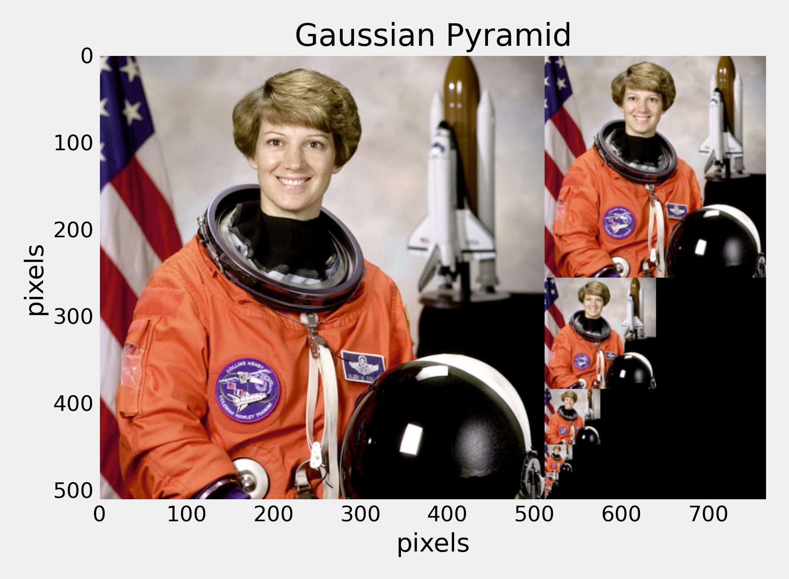

# Content

- Classification or Object Detection
- Sliding Window
- Detecting Faces
- Detecting Humans

# Object Detection

What is object detection?

::: notes
We have just been talking about image classification - what are the differences between classification and object detection?
:::

## Object Detection {data-auto-animate="true"}

_Image classification_ methods can detect an object in the image if there is just a **single** object in the scene and it clearly dominates the image.

If this constraint is not met, we are in the **object detection** scenario.

## Object Detection {data-auto-animate="true"}

We can use similar techniques we have learnt in Image Classification to detect objects in an image.

Here we apply these techniques to **sub-windows** of the image.

This approach is called a _sliding window_ method.

# Sliding Window

Sliding window is a _meta_ algorithm - a concept found in many machine learning algorithms.

::: notes
not perhaps a precise description - more a family of algorithms
:::

## Sliding Window {data-auto-animate="true"}

First, let's assume our objects have relatively similar size and fit into $n \times m$ pixel windows.

## Sliding Window {data-auto-animate="true"}

Build the dataset of positive and negative instances and train the classifier.

We could then _slide_ the classification window over the image to **search** for the object location.

::: notes
Classifier is trained as we have discussed - or even simpler.
:::

## Sliding Window {data-auto-animate="true"}

But, there are problems:

::: incremental

- Objects may be of significantly _different sizes_.
- Some windows will overlap - how do we avoid counting objects _multiple times_?

:::

::: notes
How do we decide on the window size? - we account for only one size...

We need to solve these two problems to achieve robust detection.
:::

## Sliding Window {data-auto-animate="true"}

We tackle the first problem by searching over scale as well.

::: incremental

- We build the **Gaussian pyramid** of our image.

:::

::: notes
Matlab has a function for this - `impyramid`.
:::

## Gaussian Pyramid {data-auto-animate="true"}

Each layer of a pyramid is obtained by _smoothing_ a previous layer with a Gaussian filter and _subsampling_ it.

## {data-transition="convex"}

{width=80%}

::: notes
here we have downsampled the image by a factor of 2.
we could choose a different factor, and we have the gaussian parameters to adjust.
:::

## Gaussian Pyramid {data-auto-animate="true"}

We search using our $n \times m$ window in each **layer** of the pyramid.

::: notes
This is how we tackle the first problem...objects of different sizes.
:::

## Sliding Window {data-auto-animate="true"}

The second problem is usually solved using **non-maximum suppression**.

::: notes
The second problem - overlapping windows - counting objects multiple times.
This is more apparent with windows of different sizes.
:::

## Non-Maximum Suppression {data-auto-animate="true"}

Windows with a local maximum of _classifier confidence_ **suppress** nearby windows.

::: notes
Nearby windows usually means overlapping windows.

This is a high level description of sliding windows - let's discuss more formally.
:::

## Sliding Window {data-auto-animate="true"}

Train the classifier on $n \times m$ windows.

Choose a threshold $t$ and $\Delta x$ and $\Delta y$, where:

- $t$ is a threshold for the classifier confidence.
- $\Delta x$ and $\Delta y$ are the step distance for each direction.

::: notes
So - formally we train a classifier on windows - to achieve object detection.
:::

## Sliding Window {data-auto-animate="true"}

Construct an Image Pyramid.

For each level:

- Apply the classifier to each $n \times m$ window, stepping by $\Delta x$ and $\Delta y$ in this level to get a classifier confidence $c$.
- If $c$ is above $t$, insert a pointer to the window into a list $L$, _ranked_ by $c$.

## Sliding Window {data-auto-animate="true"}

For each window $w$ in $L$, from highest confidence:

- remove all windows $u \neq w$ that overlap $w$ _significantly_
- overlap is calculated in the _original_ image, by expanding coarser scales

::: notes
This is the non-maximal suppression step.
the idea of significant overlap is not precisely defined - it is another parameter.
:::

# Detection Applications

Now we know _how_ to detect objects in an image, **what** can be detected?

::: notes
These are not
:::

# Face Detection
