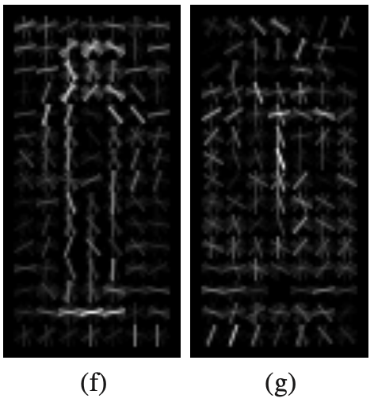
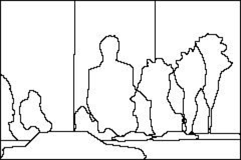
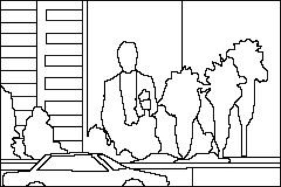

# Content

- Classification or Object Detection
- Sliding Window
- Detecting Faces
- Detecting Humans and other applications

# Object Detection

What is object detection?

::: notes
We have just been talking about image classification - what are the differences between classification and object detection?
:::

## Object Detection {data-auto-animate="true"}

_Image classification_ methods can detect an object in the image if there is just a **single** object in the scene and it clearly dominates the image.

If this constraint is not met, we are in the **object detection** scenario.

## Object Detection {data-auto-animate="true"}

We can use similar techniques we have learnt in Image Classification to detect objects in an image.

Here we apply these techniques to **sub-windows** of the image.

This approach is called a _sliding window_ method.

# Sliding Window

Sliding window is a _meta_ algorithm - a concept found in many machine learning algorithms.

::: notes
not perhaps a precise description - more a family of algorithms
:::

## Sliding Window {data-auto-animate="true"}

First, let's assume our objects have relatively similar size and fit into $n \times m$ pixel windows.

## Sliding Window {data-auto-animate="true"}

Build the dataset of positive and negative instances and train the classifier.

We could then _slide_ the classification window over the image to **search** for the object location.

::: notes
Classifier is trained as we have discussed - or even simpler.
:::

## Sliding Window {data-auto-animate="true"}

But, there are problems:

::: incremental

- Objects may be of significantly _different sizes_.
- Some windows will overlap - how do we avoid counting objects _multiple times_?

:::

::: notes
How do we decide on the window size? - we account for only one size...

We need to solve these two problems to achieve robust detection.
:::

## Sliding Window {data-auto-animate="true"}

We tackle the first problem by searching over scale as well.

::: incremental

- We build the **Gaussian pyramid** of our image.

:::

::: notes
Matlab has a function for this - `impyramid`.
:::

## Gaussian Pyramid {data-auto-animate="true"}

Each layer of a pyramid is obtained by _smoothing_ a previous layer with a Gaussian filter and _subsampling_ it.

## {data-transition="convex"}

{width=80%}

::: notes
here we have downsampled the image by a factor of 2.
we could choose a different factor, and we have the gaussian parameters to adjust.
:::

## Gaussian Pyramid {data-auto-animate="true"}

We search using our $n \times m$ window in each **layer** of the pyramid.

::: notes
This is how we tackle the first problem...objects of different sizes.
:::

## Sliding Window {data-auto-animate="true"}

The second problem is usually solved using **non-maximum suppression**.

::: notes
The second problem - overlapping windows - counting objects multiple times.
This is more apparent with windows of different sizes.
:::

## Non-Maximum Suppression {data-auto-animate="true"}

Windows with a local maximum of _classifier confidence_ **suppress** nearby windows.

::: notes
Nearby windows usually means overlapping windows.

This is a high level description of sliding windows - let's discuss more formally.
:::

## Sliding Window {data-auto-animate="true"}

Train the classifier on $n \times m$ windows.

Choose a threshold $t$ and $\Delta x$ and $\Delta y$, where:

- $t$ is a threshold for the classifier confidence.
- $\Delta x$ and $\Delta y$ are the step distance for each direction.

::: notes
So - formally we train a classifier on windows - to achieve object detection.
:::

## Sliding Window {data-auto-animate="true"}

Construct an Image Pyramid.

For each level:

- Apply the classifier to each $n \times m$ window, stepping by $\Delta x$ and $\Delta y$ in this level to get a classifier confidence $c$.
- If $c$ is above $t$, insert a pointer to the window into a list $L$, _ranked_ by $c$.

## Sliding Window {data-auto-animate="true"}

For each window $w$ in $L$, from highest confidence:

- remove all windows $u \neq w$ that overlap $w$ _significantly_
- overlap is calculated in the _original_ image, by expanding coarser scales

::: notes
This is the non-maximal suppression step.
the idea of significant overlap is not precisely defined - it is another parameter.
:::

# Detection Applications

Now we know _how_ to detect objects in an image, **what** can be detected?

::: notes
We of course enter another huge topic - so we will discuss a couple of really important applications.
:::

# Face Detection

We will mostly discuss the classic _Viola-Jones_ algorithm for face detection.

::: notes
Before we dive into viola-jones, I want to mention some other classic methods you should be aware of.
:::

## Face Detection

Another classic method in face classification is _Eigenfaces_.

::: incremental

- Eigenfaces use PCA on an aligned set of face images.
- _Fisherfaces_ extends Eigenfaces to use Fisher LDA.
- There is a document on Blackboard for you to read on these methods.

:::

::: notes
There are some slides on these methods on BB - you might find the interesting - and they are a forerunner of some very contemporary techniques for face generation.
:::

## Viola-Jones object detection

P. Viola, and M. Jones,

Rapid Object Detection using a Boosted Cascade of Simple Features.

International Conference on Computer Vision and Pattern Recognition, pp. 511-518, 2001.

::: notes
Ok, let's deep dive into this algorithm.
:::

## Viola-Jones object detection framework

A fast and robust method for face detection.

- Can be used for detection of other objects, not only faces.
- Robust - high detection rate and low false-positive rate.
- Detection only - not recognition.

::: notes
The idea is to distinguish faces from non faces.
:::

## Viola-Jones object detection framework

The method comprises four stages:

::: incremental

- feature detection
- integral image
- learning algorithm using modified AdaBoost
- _cascade_ of classifiers

:::

::: notes
the integral image is a pre-processing step.
:::

## Viola-Jones Feature Extraction {data-auto-animate="true"}

::: columns

::::: column

:::::

::::: column

Features need to be calculated **fast**!

::: incremental

- Use a simple set of _Haar-like_ features.
- add light rectangle and subtract dark rectangle
- features are translated within a sub-window

:::

:::::

:::

::: notes
Haar like features are a simple orthogonal type operator - Haar was a mathematician from the early 20th century.
Simple addition or subtraction of rectangles.
For example A : sum the pixels under the light rectangle, and subtract the sum of the pixels under the dark rectangle. ONLY summations!
:::

## Viola-Jones Feature Extraction {data-auto-animate="true"}

Features can be calculated very quickly by pre-calculating the **integral** image.

$$
I(x, y) = \sum_{\substack{x' \leq x \\ y' \leq y}} i(x', y')
$$

i.e. the sum of pixels to the left and above a given pixel.

## Viola-Jones Feature Extraction {data-auto-animate="true"}

::: columns

::::: {.column width=50%}

:::::

::::: column

Sum of pixels under a rectangle:

::: incremental

- Value at pixel 1 is _sum_ of rectangle A.
- Value at 2 is A + B.
- Value at 3 is A + C.
- at 4 is A + B + C + D.
- D = 4 + 1 - (2 + 3)

:::

:::::

:::

::: notes
Any pixel in the integral image is the sum of the pixels above and left...
one has to admire the simple genius of the integral image!
:::

## Viola-Jones Feature Extraction {data-auto-animate="true"}

::: columns

::::: column

:::::

::::: column

Each of these 4 features can be scaled and shifted in a $24 \times 24$ pixel sub-window.

- giving a total of approx 160,000 features.

:::::

:::

## Viola-Jones Feature Learning {data-auto-animate="true"}

The number of features extracted from an image is very large.

::: incremental

- We need a way to select the _subset_ of features, which are the most _important_ from the point of object **detection**.
- We also need a **fast** classifier.
- Solution: modified **AdaBoost**.

:::

::: notes
so - what did they do??
:::

## Viola-Jones Feature Learning {data-auto-animate="true"}

Modified Adaboost algorithm.

::: incremental

- Each _weak_ learner operates on only **one** feature.
- Thus, Adaboost acts as a feature _selector_.
- Can significantly reduce the initial number of 160,000 features.
- e.g. 200 features can provide 95% detection rate with 1 in 14000 false positives.

:::

::: notes

Very good, but probably not enough in a real application.
We want to improve both detection rate and reduce the number of features to calculate.

those false positives are still very high given pixels in an image.
:::

## Viola-Jones Features {data-auto-animate="true"}

{width=80%}

::: notes
Features have been selected by adaboost...
In both cases, the features can be recognised in the image of a face...
the bright bridge of the nose..., dark eyes, light cheeks, etc.
quite intuitive...
:::

## Viola-Jones Learning {data-auto-animate="true"}

Attentional cascade of boosted classifiers.

We can train a simple boosted classifier on a very low number of features and adjust its threshold to guarantee 100% detection rate.

::: notes
we will have lots of false positives...
but even so - we will have rejected many sub windows.
:::

## Viola-Jones Learning {data-auto-animate="true"}

_Many_ false positives, but we can easily **reject** most sub-windows.

- Sub-windows classified as positives are passed to the next stage of the cascade.
- Additional features are used in a more complex classifier.
- ...and so on, to reduce the number of false positives.

::: notes
extra features are calculated for these sub windows...
:::

## Viola-Jones Learning {data-auto-animate="true"}

Attentional cascade of boosted classifiers.

- 38 layers with 6061 features
- Majority of sub-windows will be rejected in the early layers of the cascade where few features are needed.

::: notes
Its still a big number, but most of those windows are rejected early on, with small features - this is what makes it so fast.
:::

## Viola-Jones Multiple Detections {data-auto-animate="true"}

The image is scanned with sub-windows at different _scales_ and different _locations_.

- Results from individual sub-windows are combined for the final result.
- Detected sub-windows are divided into disjoint sets.
- In each disjoint set we calculate the mean of four corners.

::: notes

Disjoint sets have no intersection... so the detections in one set are all the same face.
Note: this is not non-maximum suppression.
The mean box is the final detection.

:::

## Viola-Jones {data-auto-animate="true"}

MATLAB has an implementation of the algorithm.

{width=80%}

::: notes
you can find the code to produce this image on the Mathworks Website.
:::

## Viola-Jones {data-auto-animate="true"}

Very slow to train.
The original paper reports _weeks_ of training for the training set they used
(5k faces, 9.5k non-faces).

Very fast to execute.
On 700 MHz processor, it takes 0.067s to analyse 384x288 image.

::: notes
training would still take a long time...

but testing - 67 milliseconds 20 years ago - is fast!

I really encourage reading the paper - it is well written and has some great ideas in it!

Of course, there are many much better methods developed in the 20 years since this paper.
But the method here is really simple - and it addresses the issues faced really well.

This was a very influential paper!
:::

# Detecting Humans

The original HOG paper also proposed detection of humans in the sliding window.

::: notes
Another application - detecting humans...
:::

## Detecting Humans {data-auto-animate="true"}

Dalal and Triggs used a linear SVM classifier.

::: notes
as well as the Hog features - they also detected humans...
Using just a linear SVM.
This is a figure from their original paper.
:::

## Detecting Humans {data-auto-animate="true"}

::: columns
::::: column

:::::

::::: column

a. The mean gradient image for all data.
b. The maximum positive SVM weights.
c. The maximum negative SVM weights.

The SVM weights provide a nice visualisation of the decision boundary.

:::::
:::

::: notes
a - The average gradient image over the training examples.
b - Each pixel shows the maximum positive SVM weight in the block centred on the pixel.
c - Likewise for the negative SVM weights.
shows that the most important cells are the ones that typically contain major human contours
(especially the head and shoulders and the feet)
:::

## Detecting Humans {data-auto-animate="true"}

::: columns
::::: column

:::::

::::: column

d. An example 64×128 test image.
e. The computed HOG descriptor.

Performance was reduced with less margin around the subject in the test images.

:::::
:::

::: notes
64×128 detection window - 16 pixel margin around human contours.
:::

## Detecting Humans {data-auto-animate="true"}

::: columns
::::: column

:::::

::::: column

f. Positively weighted HOG descriptor.
g. Negatively weighted HOG descriptor.

Showing that the detector cues mainly on the contrast of silhouette contours and gradients inside the person typically count as negative cues.

:::::
:::

::: notes
Evidence for and against the hypothesis it is a human.

f) the detector cues mainly on the contrast of silhouette contours against the background, not on internal edges or on silhouette contours against the foreground.

g) illustrate that gradients inside the person (especially vertical ones) typically count as negative cues, presumably because this suppresses false pos
:::

## Detecting Boundaries {data-auto-animate="true"}

Object detection through segmentation using _boundary detection_.

Edges are **not** the same as object contours or occluding contours.

::: incremental

- Some edges are irrelevant or confusing for object detection.
- Solution: use a _sliding window_ to detect boundaries.

:::

::: notes
One way to segment images is to detect relevant boundaries.
:::

## Detecting Boundaries {data-auto-animate="true"}

At each window we extract features that will decide whether the centre pixel in the window is an occluding contour or not.

::: incremental

- Each pixel is assigned a _probability_ of boundary.
- Circular windows often used as boundaries are oriented.
- A boundary splits the circular window into two halves.

:::

::: notes
at each window centre pixel - is it a boundary?
so we need to repeat for every pixel in the image!
circular so everything is symmetrical.
:::

## Detecting Boundaries {data-auto-animate="true"}

Features could be _histograms_ produced from image intensity, oriented energy, brightness gradient, colour gradient etc.

The histograms are extracted from two halves of the window,
and the distance between them is calculated. E.g. $\chi^2$

This distance is mapped to probability using _logistic regression_.

::: notes
chi squared distance between histograms is something useful for your literature review.
logistic regression uses a sigmoid function to create a decision boundary.
:::

## Detecting Boundaries {data-auto-animate="true"}

Training and test data require _annotations_.

{width=80%}

## Detecting Boundaries {data-auto-animate="true"}

::: columns
::::: column

{width=80%}
{width=80%}

:::::
::::: column

Annotations are performed by different subjects.

:::::
:::

## Detecting Boundaries {data-auto-animate="true"}

Inconsistent annotations are averaged.

{width=80%}

# Summary

Reading:

- Forsyth, Ponce; Computer Vision: A modern approach, 2nd ed., Chapters 16,17 and 5.
- Sonka et al., Image Processing, Analysis and Machine Vision, 4th ed., Chapter 10
- Papers mentioned in the slides!
