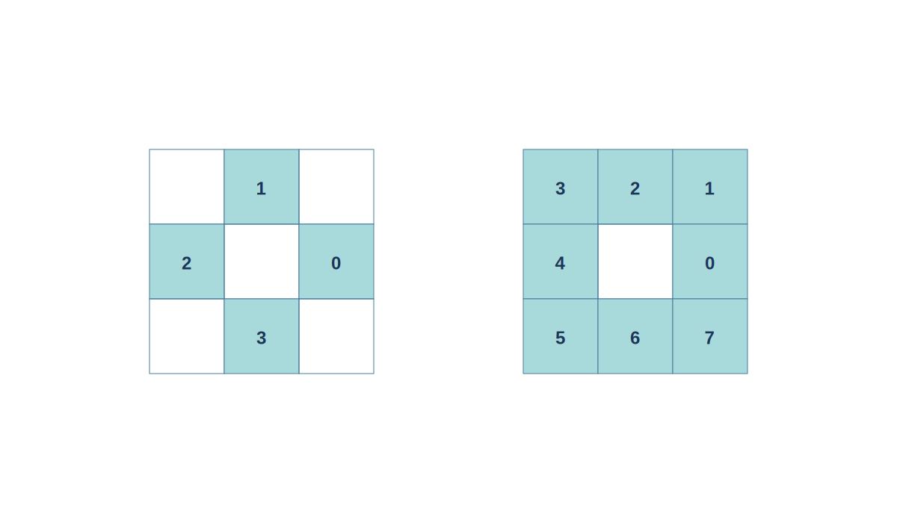
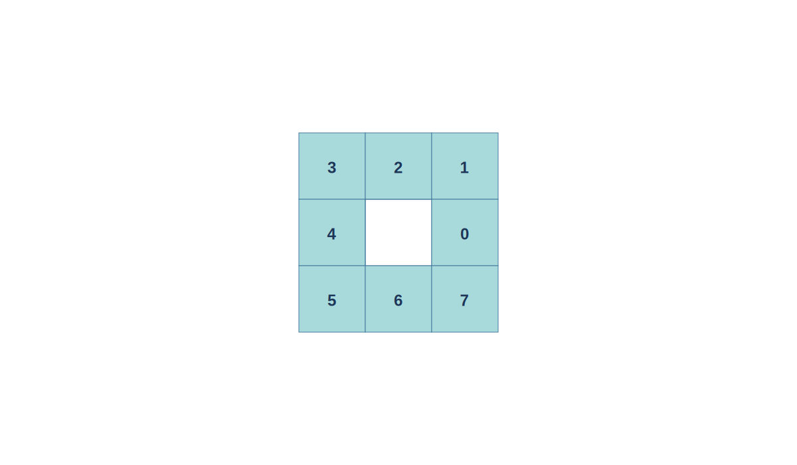
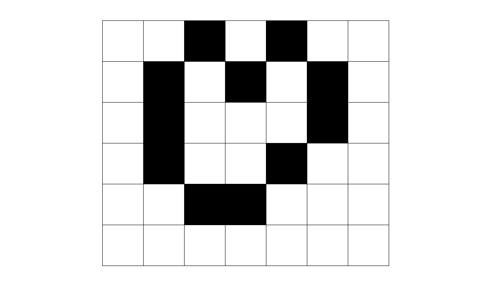
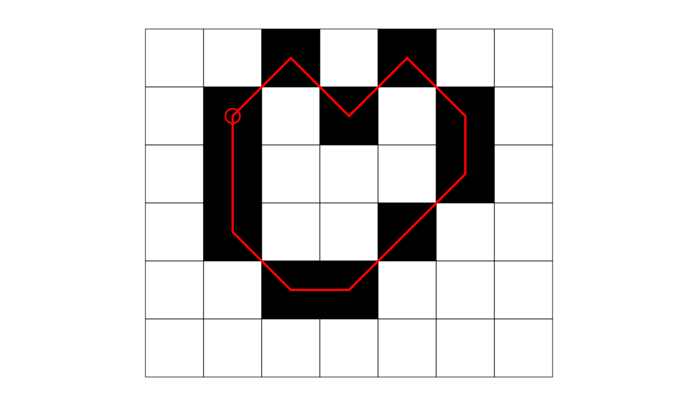
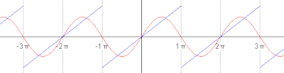
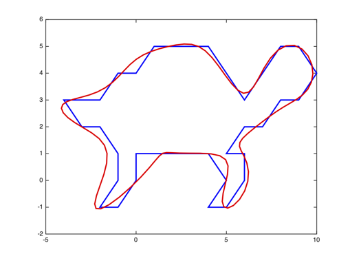

# Content

- Chain codes
- Elliptical Fourier Descriptors

# Shapes

Shapes compactly describe objects in images.

::: notes
motivation for shape representation
:::

## Representing Shapes

A shape in an image could be represented using the coordinates of edge pixels.

## Representing Shapes

Pixel coordinates encode the _shape_ **and** the _location_

- describes the shape in the image coordinate frame
- same shape in two locations appears to be different

## Representing Shapes

We are not interested in where the shape is - just the representation of the shape itself.

# Chain Codes

Rather than represent edge pixels in terms of image coordinates, represent each pixel as a **direction**.

## Chain Codes

In which direction must we move to stay on the edge?

- Shape is a _sequence of directions_.
- This is a **chain code**.

## Connectivity

- Connectivity is the notion of pixels being connected.
- A path must pass through connected pixels.
- In which directions can we travel to stay on the path?

---

---

## Chain Code Example

---

::: columns

::::: column

:::::
::::: column

Assume:

- 8 connectivity
- scan anti-clockwise
- start at left-most column, then top-most row
- edge pixels are black

:::::

:::

---

---

## Chain Codes

$6 6 7 0 1 1 2 3 5 3 5$

::: notes
this is the code... we had to take care of the starting point
:::

## Chain Codes

For invariance to starting location:

- compute the chain code and rotate so the code represents the smallest m-digit **shape-number**.
- $6 6 7 0 1 1 2 3 5 3 5 \rightarrow 0 1 1 2 3 5 3 5 6 6 7$

::: notes
Chain code is sensitive to the starting point!
:::

## Chain Codes

Chain codes _are_ **translation** invariant.

- Adding a constant value to the x, y coordinates does not change the shape.

Chain codes are **not** scale or rotation invariant.

## Chain Code Derivatives

Chain codes specify a direction in absolute terms.

- Eg. 0 represents East, regardless of current direction.

## Chain Code Derivatives

This idea can be extended to use a relative encoding.

- Represent the next direction as the number of turns required to stay on the shape boundary.

- In this case, 0 corresponds to straightforward.

- This is a chain code _derivative_ or differential chain code.

## Chain Code Derivatives

To compute the chain code derivative:

- Compute the difference between chain code elements.
- Take the result _modulo_ $n$ (the connectivity).

## Chain Code Derivatives

Need to be careful with the starting element.

- Common assumption is begin straightforward.
- Chain code wraps around, so starting code is relative to the last.

## Chain Code Derivatives

- Chain Code: $6 6 7 0 1 1 2 3 5 3 5$
- Derivative: $1 0 1 1 1 0 1 1 2 6 2$

NB: pay attention to modulus of negative numbers.

::: notes
from our previous example.
:::

## Chain Code Derivatives

Chain code derivative provides _rotational_ invariance for rotations of **90 degrees**.

## Chain Code Advantages

- compact representation - only boundary is stored
- invariant to translation
- easy to compute shape related features, e.g. area, perimeter, centroid

## Chain Code Disadvantages

- No true rotational invariance and no scale invariance.
- Extremely sensitive to noise, sub-sampling loses definition.
- Cannot have sub-pixel accurate descriptions, only 4 or 8-connectivity.

## Chain Code Disadvantages

Chain codes describe a specific instance of a shape.

- What about a class of non-rigid shapes?
- What about boundaries that are not closed?
- What about locating shapes automatically in images?

# Elliptical Fourier Descriptors

A **parametric** representation of a shape.

::: notes

will solve _some_ of these problems.

:::

## Aside: Fourier Series

A Fourier series is an expansion of a **periodic** function $f(x)$ in terms of an infinite **sum** of sines and cosines.

## Aside: Fourier Series

We can approximate non-periodic functions on a specific _interval_.

- by pretending the non-periodic part _is_ periodic **outside** the interval.

## Aside: Fourier Series

The Fourier series of a periodic function $f(t)$ of period $T$ is:

$$
f(t) = \frac{a_0}{2}
    + \sum_{n=1}^{\infty}
    \left[ a_n \cos \frac{2 \pi n t}{T}
    + b_n \sin \frac{2 \pi n t}{T} \right]
$$

for some set of Fourier coefficients $a_n$ and $b_n$ defined by the integrals:

$$
a_n = \frac{2}{T} \int_{0}^{T} f(t) \cos \frac{2 \pi n t}{T} \mathrm{d}t,~
b_n = \frac{2}{T} \int_{0}^{T} f(t) \sin \frac{2 \pi n t}{T} \mathrm{d}t.
$$

::: notes
I'll point out this is 1D - but we will get into a 2D version later.
:::

## Aside: Fourier Series

{width=80%}

## Aside: Fourier Series

## Aside: Fourier Series

A function is **even** when:

$$f(x) = f(-x) \text{ for all } x$$

It has _reflective_ symmetry about the **y-axis**, e.g. $x^2$ or $cos(x)$.

We can approximate even functions using only _cosine_ coefficients.

## Aside: Fourier Series

A function is **odd** when:

$$ -f(x) = f(-x) \text{ for all } x$$

It _rotational_ symmetry about the **origin**, e.g. $x^3$ or $sin(x)$.

We can approximate even functions using only _sine_ coefficients.

---

It is useful to know about odd and even functions, but generally we will need to know both coefficients.

## Elliptical Fourier Series

How do we go from Chain encodings to EFDs?

- First, _separate_ chain encodings into x and y **projections**.
- Allows us to deal with each dimension independently.

---

The projection of the first $p$ links is the sum of differences between all previous links.

$$x_p = \sum_{i-1}^{p} \Delta x_i, ~ y_p = \sum_{i-1}^{p} \Delta y_i $$

---

For the x-projection:

- For East, North East, or South East, $\Delta x = 1$.
- For North and South, $\Delta x = 0$.
- For West, North West, or South West, $\Delta x = -1$.

---

Similarly, for the y-projection.

- For North, North East, or North West, $\Delta y = 1$.
- For East and West, $\Delta y = 0$.
- For South, South East, or South West, $\Delta y = -1$.

---

We will consider the **"time"** derivative of the chain.

Time here means the _length_ of the chain.

- The contribution of horizontal and vertical links is one.
- The contribution of a diagonal link is $\sqrt{2}$.

$$t_p = \sum_{i-1}^{p} \Delta t_i $$

## Elliptical Fourier Series

Calculate the Fourier expansion for the x-projection.

$$
x(t) = \frac{a_0}{2}
    + \sum_{n=1}^{\infty}
    \left[ a_n \cos \frac{2 \pi n t}{T}
    + b_n \sin \frac{2 \pi n t}{T} \right]
$$

**NB:** not to infinity, but to some useful number of coefficients.

---

where:

$$\frac{a_0}{2} = \frac{1}{T} \int_{0}^{T} x(t) ~\mathrm{d}t$$

and $T$ is the length of the chain.

---

again, from the definition:

$$
a_n = \frac{2}{T} \int_{0}^{T} x(t) \cos \frac{2 \pi n t}{T} ~\mathrm{d}t,~
b_n = \frac{2}{T} \int_{0}^{T} x(t) \sin \frac{2 \pi n t}{T} ~\mathrm{d}t.
$$

How can we calculate these coefficients?

---

The time derivative of $x$ is periodic with period $T$ and can itself be represented by the Fourier series:

$$
x'(t) = \sum_{n=1}^{\infty}
    \alpha_n \cos \frac{2 \pi n t}{T} +
    \beta_n \sin \frac{2 \pi n t}{T}
$$

where:

$$
\alpha_n = \frac{2}{T} \int_{0}^{T} x'(t) \cos \frac{2 \pi n t}{T} \mathrm{d}t~,
\beta_n = \frac{2}{T} \int_{0}^{T} x'(t) \sin \frac{2 \pi n t}{T} \mathrm{d}t
$$

::: notes
consider the time derivative...
this is a different function, so different coefficients.
:::

---

then:

$$
\alpha_n = \frac{2}{T} \int_{0}^{T} x'(t) \cos \frac{2 \pi n t}{T} \mathrm{d}t
$$

The difference here is our chain code is a piecewise linear function, so the time derivative is constant.

---

$$
\begin{aligned}
\alpha_n &= \frac{2}{T} \int_{0}^{T} x'(t) \cos \frac{2 \pi n t}{T} \mathrm{d}t \\
&= \frac{2}{T} \sum_{p=1}^{K} \frac{\Delta x_p}{\Delta t_p}  \int_{t_{p-1}}^{t_p} \cos \frac{2 \pi n t}{T} \mathrm{d}t
\end{aligned}
$$

The "trick" is to notice that the integral over the whole period is a summation of the $K$ chain links, and the derivative is a constant: the change in direction over the change in length.

---

finally, we take the antiderivative of the cosine term:

$$
\begin{aligned}
\alpha_n &= \frac{2}{T} \int_{0}^{T} x'(t) \cos \frac{2 \pi n t}{T} \mathrm{d}t \\
&= \frac{2}{T} \sum_{p=1}^{K} \frac{\Delta x_p}{\Delta t_p}
\int_{t_{p-1}}^{t_p} \cos \frac{2 \pi n t}{T} \mathrm{d}t \\
&= \frac{1}{n\pi} \sum_{p=1}^{K} \frac{\Delta x_p}{\Delta t_p}
\left( \sin \frac{2 \pi n t_p}{T} - \sin \frac{2 \pi n t_{p-1}}{T} \right)
\end{aligned}
$$

---

similarly, we can calculate:

$$
\beta_n = \frac{1}{n\pi} \sum_{p=1}^{K} \frac{\Delta x_p}{\Delta t_p}
\left( \cos\frac{2 \pi n t_p}{T} - \cos \frac{2 \pi n t_{p-1}}{T} \right)
$$

---

We can also obtain $x'(t)$ directly from the $x(t)$ definition:

$$
x(t) = \frac{a_0}{2} +
    \sum_{n=1}^{\infty}
    a_n \cos \frac{2 \pi n t}{T} +
    b_n \sin \frac{2 \pi n t}{T}
$$

$$
x'(t) = \sum_{n=1}^{\infty}
    - \frac{2 \pi n t}{T} a_n \sin \frac{2 \pi n t}{T}
    + \frac{2 \pi n t}{T} b_n \cos \frac{2 \pi n t}{T}
$$

---

If we compare both derivations of $x'(t)$:

$$
x'(t) = \sum_{n=1}^{\infty}
    \alpha_n \cos \frac{2 \pi n t}{T} +
    \beta_n \sin \frac{2 \pi n t}{T}
$$

$$
x'(t) = \sum_{n=1}^{\infty}
    - \frac{2 \pi n t}{T} a_n \sin \frac{2 \pi n t}{T}
    + \frac{2 \pi n t}{T} b_n \cos \frac{2 \pi n t}{T}
$$

we can equate coefficients from both equations:

$$
- \frac{2 \pi n t}{T} a_n = \beta_n , ~ \frac{2 \pi n t}{T} b_n = \alpha_n
$$

---

and solve for $a_n$ and $b_n$, giving us the coefficients for the Fourier series:

$$
a_n = \frac{T}{2n^2\pi^2} \sum_{p=1}^{K} \frac{\Delta x_p}{\Delta t_p}
\left( \cos \frac{2 \pi n t_p}{T} - \cos \frac{2 \pi n t_{p-1}}{T} \right)
$$

$$
b_n = \frac{T}{2n^2\pi^2} \sum_{p=1}^{K} \frac{\Delta x_p}{\Delta t_p}
\left( \sin \frac{2 \pi n t_p}{T} - \sin \frac{2 \pi n t_{p-1}}{T} \right)
$$

---

we can also solve for the $y$ projection in the same way:

$$
c_n = \frac{T}{2n^2\pi^2} \sum_{p=1}^{K} \frac{\Delta y_p}{\Delta t_p}
\left( \cos \frac{2 \pi n t_p}{T} - \cos \frac{2 \pi n t_{p-1}}{T} \right)
$$

$$
d_n = \frac{T}{2n^2\pi^2} \sum_{p=1}^{K} \frac{\Delta y_p}{\Delta t_p}
\left( \sin \frac{2 \pi n t_p}{T} - \sin \frac{2 \pi n t_{p-1}}{T} \right)
$$

---

We now know everything we need to calculate the Fourier series coefficients for the $x$ and $y$ projections.

The number of harmonics is $n$.
The length of the chain is $T$.
The number of chain links is $K$.
The length of each link is $t_p$.

## Elliptical Fourier Series

The DC component determines the centre position of the ellipse.

For those interested, the calculation can be found here:

"Kuhl, Giardina;
Elliptic Fourier Features of a Closed Contour,
Computer Graphics and Image Processing, 1982"

---

## EFDs Summary

- Invariant to translation, scale and rotation.
- Less sensitive to noise than chain code as we can limit the harmonics.

---
