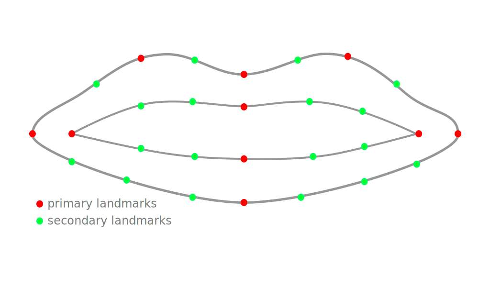
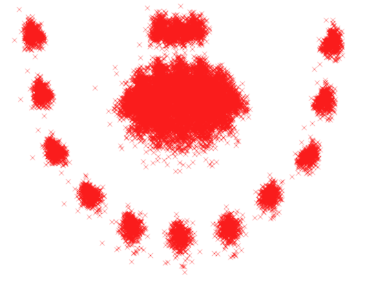
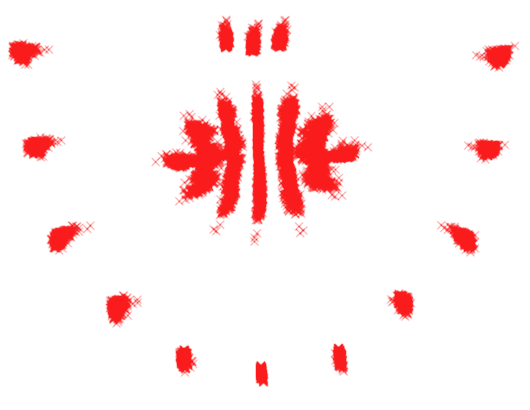
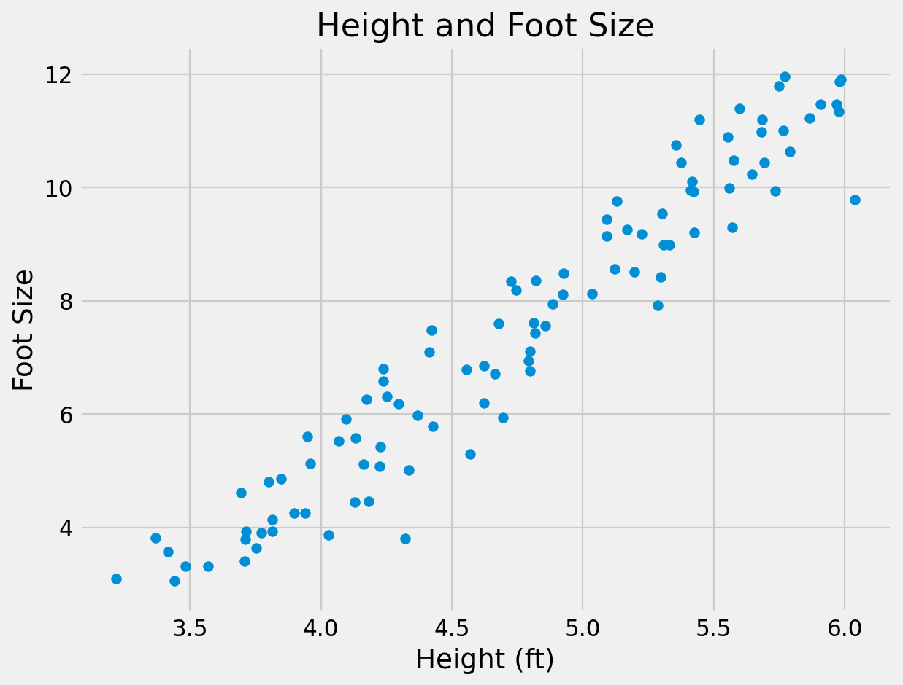
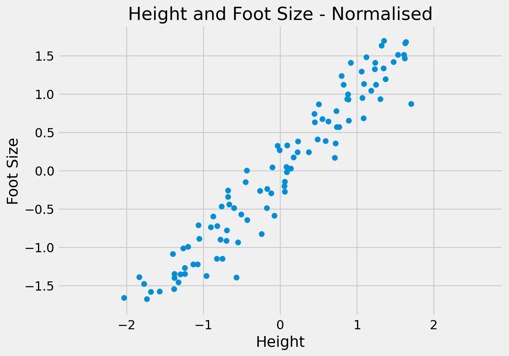
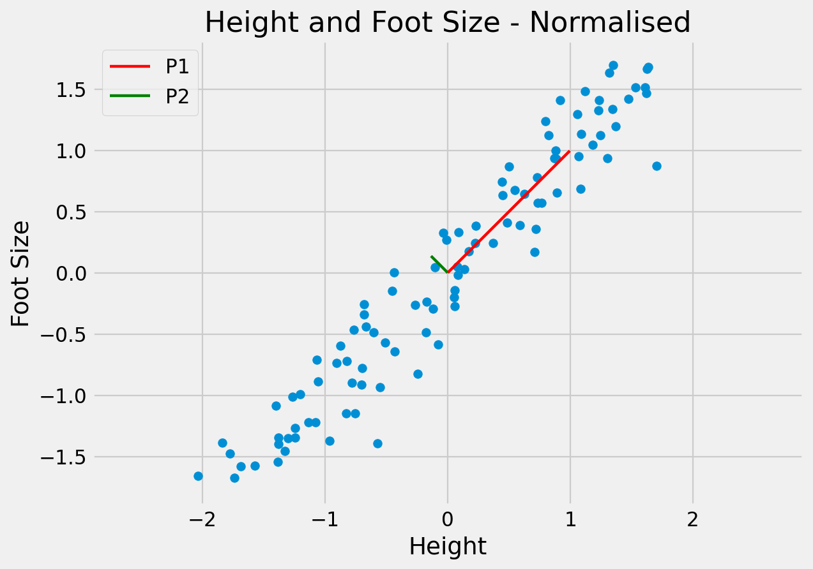
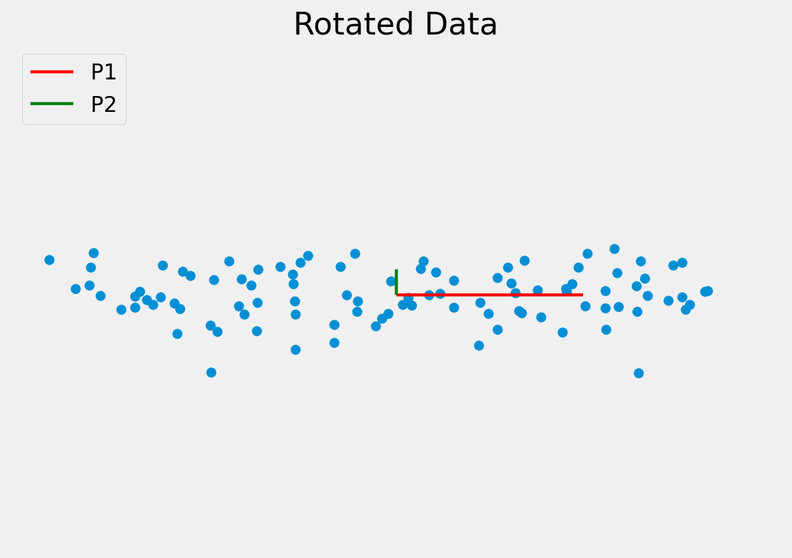
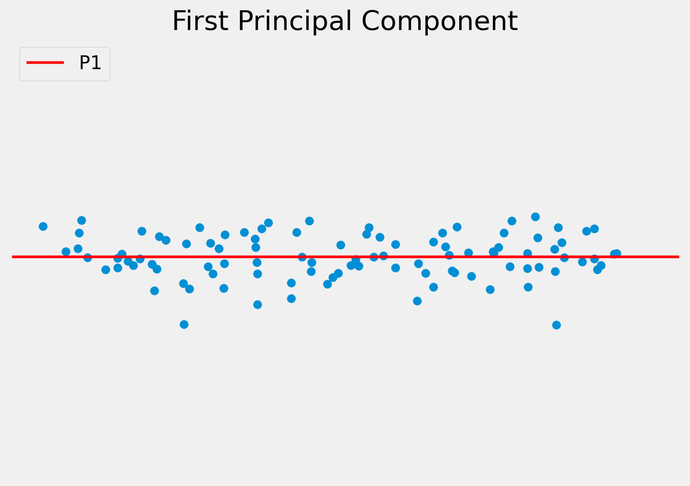
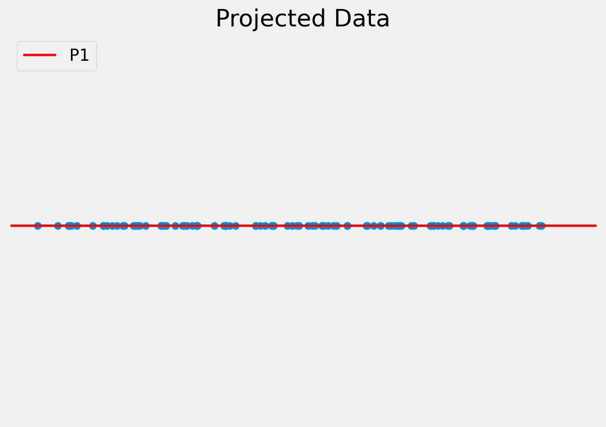
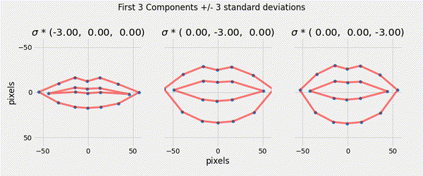

# Content

- Point Distribution Models
- Procrustes Analysis
- Principal Component Analysis

# Point Distribution Models

A _generative_ statistical model of the variation of the shape of an object.

## Point Distribution Models

If something specific about the shape is known, it should be incorporated into the image search.

A point distribution model (PDM) _learns_ the allowed variation in a **class** of shapes from _examples_.

## Landmarks {data-auto-animate="true"}

A shape is represented by a set of **landmarks** located along the shape boundary.

- Must be easy to locate from one image to another.
- Use T-junctions, points of high curvature, corners, etc

## Landmarks {data-auto-animate="true"}

To better represent the overall shape, also evenly space intermediate points along the boundary.

---

## {data-auto-animate="true"}

All example shapes must have the **same number** of landmarks and be labelled with the landmarks in the **same order**.

- Note: this initial landmarking is a **manual** process.

## {data-auto-animate="true"}

Sufficient images must be labelled to capture the expected range of variation.

- The model _cannot_ extrapolate to unknown shapes.
- The model _can_ interpolate to new instances within the bounds of the data.

---

Mathematically, a shape is the concatenation of the $x$ and $y$ coordinates of the landmarks.

$$
\mathbf{x} = \{ x_{11}, x_{12}, ..., y_{11}, y_{12}, ...y_{1n} \}^{T}
$$

The consistency in the labelling ensures the elements of these vectors have the same meaning.

## {data-auto-animate="true"}

::: columns
::::: column

:::::
::::: column

The coordinates describe the shape in the image coordinate frame.

- The same shape at different locations results in a different shape vector.

:::::
:::

## {data-auto-animate="true"}

::: columns
::::: column

:::::
::::: column

We need to normalise shapes for translation, scale and rotation.
This can be done using generalised **Procrustes analysis**.

:::::
:::

# Procrustes Analysis

Procrustes, the son of Poseidon, from Greek mythology.

## Procrustes Analysis {data-auto-animate="true"}

::: columns
::::: column

:::::
::::: column

:::::
:::

## Procrustes Analysis {data-auto-animate="true"}

1. Translate each example so it is centred on the mean.
2. Using the first shape as a reference, transform each example to align with the reference.
3. Compute the mean of the aligned shapes.
4. Align the mean with the first shape.
5. Transform shapes to match the adjusted mean.
6. If not converged, go to step 3.

**Convergence** is a _small_ change in the mean.

## {data-auto-animate="true"}

To align shapes:

$$
\begin{aligned}
\mathbf{x}_{1} &= \{ x_{11}, x_{12}, ..., y_{11}, y_{12}, ...y_{1n} \}^{T} \\
\mathbf{x}_{2} &= \{ x_{21}, x_{22}, ..., y_{21}, y_{22}, ...y_{2n} \}^{T}
\end{aligned}
$$

Scale and rotation is defined by $M$, and translation by $\mathbf{t}$:

$$
M(s, \theta) =
\begin{pmatrix}
\mathbf{x}_{2i} s \cos \theta - \mathbf{y}_{2i} s \sin \theta  \\
\mathbf{x}_{2i} s \sin \theta + \mathbf{y}_{2i} s \cos \theta
\end{pmatrix}~
~\mathbf{t} =
\begin{pmatrix} t_{x} \\ t_{y} \end{pmatrix}
$$

## Aligning Shapes {data-auto-animate="true"}

The parameters for scaling, rotation and translation are unknown.

- They need to be calculated from the data.

## Aligning Shapes {data-auto-animate="true"}

Define a **metric** that measures how well two shapes are aligned.

- Use _sum of squared differences_ between the shapes.

$$
E = (x_1 - M(s, \theta) \mathbf{x}_2 - t) ~W (x_1 - M(s, \theta) \mathbf{x}_2 - t)^T
$$

where $W$ is a diagonal weighting matrix.

---

We can alternatively write the equation as:

$$
\begin{split}
E = \sum_{i=1}^n & w_i
\left[
    \begin{pmatrix} x_{1i} \\ y_{1i} \end{pmatrix} -
    \begin{pmatrix}
        x_{2i} s \cos \theta -  y_{2i} s \sin \theta \\
        x_{2i} s \sin \theta +  y_{2i} s \cos \theta
    \end{pmatrix} -
    \begin{pmatrix} t_{x} \\ t_{y} \end{pmatrix}
\right] \\
& \left[
    \begin{pmatrix} x_{1i} \\ y_{1i} \end{pmatrix} -
    \begin{pmatrix}
        x_{2i} s \cos \theta -  y_{2i} s \sin \theta \\
        x_{2i} s \sin \theta +  y_{2i} s \cos \theta
    \end{pmatrix} -
    \begin{pmatrix} t_{x} \\ t_{y} \end{pmatrix}
\right]
\end{split}
$$

---

Let $a_x = s \cos \theta~$ and $~a_y = s \sin \theta$ and substitute:

$$
\begin{split}
E =  \sum_{i=1}^n & w_i
\left[
    \begin{pmatrix} x_{1i} \\ y_{1i} \end{pmatrix} -
    \begin{pmatrix}
        x_{2i} a_x -  y_{2i} a_y \\
        x_{2i} a_y +  y_{2i} a_x
    \end{pmatrix} -
    \begin{pmatrix} t_{x} \\ t_{y} \end{pmatrix}
\right] \\
&\left[
    \begin{pmatrix} x_{1i} \\ y_{1i} \end{pmatrix} -
    \begin{pmatrix}
        x_{2i} a_x -  y_{2i} a_y \\
        x_{2i} a_y +  y_{2i} a_x
    \end{pmatrix} -
    \begin{pmatrix} t_{x} \\ t_{y} \end{pmatrix}
\right]
\end{split}
$$

---

then multiply:

$$
E = \sum_{i=1}^n w_i
\left[
    ( x_{1i} -  a_x x_{2i} + a_y y_{2i} - t_{x} )^2 +
    ( y_{1i} -  a_y x_{2i} - a_x y_{2i} - t_{y} )^2
\right]
$$

This is the _cost function_ we must **minimise**.

---

$$
E = \sum_{i=1}^n w_i
\left[
    ( x_{1i} -  a_x x_{2i} + a_y y_{2i} - t_{x} )^2 +
    ( y_{1i} -  a_y x_{2i} - a_x y_{2i} - t_{y} )^2
\right]
$$

We have four unknown parameters: $a_x$, $a_y$, $t_x$ and $t_y$.

- Differentiate with respect to each parameter.
- Equate to zero.
- Solve the resulting system of equations.

::: notes
let's take t_x as an example...
:::

---

differentiate with respect to $t_x$:

$$
\frac{\delta E}{\delta t_x} = \sum_{i=1}^n w_i
(2(x_{1i} -  a_x x_{2i} + a_y y_{2i} - t_{x})(-1))
$$

---

equate to zero:

$$
\begin{aligned}
0 &= \sum_{i=1}^n w_i (- x_{1i} +  a_x x_{2i} - a_y y_{2i} + t_{x})
\end{aligned}
$$

---

distribute the weighting:

$$
\begin{aligned}
0 &= \sum_{i=1}^n w_i (- x_{1i} +  a_x x_{2i} - a_y y_{2i} + t_{x}) \\
0 &= - \sum_{i=1}^n w_i x_{1i} + a_x \sum_{i=1}^n w_i x_{2i} - a_y \sum_{i=1}^n w_i y_{2i} + t_{x} \sum_{i=1}^n w_i\\
\therefore \sum_{i=1}^n w_i x_{1i}  &= a_x \sum_{i=1}^n w_i x_{2i} - a_y \sum_{i=1}^n w_i y_{2i} + t_{x} \sum_{i=1}^n w_i
\end{aligned}
$$

---

let:

::: columns
::::: column
$$\sum_{i=1}^n w_i x_{1i} = X_1$$
$$\sum_{i=1}^n w_i x_{2i} = X_2$$
$$\sum_{i=1}^n w_i  = W$$
:::::

::::: column
$$\sum_{i=1}^n w_i y_{1i} = Y_1$$
$$\sum_{i=1}^n w_i y_{2i} = Y_2$$
:::::
:::

---

the expression from $\frac{\delta E}{\delta t_x}$ simplifies to:

$$X_1 = a_x X_2 - a_y Y_2 + t_x W$$

---

If we calculate the remaining derivatives, we can develop further substitutions:

$$
\begin{aligned}
C_1 &= \sum_{i=1}^n w_i (x_{1i}x_{2i} + y_{1i} y_{2i}) \\
C_2 &= \sum_{i=1}^n w_i (y_{1i}x_{2i} + x_{1i} y_{2i}) \\
Z   &= \sum_{i=1}^n w_i (x_{2i}^{2} + y_{2i}^{2})
\end{aligned}
$$

---

Finally, we have a system of linear equations:

$$
\begin{aligned}
X_1 &= a_x X_2 - a_y Y_2 + t_x W \\
Y_1 &= a_x Y_2 + a_y X_2 + t_y W \\
C_1 &= a_x Z   + t_x X_2 + t_y Y_2 \\
C_2 &= a_y Z   - t_x Y_2 + t_y X_2
\end{aligned}
$$

Solve for: $a_x$, $a_y$, $t_x$ and $t_y$.

## Aligning Shapes

This was a _simplified_ version of Procrustes analysis.

- We did not constrain $M$ to be a rotation matrix.

Matlab has a `procrustes` function.

- We will compare the two methods in the lab.

## Point Distribution Models

Given the _aligned_ shapes, compute a model that describes the _variation_ in the shape.

## Point Distribution Models

A compact linear model of the variation in the shape can be found using Principal Component Analysis (PCA). The model is of the form:

$$
\mathbf{x} = \overline{\mathbf{x}}+ \mathbf{P} \mathbf{b}_s
$$

where:

- $\mathbf{x}$ is a shape
- $\overline{\mathbf{x}}$ is a _reference_ shape, often the mean shape
- the matrix $\mathbf{P}$ describes the **variation** in shape
- $\mathbf{b}_s$ are the _parameters_ that represent a specific shape instance.

# PCA

Principal Component Analysis

## PCA

::: incremental

- Reveals the internal structure of the data in a way that best _explains the variance_ in the data.
- Used for dimensionality reduction.
- Reduces data down into its basic components, stripping away any unnecessary parts.

:::

::: notes
PCA was invented in 1901 by Karl Pearson, as an analogue of the principal axis theorem in mechanics;
:::

## PCA

- Assume we have 2-dimensional measurements.
  e.g. the height and foot size for a number of people
- We expect the measurements to be correlated to some degree.
  e.g. taller people tend to have larger feet
- Visualise the data by plotting one measure against the other.

---

{width=85%}

## PCA

The objective of PCA is to capture as much of the variation in as few dimensions as possible.

Find line of "best fit" through the data, then line of "next best fit" which is _orthogonal_ to the first...

Repeat for however many dimensions your data has

---

{width=85%}

---

{width=85%}

## PCA

Since the dimensions must be orthogonal, all we have done is rotate the axes to better align with the data.

In doing this:

- P1 captures most of the meaningful variation
- P2 seems to capture the noise in the measurements

The original data can be approximated as some distance along P1 from the centre of the data cloud.

---

{width=85%}

---

{width=85%}

---

{width=85%}

---

{width=85%}

## PCA

To project a data point onto a new axis:

$$\mathbf{b}_{s}  = \mathbf{P}^{T}  (x - \overline x )$$

## PCA

To reconstruct the data point from the features:

$$x \approx \overline x + \mathbf{P} \mathbf{b}_{s}$$

This is only an approximation since the data are truncated to lie on just the principal component(s).

## PCA

Note, in this example we have moved from a 2D problem to 1D so the representation is more compact.

Staying within the limits of the data means new examples can be generated — this is a **generative** model.

## PCA {data-auto-animate="true"}

Algorithm:

Compute the _mean_ of the data and subtract.

$$\mathbf{\overline{x}} = \frac{1}{N} \sum_{i=1}^{N} \mathbf{x}_i$$

Compute the _covariance_ matrix.

$$
S = \frac{1}{N - 1}  \sum_{i=1}^{N}
(\mathbf{x}_i - \mathbf{\overline{x}})
(\mathbf{x}_i - \mathbf{\overline{x}})^T
$$

Compute the **Eigenvectors** and **Eigenvalues** of the covariance matrix and sort into descending order by Eigenvalue.

## PCA {data-auto-animate="true"}

- Eigenvectors are the principal components.
- Eigenvalues are the variance explained by each principal component.
- We typically retain the number of eigenvectors that describe 95% of the total variation in the data.

::: notes
Eigen vectors, principal components, modes of variation, etc.
:::

## PCA {data-auto-animate="true"}

Matlab has implementations of both PCA and Eigenvector decomposition.

## Point Distribution Models

For modelling shapes, an n-point shape is represented as a 2n element vector:

$$X = \{x_1, x_2, \dots, x_n, y_1, y_2, \dots, y_n \}^{T}$$

PCA can be applied to the $\mathbb{R}^{2n}$ data, rotating the $2n$ axes to
best fit to the data cloud in $\mathbb{R}^{2n}$ space.

We retain only the meaningful variation - often resulting in considerable compression.

## Point Distribution Models

Ensuring that the shape parameters are within the limits of the original data cloud means that any generated shape is valid.

$$|b_i| \leq 3 \sqrt{\lambda_i}$$

---

{width=100%}

::: notes
Here, the original data is 20 x 2D points.
We can express the mouth shapes with only 3 values.
:::

# Summary

- Described a **generative** parametric shape model (PDM) that learns the variation in a class of shape.

- Aligned shapes using Procrustes analysis.

- Used PCA to reduce the dimensionality of the data.
