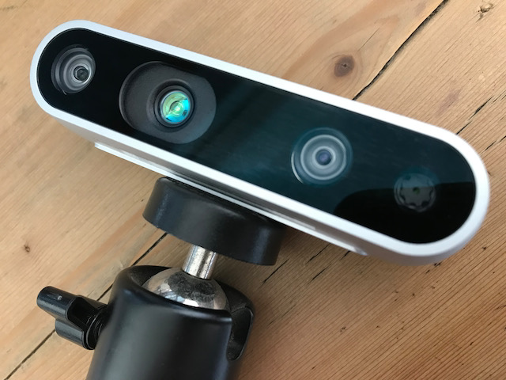
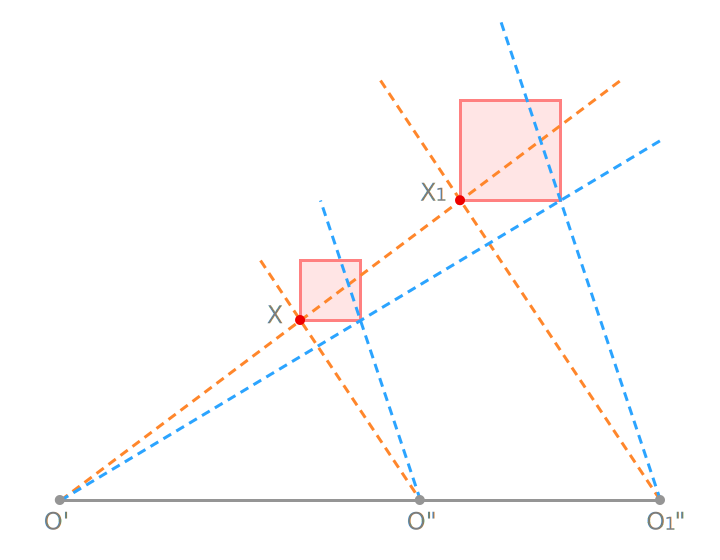
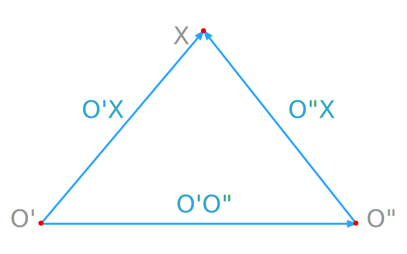

# Contents {data-transition="convex"}

- Camera Pair
- Coplanarity Constraint
- Fundamental Matrix
- Essential Matrix

# Camera Pair

Two cameras capturing images of the same scene.

::: notes
so far we have talked about the camera model - and we have confined
our discussion to a single camera, and it's calibration.
Now it's time to consider camera pairs.

:::

## Camera Pair {data-auto-animate="true}

{width=80%}

::: notes
this is a camera pair - a stereo camera. left cam, ir-projector, right cam, rgb-cam.
But this is not the only stereo pair.
This camera makes it easy to work with images taken from different locations
at the same time.
This is an example of what we call the stereo-normal case
where both cameras are point in the same direction.

We can equally have two separate cameras,
in two different positions, and take images at the same time.

Or, we could have one camera take an image then move to a different position and take another image.
:::

## Camera Pair {data-auto-animate="true}

- A stereo camera.
- Two cameras, each with a different position.
- One camera that moves.

A **camera pair** is two configurations from which images have been taken of the same scene.

::: notes
The definition means we want to estimate something...
often the relative orientation of the two cameras when taking the images

we talk about relative orientation and the two important matrices.
:::

## Orientation {data-auto-animate="true}

The **orientation** of the camera pair can be described using _independent_ orientations for each camera.

How many parameters are needed?

::: notes
These parameters are those involved in x=PX.
So first, how does it work for a calibrated camera?
can anyone remember how many parameters we need for camera extrinsic? Yes - 6 - for the rotation and translation. So 12 for two cameras...

Then for uncalibrated cameras we need the 5 extra values for each camera, so an extra 10 for the pair. A total of 22 parameters.
:::

## Orientation {data-auto-animate="true}

The **orientation** of the camera pair can be described using _independent_ orientations for each camera.

How many parameters are needed?

- _Calibrated_ cameras require **12** parameters.
- _Uncalibrated_ cameras require **22** parameters.

## Camera Motion {data-auto-animate="true}

Can we **estimate** the camera motion without
_knowing_ the scene?

::: notes
so - the question is can we estimate the camera motion without knowing the scene?
previously we needed knowledge of the scene, ie DLT with 6 points in the scene.
Or a camera target with known position and orientation.

Now think about only having images from two cameras, without any knowledge of the scene at all. Which parameters can we obtain from these images?
:::

## Camera Motion {data-auto-animate="true}

Which parameters can be obtained from these images?

- and which cannot?

::: notes
Some parameters we may not be able to estimate at all...
One thing you might have realised is - it is very difficult to estimate scale.

As humans we have learnt that objects belong to a certain size range - but sometimes we can be fooled...

From only images (no knowledge of the scene) - it is impossible to estimate scale in a single image.

:::

## Cameras Measure Direction {data-auto-animate="true}

We can't obtain _global_ **translation** and **rotation** or **scale**.

::: notes
Without knowledge of the scene we can't position the camera or find the heading.
We don't know the scale of the scene.
:::

## Cameras Measure Direction {data-auto-animate="true}

{width=80%}

::: notes
let's talk about what's going on here.
first camera and second camera are looking at the same scene.
but if we had a bigger object and moved the second camera - we'd have identical images.

This is important to emphasise...

And it is probably obvious - how could we know where in the world our cameras are?
We cant't estimate the first camera pose - 6 values, and scale...
so 7 parameters we can't estimate!
:::

## Cameras Measure Direction {data-auto-animate="true}

We can obtain:

- 3 **rotation** parameters of the second camera _w.r.t._ the first camera.
- 2 **direction** parameters of the line $B$, connecting the two centres.
- But, we _can't_ estimate the length of $B$.

::: notes
We don't know how far the second camera is only the direction.
We don't know the global position - only with respect to the first camera.
:::

## Calibrated Cameras {data-auto-animate="true}

- We need $2 \times 6 = 12$ parameters for two _calibrated_ cameras for their pose.
- Without additional information we can only obtain $12 - 7 = 5$ parameters.
- Not 3 rotation, 3 translation, and 1 scale.

::: notes
With a calibrated camera, we obtain an angle-preserving model of the object.
We cannot resolve the pose of the first camera - nor the distance between the two cameras.
:::

## Photogrammetric Model {data-auto-animate="true}

Given two cameras images, we can reconstruct an object up to a **similarity** transform.

::: notes
From two images we can construct what is called a **photogrammetric model**.
This is a 3D model of the scene up to a similarity transform - translate - rotate - uniform scale.
We can construct a 3D model, but it will not be aligned or scaled within the 3D world.
:::

## Photogrammetric Model {data-auto-animate="true}

The orientation of the photogrammetric model is called the **absolute** orientation.

- To _obtain_ the absolute orientation we need at least 3 points in 3D.

::: notes
We must distinguish between relative orientation and absolute orientation.
Relative means the second camera with respect to the first...
If we want to align the model to the world - an absolute orientation - we need to get 3 points in 3D to obtain the absolute orientation and those missing 7 parameters.

Conversely, if we know the location of the cameras, we can find the 3D location of point.
:::

## Uncalibrated Cameras {data-auto-animate="true}

For **uncalibrated** cameras, we can only obtain $22-15=7$ parameters given two images.

We need at **least 5 points** in 3D to obtain the absolute orientation.

::: notes
when talking about uncalibrated - I mean only linear errors - not lens distortions, or other non-linear errors.

We are missing the projective transformation in 3D - which has 15 parameters.
A 4x4 matrix - and ignoring the homogeneous scaling.
:::

## Relative Orientation {data-auto-animate="true}

| Camera       | image | pair | RO  | AO  | 3D  |
| :----------- | :---: | :--: | :-: | :-: | :-: |
| Calibrated   |   6   |  12  |  5  |  7  |  3  |
| Uncalibrated |  11   |  22  |  7  | 15  |  5  |

- RO : relative orientation
- AO : absolute orientation
- 3D : minimum number of control points in 3D

::: notes
to summarise the available parameters in an image, in an image pair...
for calibrated every camera has 6 extrinsics... so 12 in total. We can find 5 parameters just from the two images, and the other 7 parameters are missing.
We would need to know 3 points in 3D to find those 7 parameters and thus the absolute orientation.

Similarly for uncalibrated cameras,
we need at least 5 points in 3D to obtain the absolute orientation.

This works just by knowing the correspondence in 2 images, and we can cover at least something about the orientation between two cameras.
:::

## Relative Orientation {data-auto-animate="true}

By simply moving the camera in the scene we can obtain a **relative orientation**.

"Agarwal, Sameer, et al. Building rome in a day. 2011"

{width=80%}

::: notes
As an inspirational interlude - just by finding image correspondences
we can find the relative orientation - and for many images
we can reconstruct many points in complex models.
:::

# Coplanarity Constraint {data-auto-animate="true}

Leading to the Fundamental Matrix.

::: notes
Let's start with the geometry of the scene and this will lead us to the fundamental matrix.

We start with an uncalibrated camera - no calibration information.
And we are going to look into what we call the co-planarity constraint.
:::

## Coplanarity Constraint {data-auto-animate="true}

Which parameters can we compute without any knowledge of the scene?

::: notes
we will start with two cameras looking at a single point.
:::

## Coplanarity Constraint {data-auto-animate="true}

{width=80%}

::: notes
To repeat, we know nothing of the outside world.
we have one camera on the left, and one on the right.
They can both observe the same point, X, in the world.
:::

## {data-auto-animate="true}

{width=80%}

::: notes
What do we know? In this perfect orientation, the vector from the first camera exactly intersects the vector from the second camera.
:::

## {data-auto-animate="true}

{width=80%}

::: notes
if we have these perfect rays then this means those intersecting rays must lie on a plane.

This is something we can exploit!!
:::

## {data-auto-animate="true}

{width=80%}

::: notes
If the two intersecting rays lie on a plane, then the vector between the two cameras must lie on that plane.
So, we have 3 vectors in 3D that lie in a plane.
:::

## {data-auto-animate="true}

Coplanarity can be expressed in the following way:

$$
[O^{'}X, O^{'}O^{''}, O^{''}X] = 0
$$

{width=80%}

::: notes
This expression is a scalar triple product.
It is equal to zero if all the vectors are in a plane.
:::

## Aside: Scalar Triple Product {data-auto-animate="true}

Dot product of one vector with the cross product of the other two.

$$
[A, B, C] = (A \times B) \cdot C
$$

- It is the volume of the _parallelepiped_ formed by the three vectors.
- $[A, B, C] = 0$ if all the vectors are in a **plane**.

::: notes
a quick definition of the scalar triple product.
We can also roll the operands around to get the same result.
:::

## Coplanarity {data-auto-animate="true}

$$
[O^{'}X, O^{'}O^{''}, O^{''}X] = 0
$$

{width=80%}

::: notes
So we know that the vectors are coplanar.
Now we need to express these vectors in a way that represents the properties of our camera.
:::

## Coplanarity for Uncalibrated Cameras {data-auto-animate="true}

The directions of the vectors $O^{'}X$ and $O^{''}X$ can be derived from the image coordinates $x' x''$.

$$
x' = P'X \quad \quad x'' = P''X
$$

with the projection matrices:

$$
P'=K'R'[\textbf{I}_{3}| - X_{O'}] \quad \quad P''=K''R''[\textbf{I}_{3}| - X_{O''}]
$$

::: notes
we know that cameras project 3D points in the world onto images.
with these familiar equations.
These prime and double prime variables relate to each camera, but the X is the same for both.
This is important!!
:::

## Coplanarity for Uncalibrated Cameras {data-auto-animate="true}

The normalised direction of the vector $O^{'}X$ is:

$$
{}^{n}x^{'} = (R')^{-1}(K')^{-1} x'
$$

::: notes
we can compute this vector from the inverse of the calibration matrix K.
we need to go a bit further to go from the camera coordinate system to the world coordinate system by rotating with R inverse too.
:::

## Coplanarity for Uncalibrated Cameras {data-auto-animate="true}

The _normalised_ direction of the vector $O^{'}X$ is:

$$
{}^{n}x^{'} = (R')^{-1}(K')^{-1} x'
$$

as the _normalised_ projection:

$$
{}^{n}x^{'} = [\textbf{I}_{3}| - X_{O'}]X
$$

This gives the **direction** from the centre of projection to the point in 3D.

::: notes
And we can then say, now we have removed the rotation,
that this is the normalised projection (ideal projection) from the world point.
:::

## Coplanarity for Uncalibrated Cameras {data-auto-animate="true}

Analogously, we can do the same thing for both cameras:

$$
{}^{n}x^{'} = (R')^{-1}(K')^{-1} x' \quad \quad {}^{n}x^{''} = (R'')^{-1}(K'')^{-1} x''
$$

::: notes
This gives me 2 of my vectors in my triangle.
:::

## Baseline Vector {data-auto-animate="true}

The baseline vector $O^{'}XO^{''}X$, is obtained from the coordinates of the projection centres:

$$
\textbf{b} = B = O^{'}X - O^{''}X
$$

::: notes
This is simply the difference between the two projection centres, the line from one to the other.
:::

## Coplanarity Constraint {data-auto-animate="true}

recall:

$$
[O^{'}X, O^{'}O^{''}, O^{''}X] = 0
$$

can be expressed as:

$$
\begin{aligned}
[{}^{n}x^{'}, \textbf{b}, {}^{n}x^{''} ] &= 0 \\
{}^{n}x^{'} \cdot (\textbf{b} \times {}^{n}x^{''}) &= 0 \\
{}^{n}x^{'T} S_{b} {}^{n}x^{''} &= 0
\end{aligned}
$$

::: notes
We previously had our coplanarity constraint, using the scalar triple product.
We can now rewrite it in terms of the direction vectors.

In the last part we can write the cross product as a skew symmetric matrix multiplication.
:::

## Skew Symmetric Matrix {data-auto-animate="true}

How does this work?

$$
\begin{aligned}
{}^{n}x^{'} \cdot (\textbf{b} \times {}^{n}x^{''}) &= 0 \\
{}^{n}x^{'T} S_{b} {}^{n}x^{''} &= 0
\end{aligned}
$$

Write the cross product as a skew symmetric matrix $S_b$:

$$
\begin{bmatrix} b_1 \\ b_2 \\ b_3 \end{bmatrix} \times
\begin{bmatrix} x_1 \\ x_2 \\ x_3 \end{bmatrix} =
\begin{bmatrix}
    - b_3 x_2 & + & b_2 x_3 \\
      b_3 x_1 & - & b_1 x_3 \\
    - b_2 x_1 & + & b_1 x_2
\end{bmatrix} =
\underbrace{\begin{bmatrix}
    0 & -b_3 & b_2 \\
    b_3 & 0 & -b_1 \\
    -b_2 & b_1 & 0
\end{bmatrix}}_{S_b}
\begin{bmatrix} x_1 \\ x_2 \\ x_3 \end{bmatrix}
$$

::: notes
we can show how the skew symmetric matrix works by showing the
multiplication of the cross product.
Generally, the skew symmetric matrix is a square matrix whose
transpose equals its negative.
:::

# Fundamental Matrix {data-auto-animate="true}

We can continue to work with the coplanarity constraint, to build the **fundamental** matrix.

## Fundamental Matrix {data-auto-animate="true}

By combining ${}^{n}x^{'} = (R')^{-1}(K')^{-1} x'$ and ${}^{n}x^{'T} S_{b} {}^{n}x^{''} = 0$

- we obtain:

$$
x'^{T}(K')^{-T}(R')^{-T}S_{b}(R'')^{-1}(K'')^{-1}x'' = 0
$$

::: notes
what we can do is take the normalised projection and replace with the expression containing the pixel coordinates. We can do that for both cameras.
Take note: we had to use the transpose on the left hand side of the equation.
And this whole expression should be equal to zero.
Now, I take the whole expression in the middle - which is a matrix - or product of 5 matrices - and condense to one 3x3 matrix.
We give this matrix the name F.
:::

## Fundamental Matrix {data-auto-animate="true}

By combining ${}^{n}x^{'} = (R')^{-1}(K')^{-1} x'$ and ${}^{n}x^{'T} S_{b} {}^{n}x^{''} = 0$

- we obtain:

$$
x'^{T}\underbrace{(K')^{-T}(R')^{-T}S_{b}(R'')^{-1}(K'')^{-1}}_{F}x'' = 0
$$

$$
\begin{aligned}
F &= (K')^{-T}(R')^{-T}S_{b}(R'')^{-1}(K'')^{-1} \\
  &= (K')^{-T}(R') S_{b} (R'')^{T}(K'')^{-1}
\end{aligned}
$$

::: notes
so we take all the expression in the middle, and we can simplify it a little because we have rotation matrices. To give us the definition of the matrix F.
:::

## Fundamental Matrix {data-auto-animate="true}

The matrix $F$ is the **fundamental** matrix.

$$
F = (K')^{-T}(R') S_{b} (R'')^{T}(K'')^{-1}
$$

- it allows us to express the _coplanarity constraint_ as:

$$
x'^{T} Fx'' = 0
$$

::: notes
The fundamental matrix has all the parameters that we can estimate describing the two cameras relative orientation.
:::

## Fundamental Matrix {data-auto-animate="true}

The **fundamental matrix** holds the parameters we can estimate to describe the _relative orientation_ of two cameras looking at the same point.

$$
x'^{T} Fx'' = 0
$$

::: notes
The elegant thing about F is we can express the coplanarity constraint like this.
This means if I have pixel coordinates in two cameras that refer to the same point in the world, this must give me zero if they actually are the same point.
:::

## Fundamental Matrix {data-auto-animate="true}

The **fundamental matrix** fulfils the equation:

$$
x'^{T} Fx'' = 0
$$

for **corresponding** points in two images.

- The fundamental matrix contains **all** the _information about the relative orientation_ of **two images** from uncalibrated cameras.

::: notes
Whenever we have corresponding points in two images this equation must hold.
Under the assumption that the points are estimated perfectly. Of course, in the real world, there will be noise, so we will be close to zero.
:::

## Fundamental Matrix {data-auto-animate="true}

**NOTE:** we have defined the fundamental matrix for the relative orientation from camera one to camera two.

- You will also find in the literature, $F$ can be defined for the relative orientation from camera two to camera one.

- This transposition must be accounted for when comparing expressions.

::: notes
We have built this up by looking at the relation of the second camera to the first.
Of course, we can also look at the relation of the first camera to the second.
In this case F would be the transpose of how we have shown it.
:::
